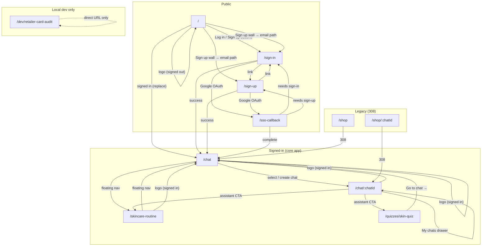
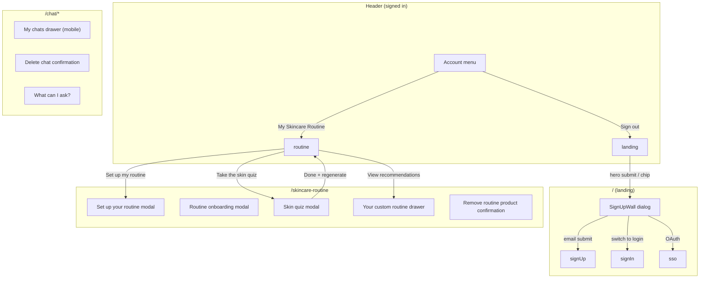

# Pages graph — commerce-platform-frontend

Generated during **ALE-82 Phase 1** discovery (`main` branch, June 2026).  
Re-validate on feature branches when routes or navigation change.

**Dev URLs:** frontend `http://localhost:3020` · GraphQL `http://localhost:4020/api/public`

---

## Auth zones

| Zone | Routes | Gate |
|------|--------|------|
| **Public** | `/`, `/sign-in`, `/sign-up`, `/sso-callback` | None |
| **Middleware-protected** | `/chat`, `/chat/*`, `/skincare-routine` | Clerk `auth.protect()` in `proxy.ts` |
| **Unprotected but auth-dependent** | `/quizzes/*` | No redirect; saving quiz answers needs signed-in GraphQL |
| **Local-only** | `/dev/retailer-card-audit` | `notFound()` unless `isLocalDevToolsEnabled()` |
| **Legacy redirects** | `/shop`, `/shop/:chatId` | 308 → `/chat`, `/chat/:chatId` |

Post-auth default destination: **`/chat`** (`CLERK_AFTER_AUTH_URL`).

---

## Route inventory

| Route | Page component | Floating header |
|-------|----------------|-----------------|
| `/` | `LandingPage` (signed out only; signed-in → `/chat`) | Yes |
| `/sign-in` | Email/password + Google OAuth | No |
| `/sign-up` | Email/password + Google OAuth (+ email verify step) | No |
| `/sso-callback` | OAuth return handler | No |
| `/chat` | `ChatPage` — list / new chat; auto-navigates to `/chat/:id` | Yes |
| `/chat/[chatId]` | `ChatPage` with active thread | Yes |
| `/skincare-routine` | `SkincareRoutinePage` | Yes |
| `/quizzes/[path]` | `QuizRunner` full page (e.g. `skin-quiz`) | No |
| `/dev/retailer-card-audit` | `RetailerCardAuditPage` | No |

---

## Reachability graph (routes)

Edges: **link**, **router navigation**, **redirect**, or **legacy redirect**.

---

## Overlay / modal graph (not separate routes)

These surfaces share the URL bar with their host page. Document separately because Playwright must open/close them without `page.goto`.

### Query-param deep links (`/skincare-routine`)

| Param | Opens / triggers |
|-------|-------------------|
| `openSetup=1` | “Set up your routine” modal (new-user empty state) |
| `openQuiz=1` | Routine onboarding modal |
| `openSkinQuiz=1` | Skin quiz modal |
| `generateRoutine=1` | `generateSkincareRoutine` mutation |
| `openRecs=1` | Recommendations drawer after generate |
| `regenerateSource=skin-quiz` | “Updating recommendations…” loading on hero |
| `regenerateSource=routine-onboarding` | Same, from onboarding path |

---

## Entry points

| Entry | Lands on | Notes |
|-------|----------|-------|
| Direct `/` | Landing or → `/chat` if signed in | |
| Direct `/chat` | Chat home → canonical `/chat/:id` | Middleware requires auth |
| Direct `/chat/:id` | Specific thread | Shareable deep link |
| `/sign-in?email=` | Sign-in with prefilled email | From sign-up wall |
| `/sign-up?email=` | Sign-up with prefilled email | From sign-up wall |
| Landing hero message | Sign-up wall → auth → `/chat` + pending message sent | `pendingChatMessage` |
| Assistant CTA | `/skincare-routine?openSkinQuiz=1`, `/skincare-routine?openSetup=1` | Dynamic `cta.url` |
| Account menu | `/skincare-routine` | |
| Legacy `/shop` | `/chat` | Permanent redirect |

---

## Header visibility (`shouldShowFloatingNav`)

| Path pattern | Floating nav + header |
|--------------|----------------------|
| `/`, `/chat`, `/chat/*`, `/skincare-routine` | Shown |
| `/sign-in`, `/sign-up`, `/sso-callback` | Hidden |
| `/quizzes/*` | Hidden |
| `/dev/*` | Hidden |

`FloatingNavPill` (Chat / Routine) renders only when **signed in**.

---

## Discovery gaps / branch drift risks

- **Quiz paths** beyond `skin-quiz` are dynamic (`/quizzes/[path]`); confirm available quizzes in backend before adding E2E.
- **Agent CTAs** are dynamic per message; catalog common URLs during Phase 3 smoke tests.
- **Email verification** on sign-up may block automated user creation unless Clerk dev OTP (`424242`) or Dashboard-created user is used.
- Re-run this graph when adding routes under `app/` or new `router.push` targets.
