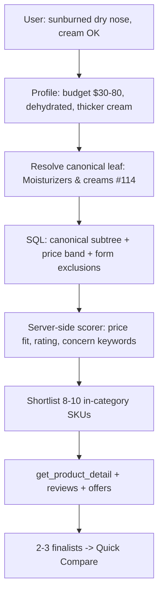

# ALE-109 — Shopping agent product search quality (sunburn chat investigation)

## Context

[Linear ALE-109](https://linear.app/dewly/issue/ALE-109/fixing-miscellaneous-bugs) — **Bug #3** (investigation)

Production chat `askdewly.com/chat/LMqnBgNqzR` (internal `chatId: 4733`, Mastra session `ad72b916-d534-4ab3-b7b3-0830a7eb82d5`) — user asked for moisturizer recommendations for a sunburned dry nose. The agent returned a Quick Compare of **Oh Lolly Manuka Marula Moisturizing Cream** ($40) and **Soko Glam Klairs Rich Moist Soothing Cream** ($26). Nothing errored and cards rendered, but the **candidate pool was garbage**: the category filter matched nothing, the search fell through to global fuzzy title matching, and the top hits were a foot cream and a sunscreen.

**Investigation sources:**

- Langfuse traces (production, `2026-08-10T01:27–01:29Z`)
- Code review: `searchProducts.ts`, `listCategories.ts`, shopping agent tools/prompts
- **Direct DB verification** against local `commerce_platform` (15,970 products) — see [Root cause](#root-cause--the-canonical-taxonomy-is-unpopulated)

**Related prior work:** [ALE-91 — Search issue](ALE-91-search-issue.md) (mask pivot, broad-request scope). Same stack; ALE-91 treated the symptom at the prompt layer. This plan finds the data-layer cause underneath it.

**Repos:** `commerce-platform-backend` (primary), `commerce-platform-scrapers` (categorization signal), `commerce-platform-frontend` (E2E repro)

**Linear:** [ALE-109](https://linear.app/dewly/issue/ALE-109/fixing-miscellaneous-bugs) is **Done**. Remaining coverage work is [ALE-112](https://linear.app/dewly/issue/ALE-112/ale-109-phase-0-tail-resolve-remaining-5703-products-without).

---

## Status (2026-09-02)

Phase 0 infrastructure and Phase B search correctness **shipped**. The original sunburn chat is **not fully closed** until an agent turn is proven to pick **Moisturizers & creams (#114)** instead of guessing `categoryId: 1`.

### Shipped PRs

| Phase | What | PRs |
| ----- | ---- | --- |
| Bug #2 | Advice-for-other share nudge kill switch | backend [#56](https://github.com/alex-the-programmer/commerce-platform-backend/pull/56), frontend [#48](https://github.com/alex-the-programmer/commerce-platform-frontend/pull/48) |
| Phase 0 | Additive `products.canonicalCategoryId` / `canonicalCategorySource` / `canonicalCategoryConfidence`; matcher + ingest + backfill | backend [#57](https://github.com/alex-the-programmer/commerce-platform-backend/pull/57), scrapers [#23](https://github.com/alex-the-programmer/commerce-platform-scrapers/pull/23) |
| Phase B | Canonical subtree search, keep category through token/fuzzy, price band, `list_categories` kind + counts, agent funnel prompt | backend [**#58**](https://github.com/alex-the-programmer/commerce-platform-backend/pull/58) (merged 2026-09-02) |

### Phase B — what #58 actually contains

Shipped:

- CANONICAL `categoryId` → `canonicalCategoryId IN (node + descendants)`, with `categoryId IN subtree` fallback for legacy rows; STAGING ids still filter `products.categoryId`
- Category kept through substring / token / core-token / **in-category** fuzzy; drop category only as last resort, then drop brand
- `priceMin` / `priceMax` via Prisma `sellerProducts.some.prices.some` (inclusive `gte`/`lte` on any listing price)
- `list_categories` returns `categoryKind` + `productCount` (canonical counts roll up subtree; **STAGING still listed**)
- Zero in-category matches logged as `search_products_zero_category_matches`
- Results expose `searchStage` + `searchStageTimingsMs`
- Agent instructions: prefer CANONICAL nodes with `productCount > 0`; face moisturizer / sunburn → **Moisturizers & creams**

Explicitly **not** in #58 (dropped as query-hardcoded, not category-driven):

- Product-form title exclusion (foot / sun / lip)
- Sunburn → soothing/barrier token expansion

### Catalog coverage when #58 merged (local DB ≈ staging catalog)

- **9,191 / 15,970 (57.6%)** have `canonicalCategoryId`
- **Moisturizers & creams (#114): 380 products** — enough to retrieve in-category
- After-sun (#132) empty — agent must use #114, which `productCount` now shows
- Remaining gap: [ALE-112](https://linear.app/dewly/issue/ALE-112/ale-109-phase-0-tail-resolve-remaining-5703-products-without) (do **not** hide STAGING from `listCategories` until coverage is nearer 95%)

### Written locally, **not** in #58

These exist on the workspace / leftover feature-branch files and still need a follow-up if we want them on `main`:

- Prisma-shaped fuzzy ranking helper (`searchProductsTitleSimilarity.ts`) — `$queryRaw` `IN (bigint[])` bound as jsonb; helper inlines validated ids
- Live catalog probe `searchProducts.liveCatalog.test.ts` (original sunburn query + #114)
- Phase D flow `e2eTestFlows/flows/chat-search-quality.md` + frontend spec `playwright/tests/chat/search-quality.spec.ts` (**not run**, no frontend PR)
- Cursor/Claude backend rule: prefer Prisma Client over raw SQL

---

## Next step

**Phase D first — prove the original chat bug is gone.** Search SQL can now return moisturizers for `#114`; the production failure was the **agent guessing `categoryId: 1`**. Playwright `chat-search-quality-01` is written and unrun. Run it locally (backend + frontend on the merged `main`), then open a frontend E2E PR.

How to read the result:

| Outcome | Meaning | Then |
| ------- | ------- | ---- |
| Cards are face moisturizers, no foot/sun/lip titles | Agent used a populated canonical node — Bug #3 is fixed in chat | Optional: ALE-112 coverage, then hide STAGING |
| Probe-green but E2E still shows foot cream / sun cream, or no cards | Agent still skipped `list_categories` / picked the wrong id | **Phase C** (server-scored shortlist or recommendation workflow) — prompt alone is not enough |
| `searchProducts.liveCatalog.test.ts` fails on staging | `#114` empty or search not deployed | Deploy #58 + confirm backfill on that DB before blaming the agent |

Do **not** start Phase C until Phase D has a result. Do **not** treat ALE-112 as blocking the sunburn repro — #114 already has 380 products.

Follow-up after D (smaller): land the uncommitted Prisma fuzzy helper + live probe on a new backend PR off `main`, so in-category fuzzy is Prisma-filtered and the original query is regression-tested in CI when inventory exists.

---
### Database changes — requires architect approval

Phase 0 writes canonical category assignments for ~16k products. Exact surface:

| Table | Column | Change |
| ----- | ------ | ------ |
| `products` | `categoryId` (existing, `BIGINT`) | **Option A:** repoint from STAGING to CANONICAL category ids — destructive, loses retailer bucket |
| `products` | `canonicalCategoryId` (**new**, `BIGINT NULL`, FK → `product_categories.id`) | **Option B (preferred):** additive; keep `categoryId` as the retailer staging bucket |
| `products` | `canonicalCategorySource` (**new**, `TEXT NULL`) | Provenance: `retailer_path` \| `llm` \| `manual` |
| `products` | `canonicalCategoryConfidence` (**new**, `DOUBLE PRECISION NULL`) | Enables threshold tuning and review queues |

**Recommendation: Option B.** Additive columns are reversible and preserve the retailer bucket that scrapers rely on. Decide before writing any migration.

---

## Root cause — the canonical taxonomy is unpopulated

A well-designed canonical taxonomy exists. Almost no products are attached to it.

| Category kind | Categories | Products attached |
| ------------- | ---------- | ----------------- |
| `CANONICAL` | 82 | **3** |
| `STAGING` | 20 | **16,787** |

All real inventory sits in 20 per-retailer staging buckets:

| id | Staging bucket | Products |
| -- | -------------- | -------- |
| 501 | Olive Young Global | 5,459 |
| 503 | Style Korean | 5,004 |
| 3796 | Jolse | 1,535 |
| 3800 | Tester Korea | 1,404 |
| 3798 | RoseRoseShop | 1,088 |
| … | 15 more | ~2,300 |

The canonical tree is semantically correct and empty:

```
K-Beauty (id 1, CANONICAL, root)
└── Skincare (11)
    ├── Moisturizers & creams (114)  → 0 products   ← the node this query needed
    ├── Serums & ampoules   (113)  → 1 product
    ├── Cleansers           (111)  → 1 product
    ├── Toners & softeners  (121)  → 0
    ├── Acne & blemish care (116)  → 0
    ├── Exfoliators & peels (117)  → 0
    ├── Eye care            (115)  → 0
    ├── Face oils           (118)  → 0
    ├── Face mists & fixers (119)  → 0
    ├── Emulsions & lotions (122)  → 0
    └── Skincare gift sets  (120)  → 0
```

Sibling canonical top-level nodes: `Sun care`, `Face masks & packs`, `Makeup`, `Hair care`, `Bath & body`, `Fragrance & perfume`, `Nail care`, `Men's grooming`, `Beauty tools & accessories`, `Wellness & supplements`, `Food & beverages`, `Lifestyle & merch`.

### Verification queries

```sql
SELECT "categoryKind", count(*) FROM product_categories GROUP BY 1;
-- CANONICAL 82 | STAGING 20

SELECT c."categoryKind", count(p.id)
FROM products p JOIN product_categories c ON c.id = p."categoryId"
GROUP BY 1;
-- STAGING 16787 | CANONICAL 3

SELECT id, name, "parentCategoryId", "categoryKind"
FROM product_categories WHERE id = 1;
-- 1 | K-Beauty | NULL | CANONICAL
```

**Verified locally.** Production Langfuse traces corroborate: every product returned in the sunburn search reported `categoryName` like `Staging taxonomy / Oh Lolly`, `Staging taxonomy / Soko Glam`. Re-confirm against production before Phase 0 ships.

### What this invalidates

| Earlier assumption | Reality |
| ------------------ | ------- |
| `categoryId: 1` was a hallucination | **No** — id 1 is `K-Beauty`, the real canonical root. The agent made a defensible choice. |
| Category 1 is a stale/legacy row to remove | **No** — it is the intended root of a healthy 82-node tree |
| Subtree filtering (`id IN descendants`) fixes it | **No** — the `K-Beauty` subtree contains ~3 products |
| Filtering `listCategories` to `CANONICAL` fixes it | **Makes it worse** — the agent would confidently filter into 0 rows on *every* turn, guaranteeing the fuzzy fallback |
| The core problem is agent tool-sequencing | **Secondary** — sequencing is genuinely broken, but correct sequencing still retrieves nothing today |

**The blocking prerequisite is classifying products into the canonical taxonomy.** No search fix, prompt fix, or architecture change produces good recommendations until `Moisturizers & creams` actually contains moisturizers.

---

## Turn-by-turn investigation (Langfuse)

| Time (PT) | User message | Agent action | Trace |
| --------- | ------------ | ------------ | ----- |
| 6:27 PM | *(chat opens)* | Greeting only — no catalog tools | `61646709…` |
| 6:27 PM | “what would you recommend to moisturize my sunburned dry nose” | Clarifying Q (thick cream vs gel) — **no search** | `14e1261f…` |
| 6:28 PM | “either one, whichever works better” | Full recommendation pipeline | `4b04083d…` |
| 6:28 PM | *(server)* | Structured enrichment → Quick Compare cards | `99c480f6…` |

### Recommendation turn tool sequence (`4b04083d…`)

```
searchProducts → getProductDetail ×3 → listProductReviewSummaries ×2
→ searchProductReviews ×2 → getLowestPriceOffer ×2 → assistant prose
```

**Not called:** `listCategories`, `listCategorySpecs`, `findProductsBySpecs`

### Known user profile injected

- Skin: tight + dehydrated
- Comfortable spend: **$30–$80**
- Memory: sunburned dry nose; prefers thicker cream; uses COSRX Ceramide moisturizer in routine
- *(Conflicting memory also present: “wants products under $30”)*

### Finalists chosen

| productId | Product | Why in shortlist (inferred) |
| --------- | ------- | --------------------------- |
| 49672 | Manuka Marula Moisturizing Cream (Ecolline / Oh Lolly) | Title says “Moisturizing Cream”; fuzzy rank #4; $40 in budget |
| 37006 | Rich Moist Soothing Cream (KLAIRS / Soko Glam) | “Soothing” fits sunburn; budget contrast at $26 |

**Deep-dived then discarded:** `14617` Moisturizing Foot Cream (NARD).
**Never deep-dived:** CeraVe (#3), Dr.Jart+ Ceramidin (#15–16), May Coop — all in the result set.

### Review / price tools

- `listProductReviewSummaries` → **empty** for both finalists
- `searchProductReviews` → **empty** for both
- `getLowestPriceOffer` → Oh Lolly $40, Soko Glam $26 (grounded)
- UI ratings (4.8/5, 4.9/5) come from **DB hydration**, not review tool output — the prose claim “highly regarded” was unsupported

### Quick Compare generation

`runStructuredEnrichment` (second LLM pass) builds `productCards` + `comparison.items` from `toolStepsDigest` + assistant reply. **No deterministic ranking** — it echoes the two productIds the agent already deep-dived and generates pros/cons/watchouts partly from model priors.

---

## Deep dive #1 — how `categoryId: 1` behaved

### What the agent searched

```json
{ "query": "moisturizing cream for sunburn", "categoryId": 1, "brandId": null, "skip": 0, "take": 50 }
```

The agent never called `listCategories` — it guessed. The guess happened to name the real canonical root.

### The cascade

`searchProducts.ts` applies `categoryId` as an **exact** match, not a subtree:

```77:79:commerce-platform-backend/src/interactions/catalog/searchProducts.ts
  if (input.categoryId != null) {
    where.categoryId = input.categoryId;
  }
```

| Step | What runs | `categoryId` applied? | Result |
| ---- | --------- | --------------------- | ------ |
| 0 | Full-string substring on name/sku | **Yes** (`1`) | 0 |
| 1 | Drop category, same substring | No | 0 |
| 2 | Drop brand (N/A) | No | — |
| 3 | Token AND (`moisturizing`+`cream`+`sunburn`) | No | 0 |
| 4 | Core token AND (drops `cream`) | No | 0 |
| 5 | **pg_trgm fuzzy** on `products.name` | No | **39** ✓ |

**Three defects, independent of the taxonomy problem:**

1. **Token and fuzzy fallbacks silently drop `categoryId`.** Even a perfect leaf category gets discarded on widen, so widened results are always catalog-global.
2. **`widerSearchNote` only reports the step that succeeded.** Steps 1–4 returned 0, so the agent saw only the fuzzy note and had no signal that its category filter had matched nothing. The single most useful diagnostic was withheld from the model.
3. **`listCategories` does not filter by `categoryKind`** and returns no product counts:

```6:12:commerce-platform-backend/src/interactions/catalog/listCategories.ts
  const categories = await prisma.productCategory.findMany({
    orderBy: { name: "asc" },
    select: {
      id: true,
      name: true,
      parentCategoryId: true,
    },
  });
```

Had the agent called it, it would have received 102 rows blending canonical and retailer-staging categories, unlabeled and uncounted — no way to tell which ids contain inventory.

---

## Deep dive #2 — fuzzy matching (pg_trgm)

### Timing

| Metric | Value |
| ------ | ----- |
| `searchProducts` latency (Langfuse obs `61525ada…`) | **386 ms** |
| End-to-end agent turn | ~13 s |

No per-stage timing exists. The 386 ms covers up to ~10 DB round-trips (2 per cascade step) before fuzzy succeeds.

### Why fuzzy ran

Query `"moisturizing cream for sunburn"` is 29 chars (≥ 12 threshold).

| Stage | Why it failed |
| ----- | ------------- |
| Substring | No title contains the full phrase |
| Token AND | Requires `sunburn` in name/sku — **no catalog title uses “sunburn”** |
| Core token AND | Still requires `sunburn` |

### What fuzzy matches

```sql
similarity(p.name, 'moisturizing cream for sunburn') > 0.28
ORDER BY similarity(p.name, $q) DESC
```

- **Field:** `products.name` only — not sku, brand, category, or specs
- **Ranking:** trigram overlap on `moisturiz`, `cream`, `moisture`
- **No concern semantics** — “sunburn” has no mapping to soothing / barrier-repair / panthenol

Hence: `Moisturizing Foot Cream` #1, `Moisturizing Sun Cream` #2 (the `sun` substring in `sunburn` actively promotes sunscreens), CeraVe #3.

Fuzzy is a reasonable **last-resort NL recovery** mechanism. It is not a reasonable primary retrieval path — but today it is the *only* path that returns rows, because every category-scoped attempt matches nothing.

---

## Deep dive #3 — why the result set was noisy

The agent treated 39 fuzzy hits as its shortlist pool. It rejected the foot cream on title inspection but never filtered sunscreens, foot masks, lip products, or body creams — there is no deterministic product-form guard at any layer.

| Rank | Product | Problem |
| ---- | ------- | ------- |
| 1 | Moisturizing Foot Cream | Wrong body area |
| 2 | Moisturizing Sun Cream | Sunscreen, not treatment moisturizer |
| 4 | Manuka Marula Moisturizing Cream | Reasonable pick |
| 10 | Moisturizing Foot Mask | Wrong form + area |
| 21 | Rich Moist Soothing Cream (Klairs) | Reasonable pick |

### Target retrieval shape (post-Phase 0)



| Today | Desired |
| ----- | ------- |
| LLM reads 39 fuzzy titles | SQL returns in-category, in-budget candidates |
| Picks 2 by name vibes | Server scores; agent compares pre-filtered set |
| Reviews empty → model invents pros | Claims require review or spec evidence |
| Category filter matches nothing | Canonical leaf with real inventory |

---

## Phase 0 — canonical categorization backfill (**blocking**)

Nothing downstream works until this lands.

### Available signal

| Signal | Coverage | Notes |
| ------ | -------- | ----- |
| **Retailer category path in specs** | 5,331 products (Olive Young Global alone) | Spec `OY PDP.detailData.product.allPathCtgrNameEn` holds the retailer's own full path |
| Product specs generally | 15,833 / 15,970 (**99%**) | `product_seller_specs` — per-retailer raw PDP fields |
| Product title + brand | 100% | Weakest signal, but universal |
| `seller_categories` | 2,383 rows across 19 sellers | **Currently unusable** — see below |

Sample of the Olive Young path values, which map cleanly onto canonical nodes:

| Retailer path | Canonical target |
| ------------- | ---------------- |
| `OliveYoungGlobal > Skincare > Cleansers > Cleansing Foams` | Cleansers (111) |
| `OliveYoungGlobal > Suncare > Sunscreen` | Sun care (12) |
| `OliveYoungGlobal > Face Masks > Sheet Masks` | Face masks & packs (10) |
| `OliveYoungGlobal > Skincare > Acne & Blemish Treatments` | Acne & blemish care (116) |
| `OliveYoungGlobal > Supplements > Immune Booster` | Wellness & supplements (20) |

### Two blockers to fix first

**1. There is no product → seller_category link.** `seller_products` has no category column; `products.categoryId` is the only one. So `seller_category_mappings` (1,886 rows) cannot currently be used to derive a product's canonical category — you can't reach a seller category from a product.

**2. `seller_category_mappings` points at the wrong targets.** It overwhelmingly maps seller categories to *staging* buckets, not canonical nodes:

| Mapping target | Mapped seller categories |
| -------------- | ------------------------ |
| `Staging taxonomy / Moida` | 521 |
| `Staging taxonomy / BeautyNet Korea` | 230 |
| `Staging taxonomy / Beauty of Joseon US` | 228 |
| … | … |
| `Skincare` (canonical) | **7** |

### Proposed approach

1. **Inventory retailer path specs per seller** — find the equivalent of `allPathCtgrNameEn` for each of the 19 sellers; record coverage. Note stored values are HTML-escaped (`&gt;`) and need unescaping.
2. **Build a retailer-path → canonical-node mapping table.** Deterministic and reviewable; a few hundred distinct paths cover most of the catalog. This is the high-confidence bulk of the backfill.
3. **LLM-assisted classification for the tail** — products with no usable retailer path: classify from title + brand + specs into the 82 canonical nodes. Store `canonicalCategorySource = 'llm'` with a confidence score.
4. **Write results** to the new additive columns (Option B above), never overwriting the staging bucket.
5. **Report coverage** — target ≥ 95% of non-merged products with a canonical category; ≥ 99% for the Skincare and Sun care subtrees that shopping traffic actually hits.
6. **Spot-check accuracy** — manual review of a stratified sample per canonical node before enabling category-scoped search.

### Ownership question

Categorization may belong in `commerce-platform-scrapers` (it owns ingest and already parses PDP payloads) rather than the backend. Decide before implementation; the backend does not own scraper migrations.

---

## Phase A — metrics and honesty (no behavior change, ships in parallel)

1. **Log when a `categoryId` filter matches zero rows** at step 0 — the single clearest "invalid category" signal, currently invisible.
2. **Accumulate `widerSearchNotes` instead of reporting only the winning step**, so the agent is told "your category matched nothing *and* we fell through to fuzzy."
3. **Stage-level timing** in the search cascade.
4. **Langfuse batch analysis:** share of `searchProducts` calls ending in `pg_trgm`; share of recommendation turns that call `listCategories` first.

These are cheap, safe, and make Phase 0 progress measurable.

---

## Phase B — search correctness (**after Phase 0**)

1. **Canonical subtree filter** — `categoryId IN (node + descendants)`, scoped to `CANONICAL`. Meaningless before Phase 0; correct after.
2. **Keep category applied through widening** — token and fuzzy stages must respect the category, or explicitly report that they dropped it.
3. **Product-form exclusion** — drop sunscreen / foot / lip / body / mask rows when the resolved category and user intent say face moisturizer.
4. **Concern → token expansion** — `sunburn` → `soothing`, `barrier`, `panthenol`, `centella`, `aloe` before falling through to fuzzy.
5. **Price-band filter** — accept `priceMin` / `priceMax` and filter on best offer, sourced from the quiz profile.
6. **Demote fuzzy** — once category-scoped retrieval works, fuzzy should be rare and clearly flagged.

### `listCategories` changes (**paired with Phase 0, not before**)

- Filter to `categoryKind = 'CANONICAL'`
- Include a **product count per node** so the agent can never pick an empty category
- Consider returning only nodes with inventory

Shipping the `CANONICAL` filter *before* Phase 0 is a regression — it would guarantee empty results on every category-scoped search.

---

## Phase C — architecture: one agent vs. Mastra workflow (**decide after Phase 0**)

### Current state

There are **zero Mastra workflows** in the repo. `shoppingAgent` binds **16 tools** on `gpt-4o-mini`, and `invokeShoppingAgent.ts` is **1,134 lines** of hand-rolled orchestration: opening-turn detection, advice-for-other detection, broad-request detection, delivery-expectation heuristics, conditional nudge assembly, a second structured-output pass, a completion **retry loop**, card sanitization, partitioning, hydration, and text dedupe.

So the real comparison is not "one agent vs. a workflow." It is "an implicit workflow expressed as prompt nudges plus post-hoc correction code" vs. "an explicit workflow with typed state." We already pay the complexity cost without the benefits: no typed inter-step state, no per-step spans, no step-level tests. The retry loop is the tell — code already detects the agent failing to finish and re-prompts it.

### The case for a workflow

The ALE-109 sequencing failure is an **adherence** problem, not a reasoning problem. The prompt already specifies the funnel; the model ignored it, exactly as it ignored the scope rules added in ALE-91. More prompt text will not fix this. A workflow makes skipping structurally impossible, and one tool per step is far more reliable for `gpt-4o-mini` than choosing among 16.

### The case against making it the entry point

Chat is open-ended. Greetings, ingredient education, off-topic redirects, "tell me about the first one", cart and coupon operations, and follow-ups on already-shown cards are not recommendation turns and suit a linear workflow badly. Mid-turn constraint changes ("actually under $20, and my T-zone is oily") need re-entry with updated state rather than in-step branching.

### Recommended shape

- **Agent stays** for conversational turns.
- **Recommendation turns route into a workflow** whose steps are mostly *not* LLM calls: resolve canonical category (one constrained classification), derive filters from profile + message, run SQL retrieval with price band and form exclusions, score and shortlist, then a single LLM step to compare finalists and write the wrap-up.

### Why this was deferred (now unblocked)

Phase 0 + Phase B shipped. A workflow step "determine the canonical categoryId" can now retrieve **Moisturizers & creams (#114)** instead of nothing. Revisit Phase C **only if Phase D shows the agent still skipping `list_categories` / picking the wrong id.**

**Interim, cheap:** cap the candidate set the agent sees. Have the server hand it a scored shortlist and let the agent only compare — a large share of the workflow benefit without new infrastructure.

---

## Phase B — how we know it is correct

Factory unit tests prove the Prisma `where` clauses. They cannot prove the original production query works against real inventory. Verification has three layers; E2E is the last, not the first.

### Layer 1 — synthetic unit tests (always on)

| Claim | Test |
| ----- | ---- |
| Canonical parent matches a child `canonicalCategoryId` | `searchProducts.phaseB.test.ts` subtree case |
| STAGING ids still filter `products.categoryId` | same file, STAGING case |
| Token widening keeps the category | same file, `category kept` note |
| Price band is inclusive `gte`/`lte` on any listing price | `$28` in `$20–$30` is kept; `$18` / `$90` are not |
| In-category fuzzy does not surface an out-of-tree exact title | fuzzy case in `searchProducts.phaseB.test.ts` |
| `listCategories` returns `categoryKind` + subtree `productCount` | `listCategories.test.ts` |

Run: `npx jest src/__tests__/interactions/catalog/searchProducts.phaseB.test.ts src/__tests__/interactions/catalog/listCategories.test.ts`

### Layer 2 — live catalog probe (this is the Phase B gate)

Call the same `searchProducts` interaction against local/staging inventory — no agent, no Playwright. The original Langfuse query was:

```json
{ "query": "moisturizing cream for sunburn", "categoryId": 114, "take": 20 }
```

`searchProducts.liveCatalog.test.ts` no-ops when `Moisturizers & creams` has fewer than 10 products (empty CI / un-backfilled DB). On a backfilled catalog it must pass:

1. `listCategories` reports `productCount > 0` for **Moisturizers & creams**.
2. That search returns `total > 0`.
3. `widerSearchNote` does **not** contain `without that category` — category was kept through token/fuzzy.
4. `searchStage` is `substring` \| `tokens` \| `core_tokens` \| `fuzzy`, **never** `unscoped`.
5. Contrast (not a pass/fail on titles): the **same query with no `categoryId`** may still rank a foot cream or sun cream — that is pre-Phase-B behavior. In-category results should not.

Title heuristics (foot / sun cream / lip) are a **taxonomy spot-check**, not a search-SQL assertion. A mis-filed sunscreen in `#114` would fail the heuristic even if the filter is correct.

### Layer 3 — Phase D E2E (agent used the tool)

Playwright cannot read `searchStage` or the tool digest. It only sees card titles and assistant prose. A green E2E means the **agent picked a populated canonical moisturizer node and recommended in-category SKUs**. A red E2E with a green Layer 2 probe means the agent still guessed the wrong `categoryId` (Phase C / prompt), not that Phase B search is broken.

---

## Phase D — E2E repro (agent + UI)

**Does not prove Phase B by itself.** Pair with the [live catalog probe](#layer-2--live-catalog-probe-this-is-the-phase-b-gate). Skip only if Layer 2 shows `#114` empty.

Repro of production chat `4733`: moisturizer for a sunburned dry nose. The unfixed path searched `categoryId: 1` (exact), matched nothing, and ranked a foot cream + sun cream via global fuzzy.

### Case `chat-search-quality-01`

- **Flow:** `e2eTestFlows/flows/chat-search-quality.md`
- **Spec:** `commerce-platform-frontend/playwright/tests/chat/search-quality.spec.ts`
- **Auth:** signed-in (`chromium`); `useAgentRegressionHooks()`; `test.slow()`
- **Turns:**
  1. `what would you recommend to moisturize my sunburned dry nose`
  2. If the first turn is a clarifying question (no cards): `cream is fine, whichever works better`
- **Hard asserts (stable heuristics only):**
  - No off-topic redirect (`hasOffTopicRedirect: false`)
  - Assistant text length > 20
  - If product cards render: names must not match `\bfoot (cream|mask)\b`, `moisturizing sun cream`, `\bsunscreen\b`, `\blip (mask|balm|cream)\b`
- **Skip when:** `productCardCount === 0` after both turns (agent asked another question, or catalog empty) — log skip reason; do not treat as Phase B failure
- **Post-run:** `grep '[agent-response-review]'` — expect `verdict` not `fail`; notes may record missing cards
- **Cannot assert:** `listCategories` before `searchProducts`, `categoryId === 114`, `searchStage`. Those belong in Layer 2 / Langfuse.

---

## Test plan

### Phase 0

| Area | Test |
| ---- | ---- |
| Retailer path parser | Escaped `&gt;` paths unescape and split correctly |
| Path → canonical mapping | Known paths resolve to expected canonical ids |
| Unmapped path | Falls through to LLM classifier, not silently dropped |
| Coverage report | Fails CI if canonical coverage drops below threshold |
| Idempotency | Re-running the backfill produces no diffs |

### Phase B

| Area | Test |
| ---- | ---- |
| Canonical subtree search | Product in `Moisturizers & creams` matches a `Skincare` filter |
| Wider search notes | Category-dropped **and** fuzzy notes both present |
| Category survives widening | Token stage retains the category constraint |
| In-category fuzzy | Out-of-tree exact title is not returned while category is kept |
| Inclusive price band | `$28` matches `priceMin: 20, priceMax: 30`; `$18` / `$90` do not |
| Form exclusion | Deferred — not in Phase B (query-hardcoded, not category-driven) |
| Concern expansion | Deferred — not in Phase B (sunburn-only) |
| **Live catalog probe** | `searchProducts.liveCatalog.test.ts` — original sunburn query + `#114` stays in-category |

### Phase D (E2E)

| Area | Test |
| ---- | ---- |
| Sunburn moisturizer chat | `chat-search-quality-01` — no off-topic redirect; no foot/sun/lip **card titles** if cards render |
| Log review | `[agent-response-review]` JSON; do not assert exact prose |

### Agent integration

| Scenario | Assert |
| -------- | ------ |
| Sunburn moisturizer turn | `listCategories` called before `searchProducts` |
| Empty category filter | Tool result explicitly reports zero in-category matches |
| Finalists | Both ids inside the resolved canonical subtree |

---

## Open questions

1. ~~Option A vs. B~~ — **B shipped** (additive `canonicalCategoryId`).
2. ~~Who owns categorization~~ — **backend owns migration; scrapers own ingest + backfill; shared logic in catalog-dedup.**
3. Should `seller_category_mappings` be remapped to canonical targets? Still open — see ALE-112.
4. Should staging categories be hidden from `listCategories`? **Not yet** — wait until coverage is nearer 95% (ALE-112).
5. Is `gpt-4o-mini` viable for funnel adherence? **Unproven until Phase D.** If E2E fails with green search, Phase C is the answer.
6. Memory contradiction ($30–$80 vs. under $30) — still open; not blocking search.

---

## References

- Langfuse — [Shopping agent turn](https://us.cloud.langfuse.com/project/cmrijtf840llyad0cqpuuyee9/traces/4b04083d312e541e08248dd06709492a)
- Langfuse — [Structured enrichment](https://us.cloud.langfuse.com/project/cmrijtf840llyad0cqpuuyee9/traces/99c480f6e8b4c6217e87817820edc285)
- Code: `commerce-platform-backend/src/interactions/catalog/searchProducts.ts`
- Code: `commerce-platform-backend/src/interactions/catalog/listCategories.ts`
- Code: `commerce-platform-backend/src/agents/shoppingAgent.ts`
- Code: `commerce-platform-backend/src/interactions/chat/invokeShoppingAgent.ts`
- Prior plan: `implementationPlans/ALE-91-search-issue.md`
- Related ticket: [ALE-111](https://linear.app/dewly/issue/ALE-111/replace-llm-generated-shopping-chat-greeting-with-canned-template) — canned chat greeting
- Follow-up: [ALE-112](https://linear.app/dewly/issue/ALE-112/ale-109-phase-0-tail-resolve-remaining-5703-products-without) — remaining canonical coverage

---

## TODO

### Verification

- [x] Confirm `product_categories` kinds and product distribution (CANONICAL 82 / 3 products; STAGING 20 / 16,787)
- [x] Identify `categoryId: 1` → `K-Beauty`, CANONICAL root
- [x] Confirm `Moisturizers & creams` (114) had 0 products **at investigation time**; after Phase 0 backfill it has **380** locally
- [x] Confirm retailer category paths exist in `product_seller_specs`
- [ ] **Re-run verification queries against production / staging after #58 deploy**
- [ ] Langfuse batch: `pg_trgm` fallback rate and `listCategories`-before-search rate (last 7 days) — do after Phase D so we measure the new search

### Phase 0 — categorization (blocking)

- [x] Decide Option A vs. B for storing canonical assignments — **Option B (additive columns)**
- [x] Decide owner repo (scrapers vs. backend) — **backend owns migration; scrapers own ingest + backfill script; shared logic in catalog-dedup**
- [x] Build retailer-path → canonical-node mapping table (deterministic aliases in `matchRetailerPathToCanonical`)
- [ ] Inventory retailer category-path specs for all 19 sellers; report coverage
- [ ] LLM classifier for the uncovered tail, with confidence + provenance
- [x] Run backfill locally; OY seller 98.0% coverage (5331/5441); sample batch 97.6%
- [ ] Stratified manual accuracy spot-check

### Phase A — metrics (parallel)

- [x] Log zero-match `categoryId` filters at step 0
- [x] Accumulate `widerSearchNotes` across all cascade steps
- [x] Stage-level timing in the search cascade
- [ ] Langfuse batch: `pg_trgm` fallback rate and `listCategories`-before-search rate (last 7 days)

### Phase B — search (after Phase 0)

- [x] Canonical subtree filter
- [x] Keep category applied through token/fuzzy widening
- [ ] Product-form exclusion — dropped from Phase B (query-hardcoded, not category-driven)
- [ ] Concern → token expansion — dropped from Phase B (sunburn-only)
- [x] Price-band filter from profile
- [x] Inclusive price-band unit test (`$28` in `$20–$30`)
- [x] In-category fuzzy unit test (out-of-tree title excluded)
- [x] `listCategories`: return `categoryKind` + product counts (STAGING still listed; prefer CANONICAL with inventory)
- [x] Unit tests for all of the above (in #58)
- [ ] Live catalog probe on `main` — written locally, **not in #58**; follow-up PR
- [x] Backend PR #58 merged

### Phase C — architecture

- [ ] Interim: server-scored shortlist handed to the agent
- [ ] Re-evaluate Mastra workflow for recommendation turns post-Phase 0

### Phase D — E2E  **← next**

- [x] Flow doc `e2eTestFlows/flows/chat-search-quality.md` + `e2eTestFlows/index.md` cross-link (workspace only)
- [x] Playwright spec `playwright/tests/chat/search-quality.spec.ts` (`chat-search-quality-01`) — **uncommitted in frontend, no PR**
- [x] Local green: `npx playwright test playwright/tests/chat/search-quality.spec.ts --project=chromium` (2026-09-02; 1 product card, no foot/sun/lip titles)
- [ ] Grep `[agent-response-review]` and confirm no foot/sun/lip card titles when cards render
- [ ] Frontend E2E PR against `main` (backend #58 already merged)

### Admin

- [x] Phase 0 + Phase B PRs merged; ALE-109 marked Done
- [x] Coverage tail split to [ALE-112](https://linear.app/dewly/issue/ALE-112/ale-109-phase-0-tail-resolve-remaining-5703-products-without)
- [ ] Optional Linear note on Bug #3: search shipped (#58); chat proof is Phase D