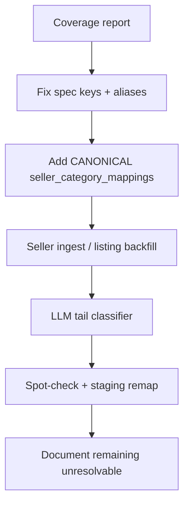

# ALE-112 — Phase 0 tail: resolve remaining products without `canonicalCategoryId`

## Context

**Linear:** [ALE-112](https://linear.app/dewly/issue/ALE-112/ale-109-phase-0-tail-resolve-remaining-5703-products-without) (child of [ALE-109](https://linear.app/dewly/issue/ALE-109/fixing-miscellaneous-bugs))

**Parent plan:** [ALE-109-shopping-agent-product-search-quality.md](./ALE-109-shopping-agent-product-search-quality.md) — Phase 0 steps 1–6. This ticket is the leftover data work after the deterministic backfill shipped.

**Already shipped (do not redo):**

- Backend [PR #57](https://github.com/alex-the-programmer/commerce-platform-backend/pull/57) — Option B columns on `products`, matcher, ingest resolve/apply, `--force` backfill
- Scrapers [PR #23](https://github.com/alex-the-programmer/commerce-platform-scrapers/pull/23) — ingest hook, Style Korean catalog API, listing-category backfill, `--force` CLI

**Parallel work — do not touch:** another agent is implementing ALE-109 **Phase B** (search correctness) in the main worktree on `commerce-platform-backend` branch `ALE-109-phase-b-search-correctness`. ALE-112 must not edit `searchProducts.ts`, `listCategories.ts`, shopping-agent prompts/tools, or that branch.

**This worktree:** `/Users/alexmarchenko/Projects/alexAndInseongWorkspace2-ALE-112`

| Repo | Branch (off `origin/main`) |
|------|----------------------------|
| workspace | `ALE-112-phase-0-tail-canonical-categories` |
| `commerce-platform-backend` | `ALE-112-phase-0-tail-canonical-categories` |
| `commerce-platform-scrapers` | `ALE-112-phase-0-tail-canonical-categories` |

**Source of truth for catalog-dedup:** `commerce-platform-backend/packages/catalog-dedup`. Do not edit the leftover workspace clone at `packages/catalog-dedup` (that clone caused the broken `../../commerce-platform-backend` script paths on PR #57).

---

## Problem statement

Shopping search still cannot filter on canonical leaves until almost all **shopper-presentable** products have `products.canonicalCategoryId`. Phase 0 infrastructure is in; coverage is not.

### Presentable = `sellers.linkable = true`

Cards and buy links only use sellers with `sellers.linkable = true` (`getLowestPriceLinkableOffer` / ALE-44). Specs and reviews may still come from unlinkable sellers; this ticket does **not** spend ingest/LLM effort on stores we never send the shopper to.

**Unlinkable today (local):** Olive Young Global (`id=50`), Seoul Glow Shop (`id=1`), Pacific Coast K-Beauty (`id=2`).

**Tester Korea (`id=488`)** is still `linkable = true` in the DB. Local catalog: **all 1,557 listings are $0–$1** (median $1, max $1; Jolse median is $23). About 370 look like sample packs (≤30ml/g or sachet `PIECE`); many titles use `[S]`. Full-size ml amounts at $1 are probably scrape placeholders, but we should not send shoppers there. Treat as out of scope and **set `sellers.linkable = false`**. Until that flip, 1,213 products exist only on Tester Korea among linkable sellers and would drag the 95% gate.

**Denominator for 95% / 99%:** non-merged products that have **at least one** `seller_products` row on a seller with `linkable = true` (after the Tester Korea flip). Products that exist only on unlinkable sellers are reported separately and do not block acceptance.

The ticket’s **5,703 / 64.3%** figure is stale in two ways: it predates the tightened matcher, and it counted Olive Young Global (high coverage, never shown).

**Current numbers (local `commerce_platform`, 2026-09-01, after ALE-112 matcher/mapping/`--force`):**

| Metric | All non-merged | Presentable (`linkable`, TK unlinkable) |
|--------|---------------:|----------------------------------------:|
| Products | 15,970 | **9,839** |
| With `canonicalCategoryId` | 9,666 (60.5%) | **5,383 (54.7%)** |
| Unresolved | 6,304 | **4,456** |
| Baseline this ticket started from | 9,191 (57.6%) | **4,950 (50.3%)** |

Presentable source mix: `seller_category_mapping` 3,240 · `retailer_path` 2,143 · `llm`/`manual` 0.

Presentable leaves: Skincare subtree **1,238** · Sun care subtree **75**.

Of 4,456 presentable unresolved: **3,533 have no category spec** (Jolse 1,477 · Style Korean 1,082 · RoseRoseShop 748). Remaining ~923 have a spec that is unmatched merch (`GWP`/`Bundle`/`free`/`set`) or OY US `All Products` breadcrumbs (~498).

OY Global unmatched paths (hair/tools/K-pop) look large (686) but only **29** of those products also have a linkable listing. Skip dedicated OY Global alias work.

**Staging (2026-08-30 remap, all products):** 5,764 / 15,970 (36.1%), all `retailer_path`. Staging is missing mapping-sourced assignments because most `seller_category_mappings` still target **STAGING** buckets. Re-run the presentable report on staging after the next remap.

Ticket acceptance: **≥95% of presentable products**, **≥99% for Skincare + Sun care** among presentable products whose retailer/listing signal is in those trees, coverage report split by linkable vs not, remaining tail documented by source.

---

## Database changes

**None required.** Reuse existing Option B columns:

| Table | Column | Role |
|-------|--------|------|
| `products` | `canonicalCategoryId` | FK → `product_categories.id`, already nullable, `ON DELETE SET NULL` |
| `products` | `canonicalCategorySource` | `retailer_path` \| `seller_category_mapping` \| `llm` \| `manual` (already in code) |
| `products` | `canonicalCategoryConfidence` | 0–1; review filter for low-confidence LLM |
| `seller_category_mappings` | existing unique `(sellerCategoryId, productCategoryId)` | **Additive CANONICAL rows** — do not delete STAGING mappings |

**Not in this ticket (would need architect approval):** a review-queue table, new `AiLlmUserAction` enum value, `seller_products.sellerCategoryId`. Low-confidence LLM rows are queried with `canonicalCategorySource = 'llm' AND canonicalCategoryConfidence < threshold`. Manual fixes set `source = 'manual'`.

**Data update (no migration):** `UPDATE sellers SET linkable = false WHERE name = 'Tester Korea'` so the presentation flag matches reality. Confirm Olive Young Global is already `linkable = false`.

---

## What already exists

| Sub-problem | Existing code |
|-------------|---------------|
| Path → canonical leaf | `matchRetailerPathToCanonical` (alias + exact only; `contains` removed) |
| Spec-key inventory | `retailerCategoryPathSpecs.ts` (`RETAILER_CATEGORY_PATH_SPEC_KEYS_BY_SELLER_ID`) |
| Resolve + apply + overwrite guards | `resolveAndApplyProductCanonicalCategory`, `applyProductCanonicalCategory` |
| Bulk remap | `backfillProductCanonicalCategories` + scrapers `npm run backfill:canonical-categories:useBackendEnv -- --force` |
| Listing-name → seller category → mapping | `LISTING_SELLER_CATEGORY_NAME_SPEC` + `resolveCanonicalCategory` (CANONICAL-only) |
| Style Korean catalog dump | `fetchStyleKoreanCatalogProducts` + listing backfill (`--seller-id=52`) |
| Jolse listing HTML backfill | same script, `--seller-id=484` (weak: 1,526 / 1,727 still unresolved) |
| Ingest hook | `upsertProductSpecStringRows` calls resolve when `sellerId` is passed |
| LLM batch-script pattern | `commerce-platform-backend/scripts/llmIngredientKnowledge*.ts` (not `trackedAgentGenerate` — that requires `userId`) |

Resolver order today: retailer breadcrumb/product-type path → `seller_category_mappings` via listing name. Unmapped → leave null (or clear on `--force`). LLM source is typed but unused.

---

## Unresolved by **linkable** seller (local, 2026-08-31)

Counts are listings on `linkable = true` sellers. A product on two sellers appears in both rows; the 95% gate is per product, not per listing.

| Seller | id | Catalog | Assigned | Unresolved | Coverage | In scope? |
|--------|----|--------:|---------:|-----------:|---------:|-----------|
| Style Korean | 52 | 4,739 | 3,632 | 1,107 | 76.6% | Yes — catalog-API tail |
| Jolse | 484 | 1,727 | 201 | 1,526 | 11.6% | Yes — almost no path/listing spec |
| Tester Korea | 488 | 1,557 | 282 | 1,275 | 18.1% | **No** — do not present; flip `linkable` to false |
| RoseRoseShop | 486 | 1,224 | 337 | 887 | 27.5% | Yes — missing / generic `RR Product type` |
| Olive Young US | 483 | 874 | 371 | 503 | 42.4% | Yes — breadcrumbs are `All Products` only |
| Skinglow Haven | 499 | 513 | 355 | 158 | 69.2% | Yes — path exists, taxonomy miss |
| Moida | 491 | 355 | 196 | 159 | 55.2% | Yes — product-type miss / generic |
| Soko Glam | 485 | 418 | 288 | 130 | 68.9% | Yes — leftover generics |
| Others (linkable) | — | — | — | ~503 | — | Yes if still unresolved after Phases 2–3 |
| Olive Young Global | 50 | 5,441 | 4,755 | 686 | 87.4% | **No** — `linkable = false`; 29 unresolved also have a linkable listing |

**Out of scope sellers:** `linkable = false` (OY Global, Seoul Glow Shop, Pacific Coast K-Beauty) and Tester Korea once the flag is flipped. Ingest hooks may still stamp canonical ids as a side effect; we do not add aliases, listing backfills, or LLM spend for those stores.

**Failure-mode note:** OY Global’s unmatched hair/tools/K-pop paths are real matcher gaps, but they sit on products we do not show. Only 33 unresolved products (any seller) have `Listing seller category name`.

---

## Approach

Deterministic first, LLM last. Re-run `backfill:canonical-categories --force` after each deterministic wave (never overwrites `manual`). Staging remap must use Neon’s **direct** host, not the pooler (P1017 after ~32 min on the last run).



### Phase 1 — Coverage report (measurement)

Add a read-only report used after every wave and as the acceptance check.

**Scrapers script:** `scripts/reportProductCanonicalCategoryCoverage.ts`  
`npm run report:canonical-categories:useBackendEnv`

Print two slices: **all non-merged** (debug) and **presentable** (the gate). Presentable = has ≥1 `seller_products` on `sellers.linkable = true`.

- Overall % with `canonicalCategoryId` (presentable is the 95% target)
- By `canonicalCategorySource`
- By seller, including `linkable` so unlinkable rows are obviously excluded from the gate
- By canonical top-level subtree (Skincare, Sun care, …) on presentable products
- Unresolved buckets: no spec signal / path present but unmatched / listing name with no CANONICAL mapping / orphan
- Skincare + Sun care **signal coverage** on presentable products: of those whose extracted retailer path or listing name matches those trees, what % have a canonical id in that subtree (99% target)

Unit-test the aggregation with a fake Prisma (include a `linkable: false` seller that must not enter the gate). The 95% check is this report against local/staging, **not** GitHub Actions — CI has no catalog DB.

### Phase 2 — Spec-key bugs + matcher aliases (cheap, high confidence)

**2a. Wrong seller keys** in `RETAILER_CATEGORY_PATH_SPEC_KEYS_BY_SELLER_ID`:

| Seller id | Actual seller | Today | Fix |
|-----------|---------------|-------|-----|
| 488 | Tester Korea | `SGH Categories` | Remove (out of presentation scope; do not add TK path specs) |
| 489 | BeautyNet Korea | `SGH Categories` | Remove or add real BNK keys if they exist in specs |

**2b. Aliases for unmatched paths on linkable sellers** (last-segment exact/alias only — do **not** bring back `contains` or one-word `cream`/`mask`/`set`/`face` on multi-segment breadcrumbs). Pull the unmatched-path list from the presentable report (Skinglow Haven, Shopify types, etc.).

**Skip Olive Young Global unmatched tails** (Extra Tools, K-Pop Albums, Hair Essence & Serum, …). They dominate the all-catalog unmatched list and sit on `linkable = false` products.

**2c. Product-type-only generic labels** (Shopify `RR Product type` = `Cream`, `Mask`, `Ampoule` with **no parent path**). Allow a **separate** single-segment map used only when the raw value has no `>`. Do not apply those generics to the last segment of a breadcrumb (`Sun Care > Cream` must stay sun care). This recovers RRS/Soko/Moida rows that have a type but were correctly refused by the tightened matcher.

Tests: extend `matchRetailerPathToCanonical.test.ts` with linkable-seller unmatched paths and the `Sun Care > Cream` non-regression. Do not add OY Global K-pop/tools cases as required coverage for this ticket.

### Phase 3 — CANONICAL `seller_category_mappings` (staging’s 36% → closer to local 58%)

`resolveCanonicalCategory` already ignores STAGING targets. Locally 205 CANONICAL mapping rows produce 3,270 product assignments; staging has essentially none of those assignments.

**Script** in catalog-dedup bulk + scrapers CLI:

1. For each `seller_categories` row, run `matchRetailerPathToCanonical(name)` (and parent path if we store hierarchy).
2. If matched, `INSERT` a mapping to that CANONICAL id with `source = 'retailer_path_alias'`, `confidence` from the matcher. Skip if the pair already exists.
3. **Do not delete** STAGING mappings (scrapers / staging buckets still use them).
4. Re-run product canonical backfill without requiring `--force` for nulls; `--force` after if we want mapping to win over a weaker path.

This is a **data** write to `seller_category_mappings`, not a schema change.

Also add the 26 Jolse + 2 Style Korean listing names that have a listing spec but no mapping row (ticket failure mode 3 — locally only 33 unresolved still have a listing spec).

### Phase 4 — Seller ingest / listing backfill

Only after Phase 1 so we can see delta per seller.

**Jolse (484, 1,526 unresolved):** listing backfill already exists and barely moved the needle. Diagnose before writing more scraper: SKU join (`retailerSku` vs `products.sku`), `list.html` pagination, extract function. Fix the join or extraction; re-run `--seller-id=484`. If HTML listing cannot cover the tail, extract breadcrumb from Jolse PDP (`jolsePdp.ts`) into a `JL …` spec key and register it in `retailerCategoryPathSpecs.ts`.

**Tester Korea (488):** out of scope. No listing backfill, no PDP breadcrumb work. Flip `sellers.linkable` to `false`.

**Style Korean tail (52, 1,107):** products in DB from sitemap/PDP but absent from `GET /api/v2/products`. Options, in order: (1) PDP breadcrumb on `/product/{slug}/{id}` written as a spec, (2) LLM in Phase 5. Do not pretend the catalog API will grow.

**RoseRoseShop (486, 887):** 751 have no `RR Product type`. Confirm `mapRoseRoseShopProductJsonToSpecRows` always writes product type / collections. Shopify collections → listing category name or a `RR Collections` spec. Phase 2c handles the 136 that already have a generic type.

**Olive Young US (483, 503):** 479 are `All Products` only. Need collection/category from the OY US listing API or a second breadcrumb source — not more matcher aliases for “All Products”.

**YesStyle / Soko Glam / Peach & Lily / Wishtrend:** inventory spec keys via the coverage report; add missing keys only where specs already exist in `product_seller_specs`. Do not start new scrapes unless the report shows a large no-signal bucket.

### Phase 5 — LLM tail classifier

For products that still have **no usable path and no CANONICAL mapping** after Phases 2–4.

**Where:** `commerce-platform-backend/scripts/` (scrapers have no LLM client). Shared classify function in `catalog-dedup` if it stays pure (prompt + parse + id allowlist) so it is unit-tested without calling the network.

**Do not** use `trackedAgentGenerate` (requires `userId` + `AiLlmUserAction`; adding an enum value is a schema change). Follow `llmIngredientKnowledge*.ts`: script + model env var, Langfuse optional.

**Input:** product name, brand name, up to N spec strings (title-like / category-like only; skip image URLs).

**Output:** JSON `{ canonicalCategoryId, confidence, reason }` constrained to the 82 ids in `canonicalTaxonomy.ts`. Reject unknown ids.

**Write:** `source = 'llm'`, confidence from the model (or a calibrated constant if the model has no score). Skip write if confidence `< 0.75` (tunable). Never overwrite `manual`; `--force` may overwrite `llm` / `retailer_path` per existing guards.

**Cost:** budget for the **presentable** unresolved set after Phases 2–4 (about 5k now; lower once Jolse/RRS/SK move). Do not classify unlinkable-only products (OY Global-only, TK-only after the flag flip). Batched, `gpt-4o-mini` or the ingredient-script default. Dry-run first on 100 stratified presentable rows; spot-check before full write.

**Review:** `SELECT` where `source = 'llm' AND confidence < 0.85` — no new table.

### Phase 6 — Hygiene, accuracy, staging

- Flip `sellers.linkable = false` on Tester Korea (and confirm OY Global is already false on staging).
- 32 orphans: list ids/names; merge or leave. They are not presentable; do not block 95%.
- Stratified spot-check on **presentable** rows: 20 per source (`retailer_path`, `seller_category_mapping`, `llm`) and 20 from Skincare + Sun care. Log disagreements; fix aliases or mark `manual`.
- Staging: wait until backend deploy has the migration (already merged). Run the presentable report, then canonical backfill on **direct** Neon host. Resume by skipping already-set rows (not `--force` unless matcher/mapping logic changed).
- Update Linear ALE-112 with the presentable baseline (**50.3%** local if TK is unlinkable, **44.9%** if not), not 64.3%.

### Out of scope

- Phase B search / `listCategories` CANONICAL-only filter (other agent; shipping that filter before ~95% still empties search)
- Phase C workflow vs one agent
- Phase D sunburn E2E (needs Phase B + this coverage)
- Deleting STAGING buckets or remapping `products.categoryId`
- Editing workspace `packages/catalog-dedup`
- New migrations / review-queue table
- Olive Young Global / Tester Korea listing backfill, PDP breadcrumbs, or dedicated matcher aliases
- LLM classification of unlinkable-only products

---

## Test plan

| Area | Test |
|------|------|
| Coverage report | Fake Prisma: presentable vs all; unlinkable seller excluded from the gate; Skincare-signal 99% helper |
| Matcher aliases | Linkable-seller unmatched paths → expected leaf; `Sun Care > Cream` still 12 not 114; `Makeup > Set` still not gift sets |
| Single-segment generics | `Cream` alone → 114; `Skincare > Cream` does **not** use the generic cream map |
| Spec keys | 488/489 no longer read `SGH Categories` |
| Mapping backfill | Inserts CANONICAL pair; skips existing; leaves STAGING row |
| Apply guards | `manual` skip; lower confidence skip; `--force` overwrite auto |
| LLM parser | Valid id applied; unknown id rejected; below-threshold not written; unlinkable-only products not selected |
| Scrapers ingest | Jolse/RRS: when the new spec is present, `resolveAndApply` is called with `sellerId` (existing upsert test pattern) |

Pre-push: `npm test` in `packages/catalog-dedup`; scrapers tests for touched upserts/scripts; `npm run lint` + `npm run build` in both repos.

---

## Runbook (after code lands)

```bash
# From commerce-platform-backend (this worktree)
npx dotenv-cli -e .env -e .env.local -- tsx scripts/catalog-dedup/report-canonical-category-coverage.ts
npx dotenv-cli -e .env -e .env.local -- tsx scripts/catalog-dedup/backfill-seller-category-canonical-mappings.ts --dry-run
npx dotenv-cli -e .env -e .env.local -- tsx scripts/catalog-dedup/backfill-seller-category-canonical-mappings.ts
npx dotenv-cli -e .env -e .env.local -- tsx scripts/catalog-dedup/backfill-product-canonical-categories.ts --force --dry-run
npx dotenv-cli -e .env -e .env.local -- tsx scripts/catalog-dedup/backfill-product-canonical-categories.ts --force

# From commerce-platform-scrapers (after npm install; catalog-dedup now points at the backend package)
npm run report:canonical-categories:useBackendEnv
npm run backfill:seller-category-canonical-mappings:useBackendEnv
npm run backfill:canonical-categories:useBackendEnv -- --force
```

# LLM tail (backend)
npx dotenv-cli -e .env -- tsx scripts/classifyProductCanonicalCategoriesLlm.ts --dry-run --limit=100
npx dotenv-cli -e .env -- tsx scripts/classifyProductCanonicalCategoriesLlm.ts
```

Staging: same report + backfill on the direct DB URL. Kill/resume if the pooler drops the connection.

---

## TODO

- [x] Set `sellers.linkable = false` on Tester Korea locally (OY Global already false locally; staging flag + remap still Phase 6)
- [x] Phase 1: coverage report with presentable (`linkable`) vs all slices + unit tests; capture sample output in the PR description
- [x] Phase 2a: remove Tester Korea / BeautyNet Korea `SGH Categories` spec-key map
- [x] Phase 2b: aliases for unmatched paths on **linkable** sellers + non-regression tests (skip OY Global K-pop/tools tails)
- [x] Phase 2c: single-segment-only generic product-type map
- [x] Phase 3: additive CANONICAL `seller_category_mappings` backfill + missing Jolse/SK listing-name rows
- [x] Re-run local canonical `--force`; record presentable coverage vs **50.3%** baseline (TK unlinkable)
- [ ] Phase 4: Jolse listing/PDP diagnosis + fix; SK PDP breadcrumb; RRS product type/collections; OY US collections if cheap — **no Tester Korea / OY Global ingest work**
  - [x] Code: Jolse leaf `/category/{slug}/{id}/` discovery, paginate until empty, skip NEW/BEST/TIME DEAL, `JL product_no` join
  - [x] Code: Style Korean PDP `categoryDepth*` → `SK category path` + listing name
  - [x] Code: RoseRoseShop collection listing name on ingest
  - [x] Code: Olive Young US listing `category_path` (strip All Products)
  - [ ] Re-run Jolse seller-category hierarchy + listing backfill `--seller-id=484`, then canonical `--force`
  - [ ] Re-run OY US / RRS category-products ingest and SK PDP enrich for the no-spec tail
- [ ] Phase 5: LLM classifier on presentable unresolved only + parser tests + 100-row dry-run spot-check, then full tail
- [ ] Phase 6: stratified accuracy sample on presentable rows; staging remap on direct host
- [ ] Confirm ≥95% **presentable** and ≥99% Skincare/Sun-care signal coverage (or document remaining unresolvable with counts)
- [x] Do **not** change search / `listCategories` in this ticket
