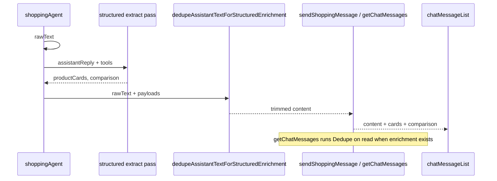

# ALE-14 Remove redundant info from the agent responses

## Context

[Linear ALE-14](https://linear.app/alexandinseongprojects/issue/ALE-14/remove-redundant-info-from-the-agent-responses): when an assistant turn also renders **product cards** and/or a **Quick compare** block, the accompanying **text bubble must not repeat** the same catalog facts (names, prices, ratings, per-SKU pros/cons, etc.). Users should read framing in prose and details in structured UI.

The ticket screenshot shows the failure mode: a long prose block listing three hand creams with ratings, then a **Quick compare** table with the same attributes.

**Repo scope:** `commerce-platform-backend` (primary). `commerce-platform-frontend` already renders `content` + `comparison` + cards correctly — no UI changes unless we add a defensive empty-state (unlikely).

**Branch:** `alexmtruecar/ale-14-remove-redundant-info-from-the-agent-responses` (Linear) or `ALE-14-remove-redundant-info-from-the-agent-responses` (team convention).

**Database changes:** None.

**Shipped:** [commerce-platform-backend#14](https://github.com/alex-the-programmer/commerce-platform-backend/pull/14) (merged).

**Related work:**

- [ALE-15](ale-15-ingredients-display-in-product-cards.md) — ingredient strips on cards; prose may still duplicate `topIngredients` / `heroActives` unless this ticket strips them.
- [ALE-44](ALE-44-olive-young-us-product-links.md) — PDP URLs on cards; prose should not paste links when cards exist (already in agent instructions).

---

## Current state

| Layer | Location | Behavior today |
| ----- | -------- | -------------- |
| Agent instructions | `src/agents/shoppingAgent.ts` | Tells model: cards are authoritative; no SKU markdown lists; short wrap-up only |
| Per-turn system nudge | `invokeShoppingAgent.ts` | `**Cards, not prose lists:**` + checkout/comparable nudge |
| Structured extraction | `invokeShoppingAgent.ts` → 2nd `trackedAgentGenerate` | Fills `productCards` + optional `comparison` from `assistantReply` + tools |
| Text normalization | `normalizeAssistantText.ts` | Strips markdown syntax only — **no** deduplication vs cards/compare |
| Card suppression | `shouldSuppressProductCardsForAssistantText.ts` | Hides cards on discovery-tone replies — **orthogonal** to text redundancy |
| Persistence | Mastra thread memory | Assistant `content` = raw model text |
| Enrichment | `shopping_assistant_enrichment` JSON | `productCards`, `comparison` keyed by `mastraMessageId` |
| API read path | `getChatMessages.ts` | `content` from Mastra memory + enrichment joined by message id |
| API write path | `sendShoppingMessage.ts` / `startShoppingConversation.ts` | Returns `content: text` from `invokeShoppingAgent` |
| Frontend | `chatMessageList.tsx` | Renders `m.content`, then `ShoppingProductComparisonBlock` when `comparison` + cards exist |

```37:41:commerce-platform-backend/src/agents/shoppingAgent.ts
**Storefront product cards (authoritative UI):** The app renders **product cards** under your message with names, prices, retailers, ratings, and purchase links from the database. Treat cards as the **only** place for per-SKU detail in a recommendation turn.

- **Do not** duplicate catalog picks as markdown or plain text: no `###` headings, numbered lists of products, per-product "Benefits / Price / Where to buy" blocks, markdown images, or tables of SKUs.
```

**Gap:** Instructions exist but the model still emits per-product blocks (especially on multi-SKU compare turns). There is **no server-side enforcement** on the string returned to clients or stored in Mastra memory.

---

## Gap analysis

| Area | Today | Target (ALE-14) |
| ---- | ----- | ----------------- |
| Assistant `content` with cards | Often lists each SKU (name, rating, price, bullets) | Short framing only (why these picks, how to use the UI) |
| Assistant `content` with comparison | Often repeats pros/cons/best-for/finish/ratings already in Quick compare | No duplicate attribute rows; optional one-line intro |
| Chat reload | Same redundant text from Mastra memory | Same deduped text user saw on send (see read-path) |
| Discovery turns (no cards) | Questions only | Unchanged |
| `wantsRepeatCards` shortcut | Fixed short text + replayed enrichment | Already OK |
| Memory fact extraction | Uses `userMessage` + card metadata, not assistant prose | Unaffected |
| Cost / latency | One main agent + one extraction pass | Prefer **deterministic** dedupe; avoid a third LLM pass unless necessary |

---

## Design decisions

### 1. Enforce on the server after structured enrichment is known (locked)

Prompt-only fixes are insufficient because:

- The main agent reply is generated **before** the extraction pass knows whether `comparison` will be attached.
- Models routinely violate “don’t list SKUs” even with strong system text.

**Approach:** After `productCards` and `comparison` are finalized in `invokeShoppingAgent`, run a pure function:

`dedupeAssistantTextForStructuredEnrichment(text, { productCards, comparison }) → string`

Use the result as the `text` returned to GraphQL and logged for the turn.

### 2. Deterministic dedupe first; LLM rewrite only as optional fallback (locked)

- **v1:** Regex / paragraph heuristics + phrase matching from card/compare payloads. Fast, testable, no extra tokens.
- **Do not** add a third `trackedAgentGenerate` in v1 unless deterministic dedupe fails acceptance tests on real transcripts.
- If v1 leaves edge cases, a follow-up ticket can add a cheap condense pass (`max_tokens` small, no tools).

### 3. Apply dedupe on read for historical messages (locked)

`getChatMessages` reads assistant `content` from **Mastra memory**, which will still contain verbose text for old turns unless we patch memory.

- When joining enrichment and `(productCards.length > 0 || comparison)`, run the **same** dedupe function on `content` before returning.
- Delivers consistent UX for existing chats without a backfill migration.

### 4. Mastra memory patch — investigate, not blocking (locked)

Ideal: overwrite the assistant message body in Mastra after dedupe so **future turns** in the thread don’t see SKU lists in context.

- Spike whether `@mastra/memory` exposes update/delete for a message by id.
- If not available in v1, rely on read-path dedupe + stronger prompts; log a follow-up.

### 5. Fallback copy when dedupe removes everything (locked)

Never return an empty bubble.

Priority:

1. If `comparison?.summary` is non-empty → use it (single paragraph; UI still shows full table).
2. Else if any cards → `"Here are my top picks — compare them in the table below."` (or without “table” when no comparison).
3. Else keep original text (shouldn’t happen when dedupe gate is off).

Tune copy to match product voice (warm, brief).

### 6. What counts as “redundant” (locked)

**When `productCards.length > 0`:**

- Lines or paragraphs that mention a card **product name** (and common variants: brand prefix, substring before size paren like `(50mL)`).
- Standalone **price** / **rating** lines matching `priceLabel` / `ratingLabel` on a card.
- Numbered or bulleted **per-product blocks** (`1. …`, `2. …`, `• Brand Product …`).
- Markdown-style per-product sections (headings already stripped by `normalizeAssistantText`, but keep detecting “Name — rating — price” patterns).

**When `comparison` is present (additional):**

- Bullet lines that substantially match any `pros`, `cons`, `watchouts`, `bestFor`, or `finish` on comparison items (case-insensitive, normalize whitespace).
- Repeating the comparison `summary` verbatim in prose when the UI shows the same summary above the table.

**Keep in prose:**

- User-specific framing (“for very dry hands”, “you asked for fragrance-free”).
- Discovery questions (no cards → dedupe not run).
- Warnings not present in structured payloads.

### 7. Frontend scope: none for v1 (locked)

`ChatMessageList` already renders structured blocks below `content`. No collapse/hide rules in the client — single source of truth in backend `content`.

### 8. Prompt tightening still worth doing (locked, low cost)

Update copy in:

- `shoppingAgent.ts` — add explicit **Quick compare** paragraph: when compare table renders, reply must be ≤2 sentences and must not restate row attributes.
- `invokeShoppingAgent.ts` `STRUCTURED_OUTPUT_INSTRUCTIONS` — note that `assistantReply` in the extraction prompt may be trimmed server-side; extraction should still use full digest for cards/compare.
- Per-turn system string — when `toolSummary` suggests multiple finalists (≥2 products with detail), append one line: “A comparison table will appear below; do not enumerate SKUs in your reply.”

These reduce how much dedupe must remove but are not the deliverable alone.

---

## Architecture



---

## Implementation steps

### 1. New module: `dedupeAssistantTextForStructuredEnrichment.ts`

**Path:** `commerce-platform-backend/src/interactions/chat/dedupeAssistantTextForStructuredEnrichment.ts`

**Exports:**

```ts
export type DedupeStructuredEnrichmentInput = {
  productCards: Array<Pick<ShoppingProductCardPayload, "name" | "priceLabel" | "ratingLabel" | "retailerName">>;
  comparison?: ShoppingComparisonPayload;
};

export default function dedupeAssistantTextForStructuredEnrichment(
  text: string,
  input: DedupeStructuredEnrichmentInput,
): string;
```

**Implementation sketch:**

- Early return if `!text.trim()` or no cards and no comparison.
- Build `nameVariants` from each card name (full string; strip parenthetical size; first token brand).
- Split into paragraphs (`\n\n`) and lines; score each paragraph for redundancy:
  - Contains ≥1 name variant + (rating or price pattern or list marker) → drop.
  - Matches comparison bullet lexicon → drop when comparison present.
- Rejoin; `normalizeAssistantText` already ran — call trim / collapse blank lines again.
- Apply fallback copy per §5 if result too short (e.g. `< 40` chars or only punctuation).

**Helpers (private, unit-tested):**

- `buildProductNameVariants(name: string): string[]`
- `paragraphMentionsCatalogSku(paragraph, variants, cardFields)`
- `paragraphDuplicatesComparisonFacts(paragraph, comparison)`
- `isMostlyRedundantParagraph(...)`

### 2. Wire into `invokeShoppingAgent.ts`

After comparison is built (before `return { text, ... }`):

```ts
const displayText =
  productCards.length > 0 || comparison
    ? dedupeAssistantTextForStructuredEnrichment(text, { productCards, comparison })
    : text;
```

Return `displayText` as `text`. Keep `rawText` only in logs if useful for debugging (`[ShoppingAgent] text dedupe` with before/after char counts).

Pass **full** `text` into the extraction prompt (unchanged) so structured output quality does not regress.

### 3. Wire into `getChatMessages.ts`

For `role === "assistant"` when enrichment has cards or comparison:

```ts
content = dedupeAssistantTextForStructuredEnrichment(content, {
  productCards,
  comparison,
});
```

### 4. Prompt updates (backend only)

Files:

- `src/agents/shoppingAgent.ts`
- `src/interactions/chat/invokeShoppingAgent.ts` (`STRUCTURED_OUTPUT_INSTRUCTIONS` + optional dynamic nudge when multiple products in `toolSummary`)

Keep edits minimal — one short paragraph each.

### 5. Unit tests

**Path:** `commerce-platform-backend/src/__tests__/interactions/chat/dedupeAssistantTextForStructuredEnrichment.test.ts`

Cases (fixture strings from ticket-style output):

| Case | Input | Cards/compare | Expect |
| ---- | ----- | ------------- | ------ |
| Cream compare (screenshot) | Long prose naming 3 creams + ratings | 3 cards + comparison | Prose shortened; no product names; fallback or summary only |
| Cards only | Numbered list with prices | 2 cards, no comparison | No numbered SKU block |
| Discovery | “What’s your skin type?” | none | Text unchanged |
| Framing kept | “Since you wanted fragrance-free, I focused on…” | 2 cards | Framing sentence kept |
| Comparison bullets | Prose repeating pros/watchouts | comparison with items | Duplicate bullets removed |
| Empty after strip | Only SKU list | cards | Fallback string, non-empty |

Use real card names from ticket example (ILLIYOON, Dr.Jart+, INNISFREE) as test data.

### 6. Manual QA

1. Send `cream` (or similar) → assistant message with Quick compare: text ≤ ~2–4 sentences, no per-SKU ratings in bubble.
2. Reload chat → same trimmed text (read-path).
3. Ask discovery question → no cards, normal conversational reply.
4. “Show cards again” → still short canned text + cards.
5. Single-product recommendation with one card → no price/rating line in prose.

### 7. Pre-push (backend)

```bash
cd commerce-platform-backend
npm run lint
npm run build
npm test
```

---

## Out of scope

- Changing Quick compare layout or rows ([`shoppingProductComparison.tsx`](../commerce-platform-frontend/components/shoppingProductComparison.tsx)).
- Hiding product card groups when comparison is shown (already handled: discount cards exclude compared ids).
- Third LLM “rewrite for brevity” pass (follow-up if needed).
- Translating or changing comparison/card **content** generation.
- Database / GraphQL schema changes.

---

## Risks and mitigations

| Risk | Mitigation |
| ---- | ---------- |
| Over-stripping removes useful nuance | Paragraph-level scoring; keep paragraphs without name+attribute signals; tests for “framing kept” |
| Name variant false positives (common words) | Prefer matching multi-token product titles; require brand+product or full card name |
| Mastra context still verbose | Read-path fixes UI; optional memory patch follow-up |
| Extraction pass uses trimmed text in prompt | Continue passing pre-dedupe `text` into extraction only |

---

## TODO

- [x] Add `dedupeAssistantTextForStructuredEnrichment.ts` + helpers
- [x] Unit tests with screenshot-style fixtures
- [x] Integrate in `invokeShoppingAgent.ts` (return deduped `text`)
- [x] Integrate in `getChatMessages.ts` (read-path for enriched assistant messages)
- [x] Tighten prompts in `shoppingAgent.ts` and `invokeShoppingAgent.ts`
- [ ] Spike Mastra message update API (optional follow-up if blocked)
- [ ] Manual QA checklist (compare turn, cards-only, discovery, reload)
- [x] `npm run lint`, `npm run build`, `npm test` in backend
