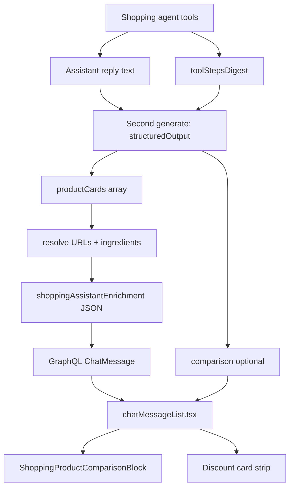

# ALE-18 Fix recommendation of similar products

## Context

[Linear ALE-18](https://linear.app/alexandinseongprojects/issue/ALE-18/fix-recommendation-of-similar-products): when the assistant shows **“Want to try something close with a discount?”**, the product cards under that heading duplicated products already shown in the **Quick compare** table (same SKU, sometimes with a discount badge).

**Branch (Linear):** `alexmtruecar/ale-18-fix-recommendation-of-similar-products`

**Repos:** `commerce-platform-backend`, `commerce-platform-frontend`

**Database changes:** None (unless we later add explicit `alternativeProductCards` on enrichment — not recommended for v1).

---

## Is this still an issue? (verification — Jun 2026)

### The UI was not removed

The heading and card strip still live in `commerce-platform-frontend/components/chatMessageList.tsx`:

```213:217:commerce-platform-frontend/components/chatMessageList.tsx
  const hasDistinctDiscountCards = cards.some((card) => {
    if (!card.productId) return true;
    return !comparedProductIds.has(String(card.productId));
  });
  const showDiscountCards = !isUser && cards.length > 0 && hasDistinctDiscountCards;
```

```293:293:commerce-platform-frontend/components/chatMessageList.tsx
                Want to try something close with a discount?
```

### Why it is hard to see in the app today

The discount block renders only when `showDiscountCards` is true. That requires **at least one** `productCard` whose `productId` is **not** in `comparison.items`.

Current agent behavior almost always fills **both** `productCards` and `comparison` on recommendation turns (`invokeShoppingAgent.ts` structured extraction + shopping agent instructions favor compare-then-recommend). When every card is also a compared product, the entire “something close with a discount” section is **hidden** — so it looks removed even though the code path remains.

| Scenario | Quick compare block | “Something close with a discount?” |
| -------- | ------------------- | ---------------------------------- |
| `productCards` + `comparison` with same product IDs | Shown | **Hidden** (common today) |
| `productCards` only (no comparison) | Hidden | Shown (all cards) |
| `productCards` + `comparison` with partial overlap | Shown | Shown — but still renders **all** cards, including duplicates |

### Partial fix already shipped (frontend)

[ALE-14](ALE-14-remove-redundant-info-from-the-agent-responses.md) documented: *“Hiding product card groups when comparison is shown (already handled: discount cards exclude compared ids).”* That is only half true:

- **Done:** hide the whole discount section when there are zero non-compared cards.
- **Not done:** when the section **does** show, map over **all** `cards`, not `cards.filter(id ∉ comparison)`.
- **Not done:** backend does not separate “finalists for compare” vs “cheaper alternatives” — one `productCards` array feeds both UIs.

### Original bug can still reproduce

1. Extraction returns 3 compared products + 1 extra card that is actually the same `productId` as a compared row (unlikely but possible if IDs differ by merge/alias — see below).
2. Partial overlap: 2 compared + 3 cards where 2 match → section visible with **5 card slots visually** (3 cards rendered, 2 duplicates of compare columns).
3. Cards **without** `productId` (legacy enrichment): `hasDistinctDiscountCards` treats them as distinct → section can show alongside comparison with ambiguous duplicates.

**Conclusion:** Ticket is **still valid** as a data/modeling bug, but **lower urgency** because the dominant UX path hides the section entirely. Before investing in a full fix, confirm with product whether we still want a separate “discounted alternatives” strip or should delete the dead UI.

---

## Current architecture



| Layer | Responsibility |
| ----- | -------------- |
| `shoppingAgent` instructions | Compare finalists; cards are authoritative for SKU detail |
| `STRUCTURED_OUTPUT_INSTRUCTIONS` in `invokeShoppingAgent.ts` | Up to 3 `productCards`; optional `comparison` keyed by `productId` |
| `invokeShoppingAgent.ts` | Filters comparison items to IDs present in cards; no split of roles |
| `getShoppingProductCard(s)` / `resolveShoppingProductCardPdpUrls` | `discountLabel` forced **null** from DB — badges only if extraction invents them |
| `chatMessageList.tsx` | Comparison table + conditional discount strip from same `productCards` |

---

## Gap analysis

| Problem | Root cause | Status |
| ------- | ---------- | ------ |
| Same product in compare + discount strip | Single `productCards` list; UI doesn’t filter rendered discount cards | Partially mitigated by hiding entire strip |
| User can’t find discount strip | Compare flow covers all card IDs → strip hidden | Byproduct of mitigation, not removal |
| “Similar with discount” not actually similar | No extraction rule or tool path for “alternative SKU” vs “finalist” | Open |
| Discount badges misleading | `discountLabel` not computed server-side from offers/coupons | Open (separate from ALE-18 unless in scope) |

---

## Product decision (required before implementation)

Pick **one** path:

### Option A — Keep the feature (recommended if coupons/alternates matter)

**Intent:** Quick compare = finalists; discount strip = **different** `productId`s that are cheaper or coupon-backed alternatives.

**Deliverables:**

1. Server-side partition after extraction (authoritative).
2. Frontend renders only `alternativeProductCards` in the strip (or filtered subset).
3. Extraction prompt rules for alternatives.

### Option B — Remove the feature

**Intent:** One card surface per turn (comparison table **or** card row, not both).

**Deliverables:**

1. Delete discount strip UI and heading from `chatMessageList.tsx`.
2. Close ALE-18 as “won’t fix / superseded by comparison-first UX”.
3. Optional: remove `discountLabel` from chat card UI if unused elsewhere.

### Option C — Minimal patch only

**Intent:** Fix duplicate rendering without schema changes; accept strip stays rare.

**Deliverables:**

1. Frontend: `discountCards = cards.filter(c => !comparedProductIds.has(c.productId))`; render strip only if `discountCards.length > 0`.
2. Backend: dedupe `productCards` by `productId` before persist.
3. Extraction instruction: “`productCards` for compare should match `comparison.items`; do not duplicate IDs.”

---

## Recommended implementation (Option A — if product confirms)

### 1. Backend — partition cards in `invokeShoppingAgent.ts`

After `extracted` / `extractedComparison` are parsed and sanitized:

```ts
const comparedIds = new Set(extractedComparison?.items.map((i) => i.productId) ?? []);
const comparisonCards = extracted.filter((c) => comparedIds.has(c.productId));
const alternativeCards = extracted.filter((c) => !comparedIds.has(c.productId));
```

- Run URL resolution + ingredient enrichment on **`[...comparisonCards, ...alternativeCards]`** (preserve order) **or** enrich separately and rejoin.
- Persist **full** list in `productCards` for GraphQL backward compatibility **or** add optional `alternativeProductCards` on enrichment (only if we want explicit API — prefer filter-on-read for v1).

**Extraction prompt additions** (`STRUCTURED_OUTPUT_INSTRUCTIONS`):

- When filling `comparison`, `comparison.items` must list only true finalists (max 3).
- `productCards` may include additional SKUs **only** when tools show a meaningfully different product (different `productId`) that is a lower price or coupon-eligible alternative — never the same `productId` as a comparison row.
- If no such alternatives exist, omit extra cards; do not pad to 3.

**Dedupe:** `productCards = uniqueBy(productId, [...comparisonCards, ...alternativeCards])` before persist.

### 2. Frontend — render filtered alternatives

In `ChatBubble`:

```ts
const discountCards = cards.filter(
  (card) => !card.productId || !comparedProductIds.has(String(card.productId)),
);
const showDiscountCards = !isUser && discountCards.length > 0;
// map discountCards in the strip, not cards
```

### 3. Tests

| Repo | File | Cases |
| ---- | ---- | ----- |
| Frontend | `src/__tests__/components/chatMessageList.test.tsx` (new) | Comparison + overlapping cards → strip shows only non-compared; all overlap → no strip; cards-only → strip shows all |
| Backend | `src/__tests__/interactions/chat/partitionShoppingProductCards.test.ts` (new helper) | Partition + dedupe by productId |

Extract `partitionShoppingProductCards` pure function in backend for testability.

### 4. Manual QA

1. Prompt that triggers compare (e.g. “compare three moisturizers for dry skin”) → Quick compare visible; discount strip **absent** unless a fourth distinct alternative appears in tools.
2. If tools return a cheaper alternate SKU → strip shows **only** that SKU, not repeats from the table.
3. Reload chat / history → same layout from persisted enrichment.
4. Legacy message with cards but no `productId` → no duplicate strip next to comparison (strip hidden or cards-only behavior documented).

### 5. Pre-push

```bash
cd commerce-platform-backend && npm run lint && npm run build && npm test
cd commerce-platform-frontend && npm run lint && npm run build && npm test
```

---

## Option B / C sketch (if product chooses)

**Option B:** Remove lines 272–304 block in `chatMessageList.tsx`; grep for heading string; update mocks only if we still use them for design reference.

**Option C:** Frontend filter + backend dedupe + one paragraph in `STRUCTURED_OUTPUT_INSTRUCTIONS` — no new modules; ~30 LOC total.

---

## Out of scope (unless explicitly added)

- Computing real `discountLabel` from `listCouponPrograms` / offer sale prices.
- Sponsored / affiliate alternative ranking.
- GraphQL schema split (`comparisonCards` vs `alternativeCards`) — defer unless mobile clients need it.
- Changing Quick compare layout (`shoppingProductComparison.tsx`).

---

## Risks and mitigations

| Risk | Mitigation |
| ---- | ---------- |
| Strip never appears after fix | Expected when no alternatives; log `alternativeCount` in existing `[ShoppingAgent] turn recommendations` |
| LLM still duplicates IDs | Server dedupe + filter; monitor logs |
| Legacy enrichments without productId | Treat missing id as non-compared only when comparison empty |

---

## TODO

- [x] **Product:** Option A (keep + fix).
- [ ] Reproduce on staging with a prompt that returns 3 compared SKUs + 1 alternate (confirm strip visibility).
- [x] Implement backend partition/dedupe (`partitionShoppingProductCards.ts` + `invokeShoppingAgent.ts`).
- [x] Frontend filter + tests (`getDiscountProductCards.ts`, `chatMessageList.tsx`).
- [x] Open PRs against `main` — [backend #15](https://github.com/alex-the-programmer/commerce-platform-backend/pull/15), [frontend #11](https://github.com/alex-the-programmer/commerce-platform-frontend/pull/11) (merged).
- [ ] Manual QA checklist above.
- [ ] Close or update Linear ALE-18 with chosen outcome.
