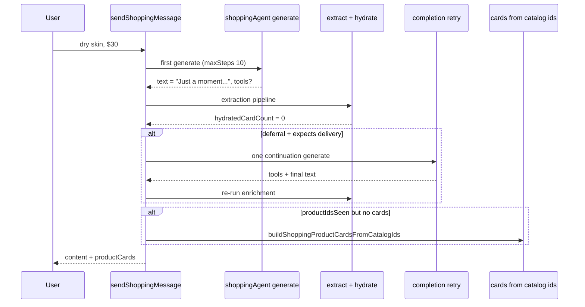

# ALE-40 Incomplete responses (deferral without delivery)

## Context

[Linear ALE-40](https://linear.app/alexandinseongprojects/issue/ALE-40/incomplete-responses): on some shopping turns the assistant **promises** to find or recommend products (“Let me find…”, “Just a moment!”) but the turn **ends without product cards, comparison UI, or a finished recommendation**. The user is left asking follow-ups like “did you recommend me anything?”

**Ticket screenshot (May 2026):**

1. User: “which moisturizers would you recommend”
2. Assistant: discovery question (skin concerns, texture, budget)
3. User: “dry skin, around $30”
4. Assistant (highlighted): “Thanks for sharing, Alex! Let me find some moisturizers that are perfect for dry skin and around your budget of $30. **Just a moment!**”
5. **No cards or follow-up** in the thread; user types “did you recommend me anything?”

**Repo scope:** `commerce-platform-backend` (primary). Frontend renders whatever GraphQL returns (`content` + `productCards` + `comparison`); no UI bug required for v1 unless we add an explicit “still working” state (out of scope).

**Branch:** `alexmtruecar/ale-40-incomplete-responses` (Linear) or `ALE-40-incomplete-responses` (team convention).

**Database changes:** None.

**Related work:**

- [ALE-41](ALE-41-comparison-returns-plain-text-instead-of-cards.md) — **different symptom**: long **compare prose** with **no** cards. **ALE-40** is a **short deferral stub** with **no** delivery. Both share tool-backed enrichment gaps; card fallback from `toolStepsDigest` (ALE-41 §3) also fixes ALE-40 when tools ran but cards were dropped.
- [ALE-14](ALE-14-remove-redundant-info-from-the-agent-responses.md) — dedupe when cards **exist**; does not fix empty deferral turns.
- WIP on disk (not committed): `shoppingEnrichmentOutcome.ts` + tests — enrichment `dropReason` logging from ALE-41; **extend** for ALE-40 `deferralIncomplete` (see §6).

---

## ALE-40 vs ALE-41 (not the same bug)

| | ALE-40 (this ticket) | ALE-41 |
| --- | --- | --- |
| **Symptom** | Short “I’ll find / just a moment” message; **no** cards | Long SKU/compare **prose**; **no** cards |
| **User perception** | Agent **did not finish** the task | Agent “answered” in text only |
| **Likely primary cause** | Model **ends turn** without tools or before final synthesis | Tools ran; enrichment pipeline **zeroed** cards |
| **Primary fix** | **Completion retry** when deferral + recommend intent + no delivery | Card fallback + suppress tightening + extraction retry |
| **Shared fix** | Deterministic cards from `productIdsSeen` when tools ran | Same |

**Implementation order:** Ship shared enrichment instrumentation + card fallback (ALE-41) first or in the same PR as ALE-40 completion pass — they touch the same block in `invokeShoppingAgent.ts`.

---

## Current state

| Layer | Location | Behavior today |
| ----- | -------- | -------------- |
| Main agent | `invokeShoppingAgent.ts` → `trackedAgentGenerate` | `maxSteps: 10`; `result.text` becomes user-visible `content` |
| Text selection | `result.text?.trim()` | **No** check for deferral / incomplete phrasing |
| `finishReason` | Logged only | **Not** used to trigger continuation |
| Tool nudge | `systemWithCheckoutNudge` | Forces tools only for link/checkout/comparable regex — **not** for “recommend moisturizers + budget” |
| Enrichment | 2nd generate + sanitize/suppress/hydrate | If **no tools**, `productIdsSeen` empty → no cards (expected) |
| Persistence | Mastra memory + `shopping_assistant_enrichment` | Whatever `text` + cards the turn returns is stored |
| Frontend | `sendShoppingMessage` → refetch messages | Single round-trip; **no** streaming/partial assistant body |

```457:460:commerce-platform-backend/src/interactions/chat/invokeShoppingAgent.ts
    const rawText =
      result.text?.trim() ||
      "Tell me what you’re looking for—skin type, concerns, or a product type—and I’ll suggest options.";
    const text = normalizeAssistantText(rawText);
```

**Gap:** A “complete” HTTP response can return deferral copy with **zero** `productCards` even when the user has supplied enough constraints to shop. Nothing re-invokes the agent or forces tools.

---

## Failure-mode analysis (confirm with logs)

Instrument first (§6), then rank in staging/prod.

| # | Stage | What goes wrong | User-visible result |
| --- | ----- | ----------------- | ------------------- |
| H1 | **No tool calls** | Model says “let me find…” and `finishReason: stop` with empty `toolResults` | Screenshot case |
| H2 | **maxSteps / step limit** | Tools run across steps; `result.text` is **intermediate** deferral, not final synthesis | Deferral + maybe no cards |
| H3 | **Enrichment empty** (ALE-41) | Tools returned ids; extraction/suppress/sanitize/hydrate → 0 cards; text may still be deferral or verbose | Deferral or prose, no cards |
| H4 | **Discovery misclassified** | Model treats “dry skin, $30” as still clarifying (unlikely here — no `?` in deferral) | Deferral without tools |
| H5 | **Budget / error swallowed** | Rare: generate throws → user sees error, not deferral | Not this ticket |

**Screenshot fit:** H1 is the best match (promise language, no cards). H3 is possible if tools ran but UI still empty — check `productIdsSeenCount` in logs.

---

## Design decisions

### 1. Goal: recommendation turns must **deliver** or **ask** — never stall (locked)

When the user has **recommendation intent** and enough constraints to search (see §2), an assistant turn must not end with-only deferral phrases.

Acceptable outcomes:

- **A.** Tools run → `productCards` (+ optional `comparison`) + short framing (ideal).
- **B.** Genuine discovery: one clarifying question, **no** “I’ll be right back” language.
- **C.** Honest failure copy: “I couldn’t load recommendations right now—try sending your request again.”

Unacceptable: “Just a moment / let me find…” as the **final** message with no cards.

### 2. Turn classification: `expectsProductDelivery` (locked)

New pure helper (unit-tested), inputs:

- `userMessage`
- Optional: recent thread context later — **v1: current message only**

Return `true` when **any** of:

- Existing patterns in `invokeShoppingAgent.ts`: `wantsProductLinkOrCheckout`, `wantsComparableProducts`
- **Recommend intent:** `/\b(recommend|suggest|show me|what should i (use|try|get)|best .+ for|top picks?|options for)\b/i`
- **Constraint follow-up:** user message includes **skin concern or product type** plus **budget or price** signal, e.g. `/\b(dry|oily|combo|sensitive|acne|spf|moisturi[sz]er|serum|cleanser|sunscreen)\b/i` and `/\$\s*\d+|under\s+\$?\d+|around\s+\$?\d+|budget\b/i`

Return `false` for `openingOnly`, `adviceForOtherUser`, and pure greetings.

Use with deferral detection (§3) — not alone.

### 3. Deferral / incomplete text detection (locked)

New pure helper `isShoppingDeferralAssistantText(text: string): boolean`

Match **deferral / async promise** phrasing (case-insensitive), e.g.:

- `just a moment`, `one moment`, `give me a (moment|second|sec)`
- `let me find`, `let me look`, `let me search`, `i'll find`, `i will find`
- `hang on`, `bear with me`, `searching for`, `looking for (some|the) (great|good)`

Exclude when the same message also contains **clear delivery**: `RECOMMENDATION_COMMIT_RE` from `shouldSuppressProductCardsForAssistantText.ts` **and** no deferral substring, or user-visible pick language with catalog grounding (keep conservative).

**Incomplete turn** when:

`expectsProductDelivery(userMessage) && isShoppingDeferralAssistantText(assistantText) && hydratedCardCount === 0`

(Use final card count after enrichment pipeline.)

### 4. Bounded completion retry (locked — primary ALE-40 fix)

When **incomplete turn** (§3) after the first `trackedAgentGenerate`:

1. Log `[ShoppingAgent] incomplete deferral — completion retry` with `finishReason`, `toolCalls`, `productIdsSeenCount`.
2. Run **one** additional `trackedAgentGenerate` on the **same** agent/thread with:
   - `maxSteps: AGENT_GENERATE_MAX_STEPS` (same cap)
   - Appended **system** message (not user-visible):  
     `You already told the user you would find products but did not finish. You MUST call catalog tools now (e.g. search_products, get_product_detail, list_seller_offers_for_product) and complete this turn with a short wrap-up. Do NOT say "just a moment", "let me find", or ask them to wait. Product cards will show below your message—do not list SKUs in prose.`
   - Prompt: repeat `userMessage` or use a fixed continuation string: `Continue and complete the product recommendations for my last message.`
3. Replace `result` with retry output for downstream enrichment + `text`.
4. **At most one** retry per user message (no loops).

If retry still incomplete → apply §5.

**Do not** retry when `adviceForOtherUser` or `openingOnly`.

### 5. When tools already ran (locked — reuse ALE-41)

If `productIdsSeenCount >= 1` but `hydratedCardCount === 0` and text is deferral or verbose:

- **Skip** completion retry (tools already executed).
- Run **deterministic card fallback** from [ALE-41 §3](ALE-41-comparison-returns-plain-text-instead-of-cards.md).
- Replace deferral `content` with short framing (`dedupeAssistantTextForStructuredEnrichment` fallback strings) or §1-C copy.

If `productIdsSeenCount >= 1` but text is deferral and **cards hydrate successfully** → replace deferral text with card fallback framing only (dedupe path).

### 6. Logging / metrics (locked)

Extend `shoppingEnrichmentOutcome.ts` (or inline until merged):

| Field | Purpose |
| ----- | ------- |
| `deferralIncomplete` | §3 true before retry |
| `completionRetryAttempted` | boolean |
| `completionRetrySucceeded` | cards > 0 or non-deferral text after retry |
| Existing `dropReason` | ALE-41 pipeline |

Keep existing `[ShoppingAgent] generate finished` log with `finishReason` and `stepCount`.

### 7. Prompt hardening (locked, secondary)

In `shoppingAgent.ts` instructions and/or per-turn `system` block in `invokeShoppingAgent.ts`:

- **Never** end a turn with “just a moment”, “let me find”, or “I’ll get back to you”—complete tool use and recommendations **in this turn**.
- When the user gives skin type + product type + budget, **call tools immediately**; do not defer.

Insufficient alone (same as ALE-14/41) but reduces H1.

### 8. `finishReason` handling (locked, investigative)

After first generate, if `finishReason` indicates step/token limit (exact enum — confirm in logs: e.g. `length`, `max-steps`, `tool-calls`):

- Treat like incomplete and run §4 completion retry **even if** deferral regex misses.

Spike in implementation: log all observed `finishReason` values for shopping turns for one week.

### 9. Frontend scope: none for v1 (locked)

No streaming or “agent is still thinking” UI. Fix is server-side completion within the existing `sendShoppingMessage` mutation latency budget.

### 10. Read-path / historical messages (locked)

Old deferral-only rows stay as-is in Mastra memory unless we add a backfill job (out of scope). `getChatMessages` cannot reconstruct missing cards without enrichment.

---

## Architecture



---

## Implementation steps

### 1. Pure helpers + tests

**New file:** `commerce-platform-backend/src/interactions/chat/shoppingTurnDeliveryExpectations.ts`

- `expectsProductDelivery(userMessage: string): boolean`
- `isShoppingDeferralAssistantText(assistantText: string): boolean`
- `isIncompleteShoppingTurn(params): boolean` — combines §3 with card count

**Tests:** `commerce-platform-backend/src/__tests__/interactions/chat/shoppingTurnDeliveryExpectations.test.ts`

- Screenshot deferral string → `isShoppingDeferralAssistantText` true
- “Here are my top picks” → false
- “dry skin, around $30” → `expectsProductDelivery` true
- Opening / advice-for-other → false

### 2. Completion retry in `invokeShoppingAgent.ts`

After first generate + `normalizeAssistantText`, **before** enrichment:

- Compute preliminary incomplete flag from text + `userMessage` (cards not known yet).

After enrichment + `hydratedCardCount`:

- Re-evaluate incomplete with final card count.
- If incomplete → §4 retry → re-run enrichment on retry `result` (extract toolResults/text from retry).
- Guard: `completionRetryAttempted` flag so only once.

**Important:** Use retry `result.toolResults` and `result.text` for the rest of the pipeline; do not merge stale first-pass tools unless retry fails (log both).

### 3. Integrate ALE-41 fallback (dependency)

Implement or cherry-pick from ALE-41 branch:

- `isToolBackedEnrichmentTurn` / `resolveEnrichmentDropReason` (`shoppingEnrichmentOutcome.ts` — already drafted)
- `buildShoppingProductCardsFromCatalogIds.ts`
- Tool-aware `shouldSuppressProductCardsForAssistantText`

When incomplete after retry and `productIdsSeenCount >= 1`, fallback cards + short `content`.

### 4. Deferral-specific content replacement

When cards present but text still matches `isShoppingDeferralAssistantText`:

- Run `dedupeAssistantTextForStructuredEnrichment` or force `buildFallback` from dedupe module so user never sees “just a moment” above cards.

### 5. Prompt updates

- `shoppingAgent.ts`: one bullet forbidding async deferral language.
- `invokeShoppingAgent.ts` `system` block: when `expectsProductDelivery`, add: “Call tools in this turn; do not tell the user to wait.”

### 6. Logging

- Wire `deferralIncomplete`, `completionRetryAttempted`, `completionRetrySucceeded` into `logShoppingEnrichmentOutcome` or adjacent log line.

---

## Test plan

### Unit

- `shoppingTurnDeliveryExpectations.test.ts` — deferral regex + expect-delivery cases (screenshot copy).
- `invokeShoppingAgent` integration-style test with mocked `trackedAgentGenerate`:
  - First call returns deferral + no tools; second returns tools + short text → expect 2 generate calls, `productCards` populated when extraction mocked.
  - First call deferral + toolResults with product ids; extraction empty → expect fallback cards, no deferral in `text`.

### Manual (staging)

1. Reproduce screenshot thread: recommend moisturizers → dry skin + $30 → must see **cards** (or clarifying question without deferral).
2. “Compare two serums under $25” → cards + compare, no deferral-only message.
3. Pure discovery: “what’s a good routine?” → allowed to ask questions; must **not** say “just a moment”.
4. Check logs for `incomplete deferral` and `enrichment outcome` on fixed turns.

### Pre-push

`cd commerce-platform-backend && npm run lint && npm run build && npm test`

---

## Risks and mitigations

| Risk | Mitigation |
| ---- | ---------- |
| Double latency (retry) | Max **one** retry; only when incomplete |
| Retry still defers | Fallback copy §1-C; log `completionRetrySucceeded: false` |
| False-positive retry on benign copy | Tight deferral regex; require `expectsProductDelivery` |
| Overlap with ALE-41 PR conflicts | Single branch or merge ALE-41 fallback first |
| maxSteps still insufficient | Log `finishReason`; consider raising cap only if metrics justify |

---

## Out of scope (v1)

- Streaming / partial UI for long tool loops
- Mastra memory edit to delete bad deferral messages
- Backfill historical incomplete messages
- Automatic follow-up user message (“still working…”)

---

## TODO

- [x] Add `shoppingTurnDeliveryExpectations.ts` + unit tests
- [x] Implement completion retry in `invokeShoppingAgent.ts`
- [x] Extend enrichment logging with deferral/retry fields
- [x] Integrate ALE-41 card fallback + tool-aware suppress (same PR or prerequisite)
- [x] Prompt: forbid deferral language in `shoppingAgent.ts` / per-turn system
- [x] `invokeShoppingAgent` tests for deferral + retry path
- [ ] Manual verification on staging (screenshot scenario)
- [x] `npm run lint && npm run build && npm test` in commerce-platform-backend
