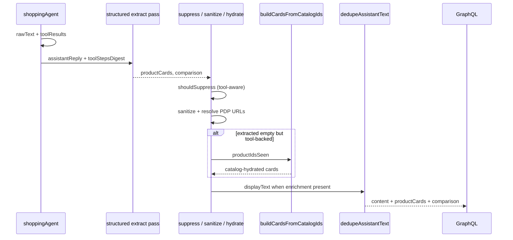

# ALE-41 Sometimes comparison returns plain text instead of cards

## Context

[Linear ALE-41](https://linear.app/alexandinseongprojects/issue/ALE-41/sometimes-instead-of-the-cards-the-comparision-returns-plain-text): on some recommendation/compare turns, the user sees a **long prose comparison** in the chat bubble but **no product cards** and **no Quick compare** table. The ticket screenshot shows multi-product attribute discussion in text only.

**Repo scope:** `commerce-platform-backend` (primary). Frontend already renders `comparison` + `productCards` when the API returns them (`chatMessageList.tsx` gates Quick compare on `comparison && cards.length > 0`). No frontend change unless we add a degraded UI for “cards failed to load” (out of scope for v1).

**Branch:** `alexmtruecar/ale-41-sometimes-instead-of-the-cards-the-comparision-returns-plain` (Linear) or `ALE-41-comparison-returns-plain-text-instead-of-cards` (team convention).

**Database changes:** None.

**Related work:**

- [ALE-14](ALE-14-remove-redundant-info-from-the-agent-responses.md) — **opposite symptom**, already shipped ([commerce-platform-backend#14](https://github.com/alex-the-programmer/commerce-platform-backend/pull/14)). When structured UI **exists**, strip redundant prose. **ALE-41** is when structured UI **does not exist** but prose still contains the compare content.
- [ALE-18](ALE-18-fix-recommendation-of-similar-products.md) — discount card strip vs compare finalists; only relevant once cards reliably attach.

---

## ALE-14 vs ALE-41 (not the same bug)

| | ALE-14 (fixed) | ALE-41 (this ticket) |
| --- | --- | --- |
| **Symptom** | Cards + Quick compare **shown**, text **repeats** the same facts | Cards + Quick compare **missing**, text **is** the compare |
| **Root cause** | Model ignores “cards are authoritative”; no server trim | Structured enrichment empty/failed while main agent still writes SKU/compare prose |
| **Fix** | `dedupeAssistantTextForStructuredEnrichment` on write + read | Ensure `productCards` / `comparison` are populated (or recover from tools); avoid “compare prose + no UI” |
| **Dedupe interaction** | Runs when `productCards.length > 0 \|\| comparison` | When enrichment is missing, dedupe **does not run** → user sees **full** verbose text (worst case) |

ALE-14 did **not** cause ALE-41. It can make the failure **more obvious**: before ALE-14, users might have seen duplicate text **and** UI; after ALE-14, successful extractions show short text + UI, but failed extractions show **only** the long prose with nothing below.

---

## Current state

| Layer | Location | Behavior today |
| ----- | -------- | -------------- |
| Main agent | `invokeShoppingAgent.ts` → `trackedAgentGenerate` | Can emit long per-product/compare prose despite system nudge (“≤2 sentences when Quick compare”) |
| Structured extraction | 2nd `trackedAgentGenerate` with `shoppingStructuredOutputSchema` | Fills `productCards` + optional `comparison` from `assistantReply` + `toolStepsDigest` |
| Card suppression | `shouldSuppressProductCardsForAssistantText.ts` | If discovery-tone + `?` and no commit phrase → **clears** extracted cards **and** comparison |
| Corpus sanitize | `sanitizeShoppingProductCardsAgainstCorpus.ts` | Drops cards whose `productId` not in tool steps / text |
| PDP resolution | `resolveShoppingProductCardPdpUrls.ts` | Drops cards with **no** resolvable `productUrl` |
| Comparison attach | `invokeShoppingAgent.ts` ~585–608 | `comparison` only if `extractedComparison` **and** `productCards.length > 0` **and** filtered items share ids with hydrated cards |
| Text to client | `dedupeAssistantTextForStructuredEnrichment.ts` | Only when cards or comparison present |
| Persistence | `shopping_assistant_enrichment` | `productCards`, `comparison` JSON by `mastraMessageId` |
| Frontend | `chatMessageList.tsx` | Quick compare: `comparison && cards.length > 0` |

```273:275:commerce-platform-frontend/components/chatMessageList.tsx
          {!isUser && comparison && cards.length > 0 ? (
            <ShoppingProductComparisonBlock comparison={comparison} cards={cards} />
          ) : null}
```

**Gap:** Multiple backend gates can zero out enrichment while the main agent still produces compare-shaped prose. There is **no deterministic fallback** from `toolStepsDigest.productIdsSeen` when the LLM extraction pass returns empty or bad ids.

---

## Failure-mode analysis (hypotheses to confirm with logs)

Instrument first (see §Implementation), then rank by frequency in staging/prod logs.

| # | Stage | What goes wrong | User-visible result |
| --- | ----- | ----------------- | ------------------- |
| H1 | Extraction LLM | `productCards: []`, no/invalid `comparison` despite tools | Prose only |
| H2 | Extraction throws | `catch` logs warning; `extracted` stays `[]` | Prose only |
| H3 | `shouldSuppressProductCardsForAssistantText` | Discovery regex + `?` without commit phrase; tools had picks | Prose only (extraction discarded) |
| H4 | `sanitizeShoppingProductCardsAgainstCorpus` | Hallucinated `productId`s not in tool corpus | Prose only |
| H5 | `resolveShoppingProductCardPdpUrls` | All cards return `null` (no PDP URL in DB) | Prose only; comparison dropped because `productCards.length === 0` |
| H6 | Comparison id mismatch | `comparison.items` reference ids not in hydrated cards → `filteredItems.length === 0` | Cards may show, **no** Quick compare |
| H7 | Main agent only | No tool calls (`maxSteps` / model skips tools) but still writes picks in prose | Extraction correctly empty; prose wrongly verbose |

**Not ALE-14:** Dedupe does not remove cards or comparison objects—only the `content` string.

---

## Design decisions

### 1. Goal: “compare turn” must have structured UI or short honest fallback (locked)

When the turn is classified as **tool-backed recommendation/compare** (see §2), the API must not return a long prose comparison without at least **product cards** (and Quick compare when 2–3 finalists).

Acceptable outcomes:

- **A.** `productCards` (+ `comparison` when 2–3 finalists) + short deduped `content` (ideal; aligns with ALE-14).
- **B.** `productCards` only, no comparison object (single pick or extraction failed to fill compare rows).
- **C.** Short fallback `content` when recovery impossible: e.g. “I found options in the catalog but couldn’t load the product cards—try asking again.” — **not** a wall of SKU prose.

Unacceptable: long compare prose + empty `productCards` and empty `comparison`.

### 2. Turn classification: `isToolBackedRecommendationTurn` (locked)

New pure helper (unit-tested), inputs:

- `toolStepsDigest` from `buildToolStepsDigest(result.toolResults)`
- `userMessage` (optional: compare intent regex, already have `wantsComparableProducts` patterns in `invokeShoppingAgent.ts`)
- `assistantText` after `normalizeAssistantText`

Return `true` when **both**:

- `toolStepsDigest.productIdsSeen.length >= 1` (at least one catalog id from tools), **and**
- Assistant text or user message signals **commit to picks**, e.g. existing `RECOMMENDATION_COMMIT_RE` from `shouldSuppressProductCardsForAssistantText`, or ≥2 product name variants detected in prose vs digest (reuse `buildProductNameVariants` / `paragraphMentionsCatalogSku` patterns from dedupe module where practical).

Return `false` for opening-only, `adviceForOtherUser`, and pure discovery (no tool ids).

Use this flag to decide fallback/retry—not to force cards on “what’s your skin type?” turns.

### 3. Deterministic card fallback from catalog ids (locked for v1)

When `isToolBackedRecommendationTurn` and, after extraction + sanitize + suppress, `extracted.length === 0` but `productIdsSeen.length >= 1`:

1. Take top N ids from digest (prefer ids from `get_product_detail` / last search shortlist — start with **last 3 unique** ids in `productIdsSeen` order).
2. New module `buildShoppingProductCardsFromCatalogIds.ts`:
   - For each id: load display fields via existing catalog/seller helpers (`getLowestPriceOffer`, `listSellerOffersForProduct`, product name from Prisma — mirror fields extraction expects).
   - Produce `ShoppingProductCardExtractionPayload`-shaped rows (server fills URL via `resolveShoppingProductCardPdpUrls`).
3. If comparison was extracted but cards were empty, re-run comparison attach after fallback cards hydrate.

**Scope limit:** Fallback cards may omit rich `comparison` pros/cons if extraction failed entirely; Quick compare can show with **minimal** rows (price/rating from DB, empty pros/cons) **only** if we also recovered `extractedComparison` — otherwise cards-only is enough for v1.

### 4. Tighten `shouldSuppressProductCardsForAssistantText` (locked)

Do **not** clear extraction when:

- `toolStepsDigest.productIdsSeen.length >= 2`, **or**
- Structured extraction returned non-empty `comparison` with ≥2 items.

Rationale: false-positive suppression (H3) is cheap to fix and high impact.

Change signature to accept `{ assistantText, productIdsSeen, extractedComparison? }`.

### 5. One extraction retry (locked, bounded)

If first extraction returns `productCards.length === 0` and `isToolBackedRecommendationTurn`:

- Single retry with `toolChoice: "none"`, same schema, appended instruction: “Previous attempt returned no productCards; toolStepsDigest lists these productIds: … — you must output productCards for them.”
- Cap tokens; no third pass.

If retry still empty → deterministic fallback (§3).

### 6. Logging / metrics (locked)

Structured log line `[ShoppingAgent] enrichment outcome` with:

- `productIdsSeenCount`, `extractedCardCount`, `afterSanitizeCount`, `afterSuppress`, `hydratedCardCount`, `comparisonItemCount`
- `dropReason` enum when final `productCards.length === 0` on tool-backed turn: `extraction_empty` \| `extraction_failed` \| `suppressed` \| `sanitized_empty` \| `pdp_resolve_empty` \| `not_tool_backed`

Enables confirming H1–H7 before/after fix.

### 7. Prompt adjustments (locked, secondary)

- Main agent system string: if tools returned ≥2 product ids, **forbid** multi-paragraph compare prose; say UI will render the table (reduces H7 noise; not sufficient alone).
- `STRUCTURED_OUTPUT_INSTRUCTIONS`: emphasize filling `productCards` from `toolStepsDigest.productIdsSeen` even when `assistantReply` is long (extraction must not mirror prose-only).

### 8. Frontend scope: none for v1 (locked)

Keep rendering rules. Optional follow-up: empty-state when `content` mentions prices/ratings but arrays empty (defensive).

### 9. Read-path / historical messages (locked)

`getChatMessages` cannot reconstruct cards without enrichment. **No backfill** in v1. New turns fixed going forward. Optional follow-up: re-run extraction offline for broken rows (out of scope).

---

## Architecture



---

## Implementation steps

### 1. Instrumentation

**File:** `invokeShoppingAgent.ts`

Add `logEnrichmentOutcome(...)` after enrichment pipeline (before return). Include `dropReason` when tool-backed and no cards.

### 2. `isToolBackedRecommendationTurn.ts`

**Path:** `commerce-platform-backend/src/interactions/chat/isToolBackedRecommendationTurn.ts`

Unit tests: discovery question + tools → false; “here are two picks” + 2 ids → true; tools but only questions → false.

### 3. Update `shouldSuppressProductCardsForAssistantText.ts`

- Accept `productIdsSeen` and optional `comparison`.
- Never suppress when `productIdsSeen.length >= 2` or `comparison?.items.length >= 2`.
- Extend tests.

### 4. `buildShoppingProductCardsFromCatalogIds.ts`

- Input: `number[]` productIds (max 3 for compare finalists, max 5 for hydrate attempt).
- Output: `ShoppingProductCardExtractionPayload[]` (partial fields OK before PDP resolve).
- Use Prisma + `getLowestPriceOffer` / product table for `name`, `priceLabel`, `retailerName`, `ratingLabel`.
- Unit tests with mocked catalog calls (interaction-style) or factory products in jest-prisma.

### 5. Wire pipeline in `invokeShoppingAgent.ts`

After existing extraction block:

```ts
if (isToolBackedRecommendationTurn({ userMessage, assistantText: text, toolStepsDigest }) && extracted.length === 0) {
  // optional: one retry (§5)
}
if (/* still empty */ && productIdsSeen.length > 0) {
  extracted = buildShoppingProductCardsFromCatalogIds(productIdsSeen.slice(-3));
}
```

Preserve order: suppress → sanitize → partition → hydrate → comparison attach.

When tool-backed and **still** no cards after fallback: replace `displayText` with short fallback copy (§1-C) instead of long prose.

### 6. Extraction retry (optional in same PR if small)

Single retry block between first parse and suppress; only when `extracted.length === 0` && tool-backed.

### 7. Prompt tweaks

- `invokeShoppingAgent.ts` system string + `STRUCTURED_OUTPUT_INSTRUCTIONS` (minimal).

### 8. Unit tests

| File | Cases |
| ---- | ----- |
| `isToolBackedRecommendationTurn.test.ts` | classification matrix |
| `shouldSuppressProductCardsForAssistantText.test.ts` | no suppress when 2+ tool ids |
| `buildShoppingProductCardsFromCatalogIds.test.ts` | builds cards from ids; handles missing product |
| Extend existing sanitize/dedupe tests only if behavior changes |

### 9. Manual QA

1. Prompt that previously produced prose-only compare (ticket repro: multi hand cream / compare intent) → Quick compare + cards; short text.
2. Pure discovery (“what’s your skin type?”) → no cards, normal question text.
3. Single-product pick with one tool id → one card, no compare table.
4. “Show cards again” → still works (`sendShoppingMessage` replay path).
5. Reload chat → enrichment persisted; same UI as live send.

### 10. Pre-push (backend)

```bash
cd commerce-platform-backend
npm run lint
npm run build
npm test
```

---

## Out of scope

- Changing Quick compare layout (`shoppingProductComparison.tsx`).
- Re-running extraction for old Mastra messages without enrichment.
- Third LLM pass for comparison prose generation.
- Frontend “failed to load cards” component (follow-up).
- Database / GraphQL schema changes.

---

## Risks and mitigations

| Risk | Mitigation |
| ---- | ---------- |
| Fallback shows wrong products (last 3 ids in digest) | Prefer ids from `get_product_detail` tool entries first; document ordering in helper; log chosen ids |
| Cards without comparison feel incomplete | Retry extraction; attach comparison when extraction partial |
| Over-showing cards on discovery turns | `isToolBackedRecommendationTurn` gate |
| Extra latency (retry + DB hydrate) | One retry max; hydrate only when extraction empty |
| PDP resolve still drops all cards | Log `pdp_resolve_empty`; surface fallback copy (§1-C) |

---

## TODO

- [ ] Add `isToolBackedRecommendationTurn` + tests
- [ ] Add enrichment outcome logging in `invokeShoppingAgent.ts`
- [ ] Tool-aware `shouldSuppressProductCardsForAssistantText` + tests
- [ ] Add `buildShoppingProductCardsFromCatalogIds` + tests
- [ ] Wire fallback + optional extraction retry in `invokeShoppingAgent.ts`
- [ ] Short fallback copy when tool-backed but cards still empty
- [ ] Prompt nudges (system + `STRUCTURED_OUTPUT_INSTRUCTIONS`)
- [ ] Manual QA checklist
- [ ] `npm run lint`, `npm run build`, `npm test` in backend
