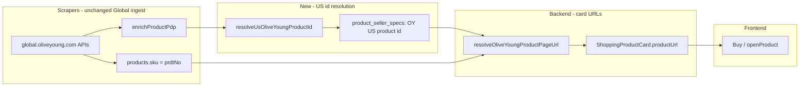

# ALE-44 Olive Young links: send users to the US store, not Global

## Context

[Linear ALE-44](https://linear.app/alexandinseongprojects/issue/ALE-44/oliveyong-links-send-users-to-the-global-instead-of-the-us-store): outbound **Buy** / product-card links point at **Olive Young Global** (`global.oliveyoung.com`), but our shoppers are in the **US**. Global explicitly does not ship to the US and nudges users toward the US storefront.

**Example (from ticket):** [ILLIYOON hand cream on Global](https://global.oliveyoung.com/product/detail?prdtNo=GA240222338) — Global PDP loads, shows *“US shoppers: Visit our new US Online Store!”* and *“This site does not ship to the U.S.”*

**Repo scope:** Primarily `commerce-platform-backend` (URL resolution for `ShoppingProductCard.productUrl`). `commerce-platform-scrapers` for backfill / US ID discovery. **No frontend changes** if `productUrl` is correct server-side.

**Branch:** `ALE-44-olive-young-us-product-links` (team convention) or Linear git branch `alexmtruecar/ale-44-oliveyong-links-send-users-to-the-global-instead-of-the-us`.

**Database schema changes:** None required for v1 if we store the US product slug in existing `product_seller_specs`. Any new `sellers` / `products` columns need architect approval before migration.

---

## Executive summary

| Question | Answer |
| -------- | ------ |
| What do we emit today? | `https://global.oliveyoung.com/product/detail?prdtNo={sku}` where `products.sku` = Global `prdtNo` (e.g. `GA240222338`). |
| Can we fix this by changing the template host only? | **No.** US PDPs use a different path and **different product IDs**. |
| US URL shape | `https://us.oliveyoung.com/products/{usProductId}` (e.g. `UA61885348` — not the Global `GA*` id). |
| Does `?prdtNo=GA…` work on US? | **No** — returns **404** on the US site. |
| Is Global “useless” for US users? | **Partially.** Global lists many SKUs with **USD prices** but **does not ship to the US**. US search often finds **nothing** for the same product name. |
| Core constraint (product input, Jun 2026) | **Most catalog products are on Global only** — not discoverable on `us.oliveyoung.com` even by name search. |
| Recommended direction | **Do not** assume we can move the whole catalog to US links. Spike **US catalog overlap %**, then pick a **product policy** (US-only Buy vs split link types vs alternate retailers). Engineering implements the chosen policy. |

**Reframe the ticket:** ALE-44 is not only “wrong hostname” — it is **two storefronts with different assortments**. Sending everyone to US fixes the banner/redirect annoyance for SKUs that exist in the US, but **hides most of the catalog** if we drop Global fallbacks. Sending everyone to Global shows familiar USD pricing but **cannot complete US checkout**.

### Chosen approach (plan only — Jun 2026)

**Implementation deferred.** We will **not** ship Global→US URL mapping or partial backfill for this ticket.

**Future fix:** add a **new Olive Young US scrape** from `us.oliveyoung.com` (separate seller / ingest path, US product ids and `/products/{id}` URLs), rather than reusing Global `prdtNo` or mapping between storefronts.

Until then, outbound links remain Global (current behavior). This plan documents the problem, research, and the rejected lighter-weight options for when US ingest is designed.

---

## What we scrape today (Global only)

All Olive Young ingest in `commerce-platform-scrapers` targets **`global.oliveyoung.com`** — not `us.oliveyoung.com`:

| Piece | Source |
| ----- | ------ |
| Seller name (env) | `Olive Young Global` |
| Base URL | `https://global.oliveyoung.com` |
| Sitemap | `global.oliveyoung.com/sitemap.xml` → `?prdtNo=` |
| PDP enrich | Global POST APIs (`/product/detail-data`, etc.) |
| `products.sku` | Global `prdtNo` (`GA…`) |

No US storefront scraper exists in the repo today.

---

## Current state

### How `productUrl` is built

All shopping surfaces (chat cards, routine, comparisons) use GraphQL `ShoppingProductCard.productUrl`, resolved on the backend:

```text
products.sku (Global prdtNo)
  + sellers.productUrlTemplate (contains {{sku}})
  → buildSellerProductPageUrl()
  → productUrl on card
```

Central call sites:

| Module | Role |
| ------ | ---- |
| `interactions/sellers/buildSellerProductPageUrl.ts` | Template + SKU interpolation |
| `interactions/sellers/listSellerOffersForProduct.ts` | Per-seller URL for offers |
| `interactions/catalog/getShoppingProductCardsBatch.ts` | Batch cards (chat history, etc.) |
| `interactions/catalog/getShoppingProductCard.ts` | Single card (routine) |
| `interactions/chat/resolveShoppingProductCardPdpUrls.ts` | Post-agent card resolution |

Existing unit test documents the **intended** Olive Young template:

```8:12:commerce-platform-backend/src/interactions/sellers/buildSellerProductPageUrl.test.ts
      buildSellerProductPageUrl(
        "https://global.oliveyoung.com/product/detail?prdtNo={{sku}}",
        "ABC123"
      ),
      "https://global.oliveyoung.com/product/detail?prdtNo=ABC123"
```

**Action during implementation:** Confirm production/staging `sellers.productUrlTemplate` for the Olive Young seller row matches this (data fix, not in repo migrations).

### Catalog / scrape identity

| Field | Value today |
| ----- | ----------- |
| `products.sku` | Olive Young Global `prdtNo` (`GA…`, set in `upsertProductFromOliveYoungHit`) |
| Scrape source | `global.oliveyoung.com` APIs (`/product/detail-data`, sitemaps, ranking) |
| PDP enrich | `enrichProductPdp` — specs, reviews; **no US storefront id** |

Global `detail-data` for `GA240222338` includes `gdsCd` (barcode `8809925168664`) but **no** `us.oliveyoung.com` slug in the JSON we inspected.

### Frontend

Opens `productUrl` as-is (`window.open` / `<a href>`). No client-side URL rewriting.

---

## Gap analysis

| Area | Today | Target (ALE-44) |
| ---- | ----- | ----------------- |
| Outbound PDP link | Global international site | **US** storefront (`us.oliveyoung.com`) when the SKU is listed there |
| URL structure | `/product/detail?prdtNo=` | `/products/{usProductId}` |
| Product identifier | Global `prdtNo` (`GA*`) | US catalog id (`UA*` or other — **not** 1:1 with `prdtNo`) |
| US-only / unmapped SKUs | N/A | Defined fallback (see below) |
| Scrapers | Global-only ingest | Optional US id resolution during enrich / backfill |
| Tests | Assert Global template | Assert US URL when US id present; fallback cases |

---

## URL / redirect research (verified)

| URL | Result |
| ----- | ------ |
| `global.oliveyoung.com/product/detail?prdtNo=GA240222338` | **200** — Global PDP (US shipping blocked messaging) |
| `www.oliveyoung.com/product/detail?prdtNo=GA240222338` | **302** → `us.oliveyoung.com/product/detail` (**query stripped**) |
| `us.oliveyoung.com/product/detail?prdtNo=GA240222338` | **404** |
| `us.oliveyoung.com/products/GA240222338` | **404** |
| `us.oliveyoung.com/products/UA61885348` | Valid US PDP pattern (different product example from search) |

**Implication:** Changing `productUrlTemplate` to US host while still substituting Global `prdtNo` **will not work**.

---

## Design decisions

### 1. Keep Global `prdtNo` as canonical catalog SKU (locked)

- Scrapers, reviews, and Global APIs continue to key on `products.sku` = `prdtNo`.
- Do **not** overwrite `products.sku` with US ids — that would break Global ingest and existing jobs.

### 2. Store US PDP slug in `product_seller_specs` (locked for v1)

- Add / reuse a seller spec, e.g. **`OY US product id`** (`stringValue` = slug used in `/products/{id}`).
- Created via scraper PDP enrich or a dedicated backfill job (same pattern as other `OY …` specs).
- **No new Prisma columns** unless spike proves spec lookup is too slow (unlikely at current scale).

### 3. Central Olive Young URL resolver on the backend (locked)

Introduce something like `resolveOliveYoungProductPageUrl(productId)` (exact name TBD) used by:

- `listSellerOffersForProduct`
- `getShoppingProductCardsBatch`
- `getShoppingProductCard`
- (any other `buildSellerProductPageUrl` call for Olive Young)

Logic:

```text
if product has spec "OY US product id" (non-empty):
  return https://us.oliveyoung.com/products/{usProductId}
else:
  fallback per policy (see § Fallback)
```

Keep `buildSellerProductPageUrl` generic for other retailers (Style Korean, YesStyle, etc.).

### 4. US product id discovery — spike first, then implement (locked)

**Phase 0 spike** (half day, blocking): determine a reliable mapping `prdtNo` (+ optional `gdsCd`) → US `/products/{id}`.

Candidate approaches (try in order):

1. **US storefront search / BFF** — Inspect network tab on `us.oliveyoung.com` (product search, barcode). The US site is a Remix app with `commerce-bff` bundles; a JSON search endpoint may accept barcode or title.
2. **Match on `gdsCd`** — Global `detail-data` exposes barcode; US catalog may index by UPC.
3. **US sitemap / catalog crawl** — If a machine-readable US index exists (robots, alternate sitemap path), map `GA*` image paths or shared internal codes (US image URLs sometimes still reference `…/prd/GA…/` under `use-image.oliveyoung.com`).
4. **Manual seed for smoke** — A few known `GA*` → `UA*` pairs to unblock integration tests only.

**Deliverable from spike:** chosen API or crawl strategy, success rate on a sample of 50 in-catalog `prdtNo`s, rate limits, and whether unmapped products are “not sold in US” vs “resolver gap”.

### 5. Fallback when US id is missing (product decision — default recommendation)

| Policy | Pros | Cons |
| ------ | ---- | ---- |
| **A. Omit card / hide Buy** (recommended default) | No broken 404 links | Fewer buyable cards until backfill |
| **B. Global URL + UI disclaimer** | Always a link | Bad US UX; contradicts ticket |
| **C. US site search URL** | Always lands on US domain | May not land on exact SKU |

**Recommendation:** **A** for chat agent cards (card already dropped when `productUrl` is null in `resolveShoppingProductCardPdpUrls`). For routine/history, prefer **null `productUrl`** → disable Buy (existing `hasPurchasableProduct` patterns) over Global.

Confirm with product before implementation if they prefer search fallback.

### 6. Audience: US shoppers only for v1 (locked)

- No geo-IP routing in v1 — Commerce Platform positioning is US K-beauty shoppers.
- Future: `productUrl` could branch on user locale if we expand internationally.

### 7. Scrapers vs backend-only template change

| Approach | Verdict |
| -------- | ------- |
| Only update `sellers.productUrlTemplate` to US | **Reject** — wrong id format |
| Scraper writes US id spec + backend resolver | **Accept** |
| Second seller row “Olive Young US” | Possible but duplicates offers/prices; avoid unless pricing diverges |

---

## Proposed architecture



---

## Implementation plan

### Phase 0 — Spike: US id resolution (blocking)

- [ ] Sample 50 `prdtNo`s from DB (mix of popular + random).
- [ ] Document working US resolution method and failure modes.
- [ ] Record example mapping: `GA240222338` → `{usProductId}` (or “not listed in US”).
- [ ] Decide fallback policy (§5) with Alex.

### Phase 1 — Backend URL resolver

- [ ] Add `resolveOliveYoungProductPageUrl(productId)` (or extend seller helper with `sellerId` / seller name guard).
- [ ] Read `OY US product id` spec (define constant for spec name; align with scraper).
- [ ] Wire into `listSellerOffersForProduct`, `getShoppingProductCardsBatch`, `getShoppingProductCard`.
- [ ] Update `buildSellerProductPageUrl.test.ts` + new resolver tests (US id present / absent / non-OY seller unchanged).
- [ ] Logging/metric when Olive Young product lacks US id (count for backfill progress).

### Phase 2 — Scrapers: persist US id

- [ ] Implement `resolveUsOliveYoungProductId({ prdtNo, gdsCd, brandName, prdtNameEn })` per spike.
- [ ] Call from `processEnrichProductPdp` after `fetchGlobalProductDetailData` (has `gdsCd`, names).
- [ ] Upsert spec row via existing `upsertProductSpecStringRows` / seller spec registry.
- [ ] Optional: `POST /jobs/olive-young/us-product-id-backfill` to enqueue enrich for all products missing spec.
- [ ] Scraper unit tests with fixtures (mock US API).

### Phase 3 — Data / ops

- [ ] Verify Olive Young `sellers.productUrlTemplate` in each environment (may leave Global template for documentation or set US template **only if** resolver no longer uses template for OY — avoid double sources of truth).
- [ ] Run backfill job in staging; measure % with US id.
- [ ] Spot-check ticket example: open card link → US PDP for ILLIYOON hand cream.

### Phase 4 — Validation

- [ ] Backend: `npm run lint`, `npm run build`, `npm test`.
- [ ] Scrapers: `npm run build`, tests for new resolver.
- [ ] Manual: chat product card **Buy**, routine **Buy**, comparison table — all open `us.oliveyoung.com/products/…`.
- [ ] Confirm no regression for non–Olive Young retailers (template path unchanged).

---

## Files likely touched

| Repo | Files |
| ---- | ----- |
| `commerce-platform-backend` | `interactions/sellers/buildSellerProductPageUrl.ts`, `listSellerOffersForProduct.ts`, `interactions/catalog/getShoppingProductCard*.ts`, new `resolveOliveYoungProductPageUrl.ts`, tests |
| `commerce-platform-scrapers` | `jobs/oliveYoung/enrichProductPdp.ts`, new `scrapers/oliveYoung/resolveUsOliveYoungProductId.ts`, optional job + `server.ts` route, tests |
| `commerce-platform-frontend` | None (unless fallback UX needs copy) |

---

## Test plan

### Automated

- `buildSellerProductPageUrl` — still passes for generic retailers.
- New tests: given spec `OY US product id = UAxxxx`, resolver returns `https://us.oliveyoung.com/products/UAxxxx`.
- New tests: missing spec → `null` (or chosen fallback URL).
- Scraper: mock US API returns id → spec row written.

### Manual

- [ ] Product from ticket (`GA240222338`) — Buy opens correct US PDP (not Global, not 404).
- [ ] Product known only on Global (if any in sample) — Buy disabled or acceptable fallback per policy.
- [ ] Style Korean / other seller card — link unchanged.

---

## Risks and mitigations

| Risk | Mitigation |
| ---- | ---------- |
| US API undocumented / changes | Isolate in scraper module; feature flag env to disable US resolution |
| Low mapping coverage at launch | Backfill job + metric; phased rollout |
| Same product, different US price | v1 links only; prices still from Global scrape until separate US price source exists |
| Sets / multi-option `prdtNo` | Resolver uses parent `prdtNo` from enrich job; document variant behavior in spike |

---

## Out of scope (v1)

- Geo-based link selection (non-US users).
- Scraping **US** prices or inventory as source of truth.
- Changing review source (`oliveyoung_global` summaries) to US reviews.
- Frontend-only URL hacks without catalog-backed US ids.

---

## TODO

**Plan committed; implementation follows US scrape design (separate work).**

- [x] Document problem, Global vs US URLs, and that scrapers ingest Global only
- [x] Record decision: fix via **US site scrape from scratch** (not Global→US mapping)
- [ ] Design US ingest (seller row, sitemap/API, sku format, jobs mirroring Global pattern)
- [ ] Implement US scrapers in `commerce-platform-scrapers`
- [ ] Wire backend `productUrl` / offers to US seller + template `https://us.oliveyoung.com/products/{{sku}}`
- [ ] Product policy: retire vs keep Global catalog for agent recommendations
- [ ] lint / build / test + manual Buy flows on US links
