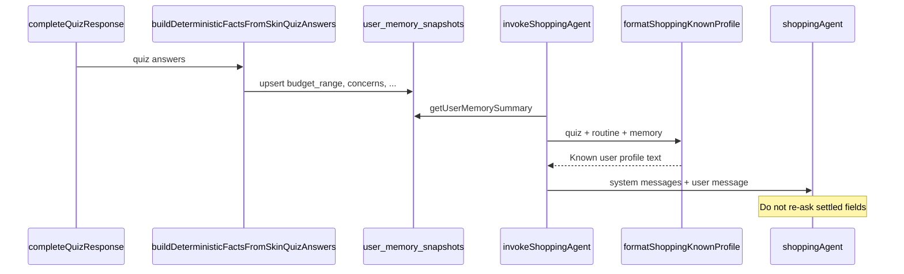

# ALE-45 The agent ignores the info from the skin quiz

## Context

[Linear ALE-45](https://linear.app/alexandinseongprojects/issue/ALE-45/the-agent-ignores-the-info-from-the-skin-quiz): users who completed the **skin quiz** (and/or have **durable user memory** and a **routine**) still get discovery questions the quiz already answered — e.g. budget after they set a comfortable spend range on the quiz. The ticket suggests the agent may be ignoring other quiz fields (concerns, feel, avoids, routine steps) and memory as well.

**Repo scope:** `commerce-platform-backend` (primary). No frontend change unless we add a debug panel (out of scope).

**Branch:** `alexmtruecar/ale-45-the-agent-ignores-the-info-from-the-skin-quiz` (Linear) or `ALE-45-agent-ignores-skin-quiz-and-user-memory` (team convention).

**Database changes:** None.

**Shipped:** [commerce-platform-backend#18](https://github.com/alex-the-programmer/commerce-platform-backend/pull/18) (merged). Also closes [ALE-37](https://linear.app/alexandinseongprojects/issue/ALE-37/have-chats-infer-information-like-pricing-skin-conerns-etc-from-the) — same root cause (positive vs negative framing).

### Same issue as ALE-37 (consolidate tickets)

[Linear ALE-37](https://linear.app/alexandinseongprojects/issue/ALE-37/have-chats-infer-information-like-pricing-skin-conerns-etc-from-the) (**Todo**): “have chats infer information like pricing, skin concerns, etc from the skin quiz if available.”

| | ALE-37 | ALE-45 |
| --- | --- | --- |
| **Framing** | Positive: chat should **use** quiz for pricing, concerns, etc. | Negative: agent **ignores** quiz / memory / routine (budget re-ask called out) |
| **Scope** | Skin quiz fields (pricing, concerns, …) | Quiz + **user memory** + **routine** |
| **Fix** | Same backend work | Same backend work |

**Treat as one delivery:** implement under **ALE-45** (plan + branch + commit prefix). When the PR ships, mark **ALE-37** as **Duplicate of ALE-45** or **Done** with a link to the same PR — do not implement twice.

ALE-37’s screenshot (Linear attachment) is the same failure mode: recommendations/discussion without inferring settled quiz fields.

**Related work:**

- [ALE-6](ale-6-nudge-users-to-complete-skin-quiz-and-routine.md) — opening nudge when quiz/routine **missing**; does not tell the model how to **use** quiz when present.
- [ALE-10](ALE-10-detection-of-advice-for-other-ppl.md) — skips chat memory extraction on “advice for other user” turns.
- [ALE-14](ALE-14-remove-redundant-info-from-the-agent-responses.md) — prose vs cards; orthogonal.
- [ALE-41](ALE-41-comparison-returns-plain-text-instead-of-cards.md) — enrichment pipeline; orthogonal.

---

## Current state

| Layer | Location | Behavior today |
| ----- | -------- | -------------- |
| Quiz + routine load | `getShoppingUserContext.ts` | Latest **completed** `skin-quiz` response → up to 20 answers as `{ questionKey, selectedOption, value }`; routine items (max 20). No question **prompt** text; budget stored as `valueJson` / ints for `BUDGET_RANGE`. |
| Memory snapshot | `getUserMemorySummary.ts` → `user_memory_snapshots.summaryText` | Up to 30 active facts → max **12 lines**, **900 chars** (`userMemoryTypes.ts`). Default text: `"No durable user memory yet."` |
| Quiz → memory | `completeQuizResponse.ts` | `extractFactsFromQuizResponse` (LLM) → `upsertMemoryFacts` → `refreshUserMemorySnapshot` |
| Chat → memory | `invokeShoppingAgent.ts` (end of turn) | `extractFactsFromChatTurn` (LLM) → upsert + refresh |
| Agent injection | `invokeShoppingAgent.ts` | Four `context` system messages per turn: turn nudge, **memory summary**, **quiz JSON** (~1400 chars), **routine JSON** (~1400 chars) |
| Base agent instructions | `shoppingAgent.ts` | Step 1 **Discovery**: “clarify what they want … **budget** or texture prefs if relevant” — no “skip if already known” |
| Per-turn system | `invokeShoppingAgent.ts` | “**Prioritize discovery** (what they need) before SKUs” — reinforces asking before recommending |
| Mastra thread memory | `shoppingAgent` `Memory` | `lastMessages: 6` — recent chat can dominate attention vs static profile |
| Request context | `invokeShoppingAgent.ts` | `userMemorySummary` + `shoppingUserContext` on `requestContext` — **tools do not read these today** |

Skin quiz keys (seed `skinQuizDefinition.ts`): `feel`, `concerns`, `budget` (`BUDGET_RANGE`), `routine` (`ROUTINE_STEPS`), `loved` (`TAG_LIST`), `avoid` (`AVOID_LIST`).

```393:421:commerce-platform-backend/src/interactions/chat/invokeShoppingAgent.ts
  const userMemorySystem = `Durable user memory (prioritize as stable context when relevant):\n${userMemorySummary}`;
  const quizSystem = `Latest skin quiz context:\n${safeJsonPreview(
    shoppingUserContext.skinQuiz,
    1400
  )}`;
  const routineSystem = `Current routine context:\n${safeJsonPreview(
    shoppingUserContext.routine,
    1400
  )}`;
  // ...
        context: [
          { role: "system", content: systemWithTurn },
          { role: "system", content: userMemorySystem },
          { role: "system", content: quizSystem },
          { role: "system", content: routineSystem },
        ],
```

**Gap:** Profile data is present but **easy for the model to ignore**: raw JSON, conflicting “discovery first” instructions, and budget/concerns/routine often buried in `valueJson` without a plain-English “already known” block. Memory facts depend on a separate LLM pass that may omit budget even when the quiz answer exists.

---

## Failure-mode analysis (confirm with logs + staging)

| # | Hypothesis | Signal | User-visible result |
| --- | ---------- | ------ | ------------------- |
| H1 | Prompt conflict | Model follows `shoppingAgent` / per-turn “discovery first” over quiz/memory system messages | Re-asks budget, skin type, concerns |
| H2 | Weak quiz formatting | `budget` answer is `valueJson` like `{low, high}` without label; truncated JSON preview | Model doesn’t treat budget as settled |
| H3 | Memory gap | `user_memory_snapshots` empty or no budget fact after quiz complete | Same as no quiz for budget |
| H4 | Memory truncation | Budget fact exists but dropped from 12-line / 900-char summary | Intermittent re-asks |
| H5 | Opening turn | User with quiz still gets “ONE discovery question” (`buildOpeningNudge`) without “use quiz” | Generic question instead of product intent |
| H6 | Thread memory | Last 6 messages repeat “what’s your budget?” pattern | Model continues asking even with profile in context |

Instrument **before** full fix (see §Implementation) so we can rank H1–H6 on real chats.

---

## Design decisions

### 1. Goal: treat quiz + memory + routine as authoritative profile (locked)

When `skinQuiz.status === "present"` and/or memory has relevant facts, the agent must:

- **Use** those fields when narrowing search and explaining picks.
- **Not** ask discovery questions whose answers are already in the profile (budget, primary concerns, current feel, avoid list, existing routine steps).
- Ask **at most one** net-new clarifier when the user’s message is underspecified (e.g. product type for this search), not a full intake.

Unacceptable: “What’s your budget?” when quiz `budget` or memory already states a spend range.

### 2. Deterministic “Known user profile” block (locked for v1)

New pure module `formatShoppingKnownProfile.ts` (unit-tested) that takes `shoppingUserContext` + optional `userMemorySummary` and returns a short **markdown-ish plain text** section, e.g.:

```text
Known user profile (do not re-ask; use when recommending):
- Skin this week: Oily, clogging up
- Top concerns: Breakouts, Dehydration
- Comfortable spend per product: $30–$80
- Routine steps already using: AM cleanser, toner, serum, moisturizer, SPF; PM cleanser, serum, moisturizer
- Products/brands they loved: COSRX Snail 96
- Avoid / steer clear of: Fragrance, Strong AHAs
- Durable memory: …
```

Implementation notes:

- Map `questionKey` → human labels from `SKIN_QUIZ_DEFINITION` (import keys/labels from seed or a small shared constant map in backend to avoid drift).
- **`budget` (`BUDGET_RANGE`)**: parse `valueJson` `{ low, high }` (and fallbacks for `valueInt` / `valueString`) into a single spend line.
- **`concerns` / `feel`**: prefer `selectedOption` labels; support multi-select via multiple answer rows or JSON if stored that way.
- **`routine`**: format enabled AM/PM steps from `valueJson` if present.
- **`loved` / `avoid`**: format tag lists from `valueJson` / `valueString`.
- Append memory summary bullets only when not redundant with quiz lines (simple substring dedupe on normalized fact text).

Inject as **one** system message in `invokeShoppingAgent.ts`:

`Known user profile:\n${knownProfile}`

Keep raw JSON quiz/routine messages **only in v1 if needed for debugging** — prefer replacing quiz/routine JSON system messages with the formatted block to reduce token noise (locked: **replace** quiz + routine JSON with single `knownProfile` message; keep separate `userMemorySystem` only if profile block doesn’t duplicate it — likely merge memory into profile block and drop duplicate).

### 3. Deterministic quiz facts into user memory (locked)

Supplement LLM extraction in `completeQuizResponse.ts` with `buildDeterministicFactsFromSkinQuizAnswers(answers)`:

- Emit stable `factKey`s: `budget_range`, `skin_feel`, `primary_concerns`, `routine_steps`, `loved_products`, `avoid_ingredients` with `exclusiveKey: true` where appropriate.
- Parse the same answer shapes as `formatShoppingKnownProfile`.
- Merge with LLM facts: deterministic facts upserted **after** LLM (or first — either way, deterministic budget should win via `exclusiveKey` on `budget_range`).

Ensures `getUserMemorySummary` includes budget even when `extractFactsFromQuizResponse` returns sparse facts.

**Follow-up (out of scope v1):** one-time backfill job for users who completed quiz before this ships (re-read latest quiz response → upsert deterministic facts → refresh snapshot).

### 4. Prompt alignment (locked)

**`shoppingAgent.ts`** — adjust discovery step:

- Before recommending, clarify only information **not** already in the user’s profile (skin quiz, routine, durable memory) injected in system context.
- Explicit: do not ask about budget, skin type, main concerns, or avoid-list if already provided.

**`invokeShoppingAgent.ts`** — per-turn system string:

- Replace “Prioritize discovery before SKUs” with “Use the Known user profile first; ask at most one focused question for **missing** info needed for **this** request, then use tools.”

**`buildOpeningNudge`** — when quiz **present** (and not missing):

- Replace “exactly ONE discovery question” with: greet + reference quiz briefly + ask **one product-intent** question (what they want to shop for now), **not** profile intake.

### 5. Logging (locked)

On each shopping turn, log `[ShoppingAgent] known profile`:

- `quizStatus`, `routineStatus`, `memorySummaryChars`
- `knownProfileChars`
- booleans: `hasBudgetInProfile`, `hasConcernsInProfile`, `hasAvoidsInProfile`

Enables verifying H1–H6 before/after in staging.

### 6. Frontend scope: none (locked)

Display unchanged; fix is context + prompts + memory seeding.

### 7. Tools / requestContext (deferred)

Optional follow-up: pass `knownProfile` into search tool descriptions or agent tool preamble. Not required for v1 if system context is strong enough.

---

## Architecture



---

## Implementation steps

### 1. Instrumentation (can land first)

**File:** `invokeShoppingAgent.ts`

- After building profile context, log `hasBudgetInProfile` etc. from parser helpers.

### 2. `formatShoppingKnownProfile.ts`

**Path:** `commerce-platform-backend/src/interactions/chat/formatShoppingKnownProfile.ts`

- Export `formatShoppingKnownProfile(shoppingUserContext, userMemorySummary?)`.
- Export small helpers for tests: `parseBudgetRangeFromQuizAnswer`, `formatQuizAnswersForProfile`.
- Unit tests: quiz present with budget JSON → profile contains `$30–$80` and “do not re-ask”; missing quiz → no budget line; concerns multi-select; empty memory.

### 3. `buildDeterministicFactsFromSkinQuizAnswers.ts`

**Path:** `commerce-platform-backend/src/interactions/userMemory/buildDeterministicFactsFromSkinQuizAnswers.ts`

- Map skin-quiz keys to `MemoryFactCandidate[]`.
- Unit tests with fixture answers mirroring DB shape (include `question.key`).

### 4. Wire quiz completion

**File:** `completeQuizResponse.ts`

- After `extractFactsFromQuizResponse`, merge deterministic facts, then `upsertMemoryFacts` once with combined list (dedupe by `factKey` + `factValue`).

### 5. Wire shopping agent context

**File:** `invokeShoppingAgent.ts`

- Build `knownProfile = formatShoppingKnownProfile(shoppingUserContext, userMemorySummary)`.
- Replace separate `quizSystem` + `routineSystem` with one `knownProfileSystem` message (or merge memory into profile and use single message).
- Update per-turn `system` string and opening nudge per §4.

### 6. Update base agent instructions

**File:** `shoppingAgent.ts`

- Discovery step uses profile-first rules (§4).

### 7. Optional: enrich `getShoppingUserContext`

**File:** `getShoppingUserContext.ts`

- Include `questionPrompt` per answer (select from question) to improve any remaining JSON fallback — only if we keep a JSON debug message.

### 8. Manual QA

1. Complete skin quiz with budget $30–$80 → start chat → ask for a serum recommendation → agent must **not** ask budget; should reference range when discussing price.
2. Same user → ask “what should I use for acne?” → should use quiz concerns, not “what are your concerns?”
3. User with quiz + routine → opening message → product-intent question, not “what’s your skin type?”
4. User with **no** quiz → still nudged to take quiz (ALE-6 behavior preserved).
5. After quiz complete, inspect logs: `hasBudgetInProfile: true`, memory snapshot contains budget fact.
6. User with avoid list (fragrance) → search/recommendation copy respects avoids without re-asking.

### 9. Pre-push (backend)

```bash
cd commerce-platform-backend
npm run lint
npm run build
npm test
```

---

## Out of scope

- Frontend quiz or chat UI changes.
- DB schema / GraphQL schema changes.
- Backfill script for existing users’ memory (follow-up ticket).
- Teaching catalog tools to read `requestContext` (follow-up).
- Changing Mastra `lastMessages` count (separate experiment).

---

## Risks and mitigations

| Risk | Mitigation |
| ---- | ---------- |
| Profile formatter drifts from quiz seed | Centralize key → label map; test against `SKIN_QUIZ_DEFINITION` keys |
| Over-constraining discovery on vague messages | Allow one **product-scoped** question; never re-ask settled profile fields |
| Duplicate facts (LLM + deterministic) | Deterministic keys with `exclusiveKey`; upsert dedupes |
| Long profile blows context | Keep formatter concise; cap lines (~15); rely on existing memory caps |
| Users completed quiz before deploy | Document re-take quiz or backfill follow-up |

---

## TODO

- [x] Add `formatShoppingKnownProfile` + unit tests
- [x] Add `buildDeterministicFactsFromSkinQuizAnswers` + unit tests
- [x] Wire deterministic facts in `completeQuizResponse.ts`
- [x] Replace quiz/routine JSON system messages with known profile block in `invokeShoppingAgent.ts`
- [x] Update `shoppingAgent.ts` and per-turn/opening prompts
- [x] Add `[ShoppingAgent] known profile` logging
- [x] Manual QA checklist (§8)
- [x] `npm run lint`, `npm run build`, `npm test` in backend
