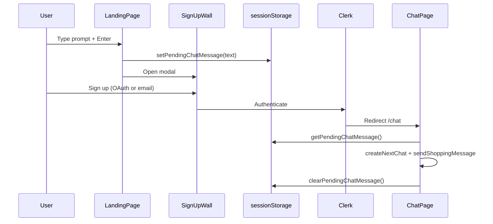

# ALE-65 Create a new landing page

## Context

[Linear ALE-65](https://linear.app/dewly/issue/ALE-65/create-a-new-landing-page): completely revamp the signed-out home page (`/`) so visitors can **enter a chat prompt directly from the landing hero**, then hit a sign-up wall before real chat begins. Align chrome, colors, and in-chat affordances with the **Enter to chat** prototype.

**Design source of truth (latest):**

| Asset | Path |
|-------|------|
| Standalone mock (ship target) | `commercePlatformMocks/Enter to chat/Dewly Landing v2 (standalone).html` |
| React source | `landing-v2.jsx`, `app-v2.jsx`, `data.jsx`, `signup.jsx`, `chat.jsx`, `styles.css` |
| Brand SVGs | `commercePlatformMocks/Enter to chat/brand/` |

**Prototype defaults** (`app-v2.jsx` `TWEAK_DEFAULTS`): `direction: "marketing"`, accent `#F26A38`, guided affordances on (`guideTyped`, `guideEnterHint`, `guideSteps`, `guideChatHelp`), sign-up wall on first submit (`requireSignup: true`).

**Acceptance criteria (from Linear):**

1. **Signed out:** no Chat / Routine toggle in the header.
2. **Signed out:** submitting a landing prompt opens a sign-up / sign-in screen.
3. **In chat:** a **“What can I ask?”** control opens suggestion chips.
4. **Signed in:** Chat / Routine toggle behaves as today.
5. **Signed in:** clicking the Dewly logo + wordmark goes to **Chat** (`/chat`), not the landing page.
6. **Visual:** consolidate to the prototype’s **orange + peach** ambient pattern.

**Repo scope:** `commerce-platform-frontend` (primary). Small follow-up in `commerce-platform-backend` to drop single-item comparison payloads ([backend PR #40](https://github.com/alex-the-programmer/commerce-platform-backend/pull/40)).

**Branch:** `ALE-65-create-a-new-landing-page` (frontend); `ALE-65-require-two-items-for-product-comparison` (backend follow-up).

**Shipped:** [frontend PR #18](https://github.com/alex-the-programmer/commerce-platform-frontend/pull/18) (merged to `main` at `2b6e29e`), [backend PR #40](https://github.com/alex-the-programmer/commerce-platform-backend/pull/40) (merged to `main` at `79bab9a`).

**Database changes:** None.

---

## Current state

| Layer | Location | Behavior today |
|-------|----------|----------------|
| Landing route | `app/page.tsx` | Static hero (“Find skincare that fits your routine—fast.”) + three feature cards + **Chat** link buttons; signed-in users `router.replace("/chat")` |
| Header (signed out) | `layoutWithHeader.tsx`, `headerAuthActions.tsx` | Logo + **Log in** + **Get started**; nav center slot hidden via `.commerceAppHeader--signedOut` |
| Header (signed in) | `floatingNavPill.tsx` | Chat \| Your Skincare Routine pill; logo `linkHome` → `/` |
| Chat entry | `proxy.ts` | `/chat(.*)` Clerk-protected — unsigned users cannot load real chat |
| Chat starters | `chatMessageList.tsx` | Four inline `STARTER_IDEAS` buttons in empty-state body only |
| Chat composer | `chatComposer.tsx` | Pill textarea + send; no “What can I ask?” toggle |
| Ambient background | `ambientGlow.tsx` | Two orange/gold radial orbs on `theme.colors.background` |
| Color tokens | `app/globals.css` | Cream `#f9f9f7`, orange `#ff5c35`, charcoal text — no peach multi-gradient ambient |
| Typography | `app/layout.tsx` | Geist sans + Instrument Serif display |

**Already satisfies AC partially:**

- `FloatingNavPill` returns `null` when `!isSignedIn` — signed-out users already see no Chat/Routine toggle.
- Signed-out header grid already hides the center nav slot.

---

## Gap analysis

| Area | Today | Target (ALE-65 / v2 mock) |
|------|-------|---------------------------|
| Landing hero | Marketing copy + link to `/chat` | Centered **marketing** hero with eyebrow, headline, subhead, **inline chat input**, starter chips, Enter hint, “How Dewly works” strip, value-prop cards |
| Enter to chat | Navigate to protected `/chat` | Capture prompt on `/`, open **sign-up wall** modal; persist prompt for post-auth send |
| Sign-up wall | Separate `/sign-up` page only | Full-screen modal over landing (OAuth + email + benefits list + dismiss) per `signup.jsx` |
| Header CTAs (signed out) | Log in + **Get started** | Log in + **Sign up** (coral pill) per mock topbar |
| Logo link (signed in) | `href="/"` | `href="/chat"` |
| Chat help | Starters only in empty message area | **“What can I ask?”** toggle above composer; popover with same starter set as landing |
| Colors / ambient | Flat cream + dual glow orbs | Peach multi-radial ambient (`.ambient` in mock `styles.css`) + coral accent `#F26A38` |
| Landing fonts | Instrument Serif headline | Marketing direction: **bold sans headline** (mock uses Hanken Grotesk 800); keep existing Geist stack unless design explicitly requests a font swap |
| Bottom marketing section | Three feature cards + second Chat CTA | **Removed** — value props live in hero `value-row` (marketing direction) |

---

## Design spec (marketing direction — ship default)

Implement the `direction === 'marketing'` branch from `landing-v2.jsx`. Other directions (`minimal`, `editorial`, `playful`) exist in the mock tweaks panel — **out of scope** for v1; do not build a tweaks panel.

### Landing layout

```
┌─────────────────────────────────────────────────────────────┐
│  [Dewly logo]                              Log in  Sign up  │  ← signed-out header (no center pill)
├─────────────────────────────────────────────────────────────┤
│                    peach radial ambient bg                  │
│                                                             │
│         [drop] 20,000+ Korean skincare products             │  ← eyebrow pill
│                                                             │
│     Find the Korean skincare that actually works for you.   │  ← h1, sans 800
│     Chat with Dewly to get matched from 20,000+ products…   │  ← subhead
│                                                             │
│   ┌─────────────────────────────────────────────────────┐   │
│   │ Try: I keep breaking out around my chin…        [↑] │   │  ← typed placeholder overlay
│   └─────────────────────────────────────────────────────┘   │
│        ↵ Enter to send · ⇧↵ new line · Replies in seconds…  │
│                                                             │
│        Not sure where to start? Tap a goal:                   │
│        [chip] [chip] [chip] [chip] [chip] [chip]            │
│                                                             │
│              HOW DEWLY WORKS                                │
│     (1) Tell Dewly… → (2) Get matched… → (3) Save routine   │
│                                                             │
│   ┌──────────────┐ ┌──────────────┐ ┌──────────────┐         │
│   │ 20,000+ …    │ │ Tailored…    │ │ Evolves…     │         │  ← value-row
│   └──────────────┘ └──────────────┘ └──────────────┘         │
└─────────────────────────────────────────────────────────────┘
```

### Copy (from mock — use verbatim unless product edits)

| Element | Text |
|---------|------|
| Eyebrow | `20,000+ Korean skincare products` |
| Headline | `Find the Korean skincare that actually works for you.` |
| Subhead | `Chat with Dewly to get matched from 20,000+ products and build a routine that evolves as your skin changes.` |
| Input placeholder (static) | `Tell Dewly about your skin, or ask anything…` |
| Chips label | `Not sure where to start? Tap a goal:` |
| Enter hint | `↵ Enter to send` · `⇧↵ new line` · `Replies in seconds with matched products & prices` |

### Starter chips + help popover

Centralize in `lib/landingStarters.ts` (ported from `data.jsx` `DEWLY_STARTERS`):

| id | label | prompt (abbreviated) |
|----|-------|----------------------|
| concern | Help with breakouts on my chin | chin/jaw breakout routine |
| routine | Build me a morning + night routine | beginner AM/PM for combination skin |
| sensitive | Gentle picks for sensitive skin | fragrance-free recommendations |
| specials | What's on special this week? | specials for dry dull skin |
| serum | Best vitamin C serum under $30 | dark spots / brighten |
| masks | What are some popular face masks? | sheet + wash-off options |

Icons: inline SVG components matching mock (`IcoSpark`, `IcoSun`, `IcoLeaf`, `IcoTag`, `IcoDroplet`, `IcoMask`) — port from `icons.jsx` or simplify to Lucide equivalents with same semantic mapping.

### Sign-up wall (`signup.jsx`)

Modal (`role="dialog"`, `aria-modal="true"`) shown when user submits from landing:

- Dewly mark, “Free account” eyebrow, headline, subhead
- Three benefit rows with check icons
- **Continue with Apple** / **Continue with Google** → Clerk OAuth (same strategies as `sign-in/page.tsx` / `sign-up/page.tsx`)
- Email field + **Create free account** → navigate to `/sign-up` with email prefilled if Clerk supports it, else store email in session and pass via query
- **Log in** link → `/sign-in`
- **I'll explore first** → close modal, restore prompt in landing input (no unsigned chat preview — `/chat` remains protected)

On OAuth / successful sign-in, read pending message from `sessionStorage` and continue post-auth flow (below).

### “What can I ask?” (chat)

Port `chat.jsx` `help-toggle` + `help-pop` pattern into chat chrome:

- Toggle button above composer: `? What can I ask?`
- Popover lists the same six starters; click sends message via existing `onSend` path and closes popover
- Show for all signed-in chat sessions (not only empty state)
- Keep existing empty-state starters in `chatMessageList.tsx` **or** remove duplication — prefer single source from `lib/landingStarters.ts` and empty-state can show a subset or link text “Try asking…”

### Color / ambient consolidation

Adopt mock tokens into `app/globals.css` (light mode primary surface):

| Token | Mock value | Action |
|-------|------------|--------|
| `--coral` / `--accent-solid` | `#F26A38` | Update `--orange` (or alias) to `#F26A38` |
| `--cream` / `--background` | `#FCF8F3` | Warm slightly vs today `#f9f9f7` |
| `--ink` / text | `#241B17` | Optional warm charcoal shift |
| Peach ambient | `--peach-bg-1`, `--peach-bg-2`, multi-radial `.ambient` | Add CSS variables + replace `AmbientGlow` implementation |

Apply peach ambient on **landing** and **chat** (mock uses same shell). Dark mode: keep existing dark tokens; peach ambient is light-mode-first (match mock — no dark landing mock).

**Scope note:** Full-app re-theme of every surface is not required — focus on landing, header, chat shell, and shared tokens. Routine/quiz pages inherit token updates only.

---

## Architecture & file plan

### New files

| File | Responsibility |
|------|----------------|
| `lib/landingStarters.ts` | Starter chip data + typed placeholder examples |
| `lib/pendingChatMessage.ts` | `sessionStorage` get/set/clear for post-auth first message |
| `components/landingPage.tsx` | Full landing composition (hero, chips, hiw, value cards) |
| `components/landingHeroInput.tsx` | Textarea, typed placeholder hook, send button, enter hint |
| `components/landingStarterChips.tsx` | Chip row |
| `components/landingHowItWorks.tsx` | Three-step strip |
| `components/landingValueCards.tsx` | Marketing value-row |
| `components/signUpWall.tsx` | Modal + benefit list + auth CTAs |
| `components/chatHelpToggle.tsx` | “What can I ask?” toggle + popover |
| `components/landingIcons.tsx` | Small SVG icons for chips / steps |

### Modified files

| File | Change |
|------|--------|
| `app/page.tsx` | Thin route wrapper → `<LandingPage />`; keep signed-in redirect |
| `app/globals.css` | Landing + wall + help + peach ambient classes; token updates |
| `components/ambientGlow.tsx` | Peach multi-radial background (or split: `LandingAmbient` used on `/` only) |
| `components/headerAuthActions.tsx` | **Sign up** coral pill; match mock auth button styles |
| `components/dewlyWordmark.tsx` | `linkHome` resolves to `/chat` when signed in, `/` when signed out |
| `components/layoutWithHeader.tsx` | Pass `isSignedIn` into wordmark href logic if needed |
| `components/chatPage.tsx` | Wire `chatHelpToggle`; consume pending message after auth |
| `components/chatComposer.tsx` | Slot for help toggle above input row |
| `components/chatMessageList.tsx` | Import starters from `lib/landingStarters.ts` (dedupe) |
| `lib/brand.ts` | Landing copy constants (headline, subhead, eyebrow) |

### Tests (Vitest + Testing Library)

| Test file | Coverage |
|-----------|----------|
| `landingPage.test.tsx` | Renders headline, chips, submit opens wall |
| `landingHeroInput.test.tsx` | Enter submits; typed placeholder respects `prefers-reduced-motion` |
| `signUpWall.test.tsx` | OAuth buttons, dismiss, login link |
| `pendingChatMessage.test.ts` | sessionStorage round-trip |
| `chatHelpToggle.test.tsx` | Toggle opens popover; chip click calls handler |
| `dewlyWordmark.test.tsx` | Signed-in href `/chat`, signed-out `/` |
| `headerAuthActions.test.tsx` | **Sign up** label + href |
| Update `layoutWithHeader.test.tsx` | Logo href when signed in |

---

## Key flows

### 1. Landing → sign-up wall → chat with first message



**Implementation details:**

1. `LandingPage.onSubmit(text)` → `setPendingChatMessage(text)` → `setWallOpen(true)`.
2. Clerk OAuth: use `redirectUrl: "/chat"` and `redirectCallbackUrl: "/sso-callback"` (existing pattern). Ensure `sso-callback` also lands on `/chat`.
3. `ChatPage` on mount (when `authReady` && pending message present):
   - If no `activeChatId`, call `createNextChatMutation` then `sendShoppingMessageMutation` with pending text.
   - Clear pending message on success; surface error via `ChatActionError` on failure.
4. Guard with a ref/`sessionStorage` flag to avoid double-send on Strict Mode remount (mirror `tryMarkConversationSeeded` pattern in `lib/chatConversationSeed.ts`).

### 2. Signed-in logo navigation

- `DewlyWordmark`: when `linkHome && isSignedIn` → `href="/chat"`; when signed out → `href="/"`.
- Update `aria-label` to “Dewly chat” vs “Dewly home” accordingly.
- Landing page itself remains reachable only when signed out (signed-in `/` still redirects to `/chat`).

### 3. Dismiss sign-up wall (“I'll explore first”)

- Close modal; do **not** navigate to `/chat`.
- Keep typed text in landing input state.
- Optional: show a slim dismissible reminder banner below header (mock `SignupBanner`) — include if low effort; otherwise defer.

---

## Design decisions

### Marketing direction only (locked)

Ship `direction: "marketing"` from the mock. No tweaks panel, no alternate layout directions in production.

### No anonymous / preview chat (locked)

The mock simulates unsigned chat with canned `dewlyReply`. Production `/chat` requires Clerk (`proxy.ts`). **Do not** add backend anonymous chat for this ticket. Unsigned users always hit the sign-up wall before a real thread.

### Shared starter catalog (locked)

One module (`lib/landingStarters.ts`) feeds landing chips, chat help popover, and (optionally) empty-state suggestions.

### Fonts (locked for v1)

Keep Geist + Instrument Serif already loaded. Style the marketing headline with **Geist sans, weight 800** to match mock proportions — do **not** add Hanken Grotesk / Newsreader unless design requests a follow-up font ticket.

### Accent color (locked)

Adopt mock coral `#F26A38` as `--accent-solid` for light mode to match prototype screenshots. Verify contrast on white/on-accent buttons.

### Remove legacy landing section (locked)

Delete the bottom “shopping concierge” three-card section and duplicate Chat CTAs from `app/page.tsx`. All marketing content lives in the new hero.

### Header on landing (locked)

Keep existing `commerceAppHeader` shell (logo left, auth right, no center pill). Restyle auth buttons to mock; hide `ThemeToggle` on landing if it competes visually — **optional**, default keep toggle.

---

## Implementation phases

### Phase 1 — Tokens, ambient, shared data

1. Add peach/coral CSS variables and `.commerceAmbient` (port from mock `styles.css`).
2. Update `AmbientGlow` (or page-level wrapper) to use peach gradients.
3. Create `lib/landingStarters.ts` and `lib/pendingChatMessage.ts`.
4. Add landing copy constants to `lib/brand.ts`.

### Phase 2 — Landing UI

1. Build `landingHeroInput` (typed placeholder hook with `prefers-reduced-motion` fallback).
2. Build chips, how-it-works, value cards components.
3. Compose `landingPage.tsx`; replace `app/page.tsx` body.
4. Add responsive CSS (mock breakpoints at ~900px / 600px).

### Phase 3 — Sign-up wall + post-auth send

1. Build `signUpWall.tsx` wired to Clerk OAuth + `/sign-up` / `/sign-in`.
2. Landing submit opens wall + stores pending message.
3. `ChatPage` reads pending message after auth and sends first message.

### Phase 4 — Header + logo behavior

1. Update `headerAuthActions` → Log in + Sign up styling.
2. Update `dewlyWordmark` signed-in link → `/chat`.
3. Confirm signed-out header still hides nav pill (regression test).

### Phase 5 — Chat “What can I ask?”

1. Build `chatHelpToggle.tsx`.
2. Integrate above `ChatComposer` in `chatPage.tsx`.
3. Dedupe starters in `chatMessageList.tsx`.

### Phase 6 — Tests & validation

1. Unit tests per table above.
2. `npm run lint` && `npm run build` in `commerce-platform-frontend`.

---

## Manual test plan

- [ ] Signed out `/`: no Chat/Routine pill; peach ambient; hero input + chips + how-it-works + value cards visible.
- [ ] Typed placeholder animates; respects reduced motion (shows first example static).
- [ ] Enter sends; Shift+Enter inserts newline.
- [ ] Chip click opens sign-up wall with pending message stored.
- [ ] Sign-up wall: Google OAuth completes → `/chat` → first message sent automatically.
- [ ] Sign-up wall: email path → `/sign-up` → after completion → `/chat` → first message sent.
- [ ] Sign-up wall: “I'll explore first” closes wall; prompt preserved on landing.
- [ ] Signed in: logo → `/chat` (not `/`).
- [ ] Signed in: Chat/Routine pill still works.
- [ ] Signed in `/chat`: “What can I ask?” opens starters; selecting one sends message.
- [ ] Mobile ~375px: hero, chips wrap, value cards stack, wall scrollable.
- [ ] Dark mode: no visual regressions on chat/routine (landing is light-focused).

---

## Out of scope

- Backend / GraphQL changes, anonymous chat, or guest threads
- Mock layout directions other than **marketing** (`minimal`, `editorial`, `playful`)
- Mock tweaks panel (`tweaks-panel.jsx`)
- Replacing Geist with Hanken Grotesk
- Changing Clerk application settings
- Routine page layout changes beyond inherited color tokens
- SEO / metadata copy refresh (optional nice-to-have)

---

## Related work

- [ALE-31](ALE-31-re-theme-navigation.md) — floating Chat/Routine pill, `/chat` routes
- [ALE-46](ALE-46-rename-hubble-to-dewly.md) — brand constants, header auth pattern, signed-out nav hiding
- [ALE-52](ALE-52-change-logo-and-dewly-font-size.md) — nav wordmark sizes

---

## TODO

- [x] Phase 1: Peach/coral tokens + ambient background + `lib/landingStarters.ts` + `lib/pendingChatMessage.ts`
- [x] Phase 2: Landing components + replace `app/page.tsx` + responsive CSS
- [x] Phase 3: `signUpWall.tsx` + pending-message post-auth send in `chatPage.tsx`
- [x] Phase 4: Header auth restyle + signed-in logo → `/chat`
- [x] Phase 5: `chatHelpToggle.tsx` + dedupe chat starters
- [x] Phase 6: Unit tests + `npm run build`

### Follow-up polish (shipped in PR #18 second commit)

- [x] Shared `signUpWallContext` — header Log in / Sign up open distinct wall modes without false “chat started” copy
- [x] Chat z-index fix (messages visible under ambient glow); grouped composer footer
- [x] Pending landing prompt routing + Apollo cache seed after `startShoppingConversation`
- [x] Single-item “Quick compare” → “Top pick” card; discount strip excludes comparison finalists
- [x] Backend: require ≥2 items before persisting comparison ([PR #40](https://github.com/alex-the-programmer/commerce-platform-backend/pull/40))
