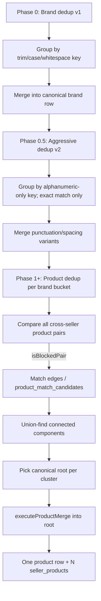

# ALE-77 Evaluate and extend cross-retailer product deduplication

## Context

**Linear:** [ALE-77](https://linear.app/dewly/issue/ALE-77/evaluate-and-extend-cross-retailer-product-deduplication)

We recently ingested catalog data from many new K-beauty retailers (multi-brand shops, US brand stores, Korea specialists). Cross-retailer **product deduplication** today only runs for **Olive Young Global × Style Korean**. Each retailer scrape currently creates its own `products` row (keyed by seller-scoped `sku`), so the same physical SKU often appears multiple times in `products` instead of once with multiple `seller_products`.

**Desired end state:** One canonical `brands` row per real-world brand, then one canonical `products` row per sellable SKU (same product + same size/shade), with one `seller_products` row per retailer listing attached to it. Downstream price comparison (`listSellerOffersForProduct`, `pickLowestPricedSellerOffer`, shopping cards) already assumes this model — it just does not work until duplicates are merged.

**Prerequisite:** **Brand dedup must run before product dedup** — Phase 0 (v1: case/whitespace) then Phase 0.5 (v2: punctuation/spacing, exact aggressive key only). Product matching gates on shared `brandId`; duplicate brand rows split the same real brand into separate buckets and prevent cross-retailer product edges.

**Branch (when implementing):** `ALE-77-cross-retailer-product-deduplication-evaluation` (`commerce-platform-backend` for merge scripts; `commerce-platform-scrapers` for brand resolution on ingest).

**Database changes:** Phase 0 may add `brands.normalizedName` (unique) — **architect approval required**. Phase 2+ product dedup may rename `product_match_candidates` pair columns — **architect approval required**.

**Related:**

- [ALE-76](./ALE-76-extend-catalog-spec-resolution-new-retailers.md) — merged products carry specs from multiple retailers; thumbnail/ingredient resolution must stay correct after dedup.
- Scrape integration plans (ALE-56–74) — all explicitly defer `ProductMatchCandidate` merges to this work.

---

## Strategy decision (locked)

**Use name-heuristic blocking only; no LLM scoring step.**

| Decision | Rationale |
|----------|-----------|
| Match via `isBlockedPair` (token overlap + prefix) within same brand | Cheap, deterministic, already produced good candidate pairs for OY×SK |
| Auto-merge all non-`MERGED` candidates | Manual review showed heuristic pairs were mostly correct; `runLlmProductMatching.ts` often **incorrectly REJECTED** valid same-SKU pairs (strict size/shade prompt, uncertainty → `match: false`) |
| Remove `runLlmProductMatching.ts` from the pipeline | Not used for v1 multi-retailer rollout; script may remain on disk for reference but is **out of scope** |
| **No primary / secondary retailer** | OY Global was “primary” only because it had the best taxonomy when dedup was OY×SK. Many clusters are 3–5 retailers with **no OY listing** (Peach & Lily + Soko Glam + COSRX US only). Matching and merging must be **symmetric across all sellers**. |
| **Full multi-retailer comparison** | Within each brand, compare products across **every seller pair** (not hub-and-spoke through OY). Build **equivalence clusters** (union-find); one canonical `products` row per cluster. |
| **Brand dedup before product dedup** | Collapse duplicate `brands` rows first so the product **brand gate** (`same brandId`) reflects real-world brands. |

**End-to-end pipeline:**



**Name heuristic (how a pair is produced):**

1. **Brand gate** — only compare products sharing the same `brandId` (exclude `Unknown brand`).
2. **Cross-seller only** — compare product A (seller X) vs product B (seller Y) where X ≠ Y.
3. **Token overlap** — lowercase names; extract tokens (3+ alphanumeric/Hangul chars); drop stop words (`ml`, `set`, `spf`, etc.); match if ≥2 shared tokens (`PRODUCT_DEDUP_MIN_TOKEN_OVERLAP`, default 2).
4. **Prefix fallback** — if token overlap fails, match when either normalized name contains the other’s first 12 characters.
5. **Cap** — at most K counterpart candidates per product per run (`PRODUCT_DEDUP_MAX_COUNTERPARTS_PER_PRODUCT`, rename from `PRODUCT_DEDUP_MAX_OY_PER_SK`).

Implementation today: `lib/productDedupBlocking.ts`, `buildProductMatchCandidates.ts` (still OY×SK asymmetric — **to be generalized**).

**Canonical root selection (within a cluster, not a “primary retailer”):**

When collapsing a connected component, pick **one** surviving `products.id` as the canonical row (`mergedIntoProductId` chain points here). Tie-breakers in order:

1. Row that already has the **most `seller_products`** (preserves existing multi-retailer merges).
2. Row with **richest taxonomy** — best `categoryId` / most `product_seller_specs` (OY often wins here but is **not required**).
3. **Lowest `products.id`** (stable deterministic fallback).

Display name, thumbnail, and ingredients for cards already resolve from **specs on the canonical row** ([ALE-76](./ALE-76-extend-catalog-spec-resolution-new-retailers.md)); they do not require OY to be in the cluster.

---

## Current architecture (audit)

### Data model

| Table / column | Role |
|----------------|------|
| `brands` | Brand identity (`name` only today — **no unique constraint**) |
| `products` | Canonical product identity (name, brand, category, `sku`) |
| `products.mergedIntoProductId` | Tombstone pointer when a duplicate row was merged into a canonical row |
| `seller_products` | `(sellerId, productId)` — retailer listing; **unique per seller per product** |
| `seller_product_prices` | Price per `seller_product` + currency |
| `product_match_candidates` | Duplicate **pair** with `matchMethod`, `status`. **Legacy:** `primaryProductId` / `secondaryProductId` implied OY→SK direction; **target:** unordered pair or explicit `sellerAId`/`sellerBId` |

`ProductMatchStatus` in v1: `PENDING` (or legacy `APPROVED`/`REJECTED`) → merge → `MERGED`. No LLM review step.

**Legacy limitation:** `primaryProductId` / `secondaryProductId` and “OY is always primary” in `executeProductMerge` are **OY×SK artifacts**, not the long-term model.

### Pipeline scripts (`commerce-platform-backend/scripts/`)

| Script | What it does | Limitations |
|--------|--------------|-------------|
| `buildProductMatchCandidates.ts` | For each overlapping brand (OY ∩ SK), token-overlap blocking; inserts `PENDING` rows | **OY × SK only**, asymmetric primary/secondary — replace with all-seller-pairs-in-brand |
| `lib/productDedupBlocking.ts` | `significantTokens`, overlap ≥2 or 12-char prefix match | No volume/shade normalization — can false-merge variants with similar titles |
| `mergeMatchedProducts.ts` | Runs `executeProductMerge` for all candidates where `status != MERGED` | **Intentional** — auto-merge heuristic matches regardless of legacy LLM `REJECTED` status; must use **cluster canonical root**, not fixed primary |
| `lib/executeProductMerge.ts` | Moves `seller_products`, specs, reviews, cart refs to **survivor**; sets merged row tombstone | Survivor = canonical root from cluster picker, **not** “always OY” |
| `runLlmProductMatching.ts` | ~~Batch LLM scoring~~ | **Removed from pipeline** — do not run for dedup |
| `analyzeProductDedup*.ts` | Ad-hoc DB exploration (counts, brand overlap, name duplicates) | Not a repeatable metrics report |

### Runtime resolution

- `src/interactions/catalog/resolveCanonicalProduct.ts` — APIs follow `mergedIntoProductId` chain.
- `commerce-platform-scrapers/src/db/resolveCanonicalProductRow.ts` — scrapers resolve tombstones on re-ingest.

### What already works post-merge

- `listSellerOffersForProduct` loads all `seller_products` on the canonical product and returns per-retailer prices.
- `getShoppingProductCardsBatch` picks lowest linkable offer across sellers on the canonical product.
- **Gap:** Without dedup, each retailer’s listing sits on a separate `products` row, so price comparison across retailers for the “same” SKU does not happen.

### Brand table — root cause of duplicates

| Issue | Detail |
|-------|--------|
| No uniqueness on `brands.name` | Same logical brand can exist as multiple rows |
| Scraper lookup was case-sensitive exact match (pre-Phase 0) | Fixed in Phase 0.3 (v1) + Phase 0.5 (aggressive fallback) via `resolveBrandByName.ts` |
| Verbatim duplicates | Same string inserted twice (race or re-ingest) — rare but possible without unique index |
| Punctuation/spacing variants (post-v1) | e.g. `AGE 20's` vs `AGE20'S` — addressed in Phase 0.5 aggressive merge |
| Product dedup impact | `INTERSECT` on `brandId` treats duplicate brand rows as different brands → **zero overlap**, no product match edges |

Pattern repeated across Shopify upserts (`upsertProductFromPeachAndLilyHit.ts`, `upsertProductFromJolseHit.ts`, etc.).

---

## Phase 0 — Brand dedup (prerequisite, before product dedup)

**Goal:** One canonical `brands` row per real-world brand so product dedup’s brand gate works across retailers.

### 0.1 Audit duplicate brands

Script `scripts/brandDedupReport.ts`:

| Metric | SQL / logic |
|--------|-------------|
| Total brands | `COUNT(*)` from `brands` |
| Duplicate groups | `GROUP BY lower(trim(name))` HAVING `COUNT(*) > 1` |
| Case-only variants | Groups where raw `name` values differ only by case |
| Verbatim duplicates | Groups where raw `name` is identical |
| Products affected | `SUM` of `products` per duplicate group |
| Sample rows | Top 20 groups by product count |

Store snapshot under `scripts/fixtures/brand-dedup/`.

**Normalization key (v1):**

```ts
function normalizeBrandName(name: string): string {
  return name.trim().replace(/\s+/g, " ").toLowerCase();
}
```

v1 matches: case differences, leading/trailing whitespace, collapsed internal spaces.

**Out of v1 (addressed in Phase 0.5):** punctuation and spacing variants (`AGE 20's` vs `AGE20'S`, `AMPLE:N` vs `AMPLE N`, `K-POP` vs `KPOP`).

**Still out of scope:** fuzzy aliases (`Etude` vs `ETUDE HOUSE`), prefix/substring matches (`Alive` vs `ALIVE LAB`), product-line suffixes (`AMUSE` vs `AMUSEDew`) — manual mapping table if needed later.

### 0.2 Merge duplicate brands

Script `scripts/mergeDuplicateBrands.ts` + `lib/executeBrandMerge.ts`:

For each normalization group with `COUNT > 1`:

1. **Pick canonical brand** (survivor):
   - Most `products` referencing it
   - Tie-break: lowest `brands.id`
   - **Display `name`:** keep the most common raw spelling among members, or the survivor’s current `name` (prefer established casing e.g. `COSRX` over `cosrx` when product count ties)
2. **Repoint FKs** from duplicate brand ids → canonical:
   - `products.brandId`
   - `chat_considered_brands.brandId` (handle `@@unique([chatId, brandId])` clashes — delete duplicate link if canonical already linked)
   - `coupon_programs.brandId` (nullable; same clash handling)
3. **Delete** duplicate `brands` rows (no tombstone column today)

Support `--dry-run` and `--limit`. Skip `Unknown brand` unless explicitly grouped (usually single row).

### 0.3 Prevent new duplicates on ingest (scrapers)

Shared helper in `commerce-platform-scrapers` (e.g. `src/db/resolveBrandByName.ts`):

```ts
// 1. normalize input (v1: trim/collapse/lowercase)
// 2. findFirst where lower(trim(name)) matches
// 3. if miss, findFirst where aggressive key matches (Phase 0.5)
// 4. create with canonical display name if missing
```

Replace copy-pasted brand blocks in each `upsertProductFrom*Hit.ts`. **Long-term:** `brands.normalizedName` column + unique index (architect approval) so DB enforces uniqueness.

### 0.4 Phase 0 exit criteria (v1)

| Criterion | Target |
|-----------|--------|
| Zero duplicate groups on `lower(trim(name))` | Except documented manual aliases in a skip list |
| `brandDedupReport.ts` clean (`--mode=v1`) | Re-run after merge |
| Scraper helper merged | At least one retailer path + pattern documented for rest |
| Product dedup unblocked | Overlap-brand counts between seller pairs increase vs pre-merge snapshot |

**Local v1 merge (2026-06-13):** 2,213 brands → 1,859 brands (296 groups, 354 duplicate rows deleted).

---

## Phase 0.5 — Aggressive brand dedup (punctuation / spacing variants)

**Goal:** Collapse brands that v1 left separate because punctuation, apostrophes, or internal spacing differed, while **not** merging brands that only share a prefix or product-line suffix.

**When:** Run **after** Phase 0 v1 merge on a clean v1 report (`duplicateGroups=0` under `--mode=v1`).

### 0.5.1 Why v2 was needed

After v1, ad-hoc inspection found pairs like:

| Raw names | v1 key | v2 (aggressive) key | Merge? |
|-----------|--------|---------------------|--------|
| `AGE 20's` / `AGE20'S` | different | both `age20s` | yes |
| `Alternative stereo` / `alternativestereo` | different | both `alternativestereo` | yes |
| `AMPLE:N` / `AMPLE N` | different | both `amplen` | yes |
| `K-POP` / `KPOP` | different | both `kpop` | yes |
| `Dr.Jart+` / `Dr.Jart` | different | both `drjart` | yes |
| `TONYMOLY` / `TONY MOLY` | different | both `tonymoly` | yes |
| `Alive` / `ALIVE LAB` | different | `alive` vs `alivelab` | **no** |
| `AMUSE` / `AMUSEDew` / `AMUSESoft` | different | `amuse`, `amusedew`, `amusesoft` | **no** |

v1 fixed case and whitespace only. v2 catches “same spelling, different punctuation/spacing” without fuzzy matching.

### 0.5.2 Normalization key (v2)

```ts
/** v2: lowercase letters, digits, and Hangul only */
function normalizeBrandNameAggressive(name: string): string {
  return name.toLowerCase().replace(/[^a-z0-9가-힣]+/g, "");
}
```

**Auto-merge rule:** group brands by aggressive key; merge a group **only when** `COUNT > 1` and the aggressive key is **non-empty**. No prefix matching, no edit distance, no “contains” heuristics.

**Canonical pick / FK repoint / delete:** same as Phase 0.2 (`executeBrandMerge.ts`, `pickCanonicalBrand`, `pickDisplayBrandName`).

**Duplicate kind:** `punctuation_spacing` when v1 keys differ but aggressive keys match; otherwise inherit v1 kind (`case_only`, `whitespace`, `verbatim`) for groups that still qualify under both keys.

### 0.5.3 Scripts and flags

| Script | v1 (default) | v2 |
|--------|--------------|-----|
| `scripts/brandDedupReport.ts` | `--mode=v1` → `scripts/fixtures/brand-dedup/report.json` | `--mode=v2` → `report-v2.json` |
| `scripts/mergeDuplicateBrands.ts` | `--mode=v1` | `--mode=v2` |

Both support `--dry-run` and `--limit=N`. Skip `Unknown brand` (same as v1).

**Code locations:**

- `scripts/lib/brandDedup/normalizeBrandName.ts` — `normalizeBrandName` (v1), `normalizeBrandNameAggressive` (v2)
- `scripts/lib/brandDedup/brandDedupLogic.ts` — `groupDuplicateBrands(brands, mode)`
- `commerce-platform-scrapers/src/db/resolveBrandByName.ts` — v1 lookup, then v2 aggressive SQL fallback on ingest

**Scraper aggressive lookup (Postgres):**

```sql
WHERE lower(regexp_replace(name, '[^a-z0-9가-힣]+', '', 'g')) = $aggressiveKey
```

### 0.5.4 Local merge results (2026-06-13)

Run order: v1 merge (already done) → v2 report → v2 dry-run → v2 live merge → verify.

| Step | Result |
|------|--------|
| Pre-v2 brands | 1,859 |
| v2 duplicate groups | 74 (`punctuation_spacing`) |
| Brands merged (live) | 78 rows across 74 groups |
| Post-v2 brands | **1,781** |
| Post-v2 `brandDedupReport --mode=v2` | **0 duplicate groups** |
| Post-v2 `brandDedupReport --mode=v1` | **0 duplicate groups** (v2 merge did not reintroduce v1 dupes) |

Example merges: `AGE 20's`+`AGE20'S`, `AMPLE:N`+`AMPLE N`, `SOME BY MI`+`SOMEBYMI`, `Hada Labo`+`HADA LABO`.

### 0.5.5 Phase 0.5 exit criteria

| Criterion | Target |
|-----------|--------|
| Zero duplicate groups on aggressive key | `brandDedupReport.ts --mode=v2` |
| v1 still clean | `brandDedupReport.ts --mode=v1` |
| Scraper resolves aggressive variants | `resolveBrandByName` v2 fallback + tests |
| False-merge guardrails | No merge when aggressive keys differ (`Alive`/`ALIVE LAB`, `AMUSE`/`AMUSEDew`) |

### 0.5.6 What we explicitly did not do

- Prefix / substring matching (`alive` ⊂ `alivelab`)
- Product-line suffix collapsing (`AMUSE` + `AMUSEDew`)
- Fuzzy alias table (`Etude` vs `ETUDE HOUSE`)
- DB unique index on aggressive key (still optional `brands.normalizedName` in Phase 0.4)

---

## Phase 1 — Evaluate name-heuristic effectiveness on OY×SK (after Phase 0)

**Goal:** Measure how well **token-overlap blocking + auto-merge** works on the only pair it was built for, before extending to other retailers.

## Retailer inventory (scope)

As of the recent scrape wave, sellers in scope include (non-exhaustive):

| Seller | Prefix / platform | Notes |
|--------|-------------------|-------|
| Olive Young Global | `OY ` | Richest taxonomy/specs — **tie-breaker for canonical root**, not required in cluster |
| Olive Young US | `OY US ` | Separate catalog from Global |
| Style Korean | `SK ` | Legacy second half of OY×SK pair only |
| Jolse | `JL ` | HTML ingredients spec |
| Soko Glam, Wishtrend, RoseRoseShop, Peach & Lily, Moida, Oh Lolly | Shopify `* Thumbnail URL` | Description-heavy; few dedicated ingredient specs |
| COSRX US, BOJ US, Medicube US, Innisfree US, Laneige US | Brand stores | Often overlap with multi-brand retailers |
| Skinglow Haven | `SGH ` | WooCommerce |
| Tester Korea, BeautyNet Korea, Stylevana, iHerb | Various | In progress / blocked / optional |

**Comparison scope:** 22 sellers → 231 unordered **seller** pairs, but we do **not** hub through OY. Per brand bucket: compare every product on seller A against every product on seller B for all pairs (A,B) where both have listings in that brand. Union-find collapses transitive matches (A↔B, B↔C ⇒ A,B,C one cluster). Phase 2 estimates candidate edge volume from name blocking (no LLM cost).

### 1.1 Inventory baseline metrics

Add script `scripts/productDedupBaselineReport.ts` (or extend `analyzeProductDedup.ts`) that prints:

| Metric | SQL / logic |
|--------|-------------|
| Total active products | `mergedIntoProductId IS NULL` |
| Products per seller | `seller_products` grouped by `sellerId` |
| Multi-seller products today | `products` with `COUNT(seller_products) > 1` |
| Tombstoned products | `mergedIntoProductId IS NOT NULL` |
| Candidate counts by status | `product_match_candidates` group by `status` |
| Overlap brands per seller pair | INTERSECT on `brandId` — **run after Phase 0** so case-duplicates count as one brand |

Store output as dated snapshot under `scripts/fixtures/product-dedup/` for regression.

### 1.2 Heuristic quality (OY×SK)

For legacy `product_match_candidates` (OY as `primaryProductId`, SK as `secondaryProductId`, `blocked_heuristic`):

| Metric | Definition |
|--------|------------|
| **Precision** | Sample N candidate pairs (or post-merge pairs); human label: same sellable SKU? Target: report % |
| **False positive rate** | Heuristic pairs that differ in volume, shade, or bundle vs single |
| **Recall proxy** | Among brands in overlap, count SK products with no candidate to any OY product but high name similarity (token overlap ≥3 or pg_trgm if available — see `probeFuzzyProducts.ts`) |
| **Blocking yield** | `inserted candidates / (|SK| × |OY|)` per brand — is blocking too loose or too tight? |

### 1.3 Build a small ground-truth set

Manually label **~50–100** OY×SK pairs (stratified):

- Heuristic matches that were merged (positives)
- Heuristic matches that look wrong (false positives)
- Random non-matched pairs in same brand (negatives / recall)
- Known-hard cases: minis, sets, refills, shade variants, US vs KR packaging names

Save as `scripts/fixtures/product-dedup/ground-truth-oy-sk.json`:

```json
{
  "pairs": [
    {
      "productIdA": 123,
      "productIdB": 456,
      "sellerA": "Olive Young Global",
      "sellerB": "Style Korean",
      "sameSellableSku": true,
      "notes": "50ml cream, same INCI"
    }
  ]
}
```

Script `scripts/productDedupEvaluate.ts` computes precision/recall/F1 against this file by re-running `isBlockedPair` on labeled product names (and optionally checking merge outcomes).

### 1.4 Merge outcome audit

For products with `mergedIntoProductId` set:

- Verify `seller_products` from all merged retailers exist on **canonical root** only
- Verify no duplicate `(sellerId, productId)` clashes lost listings
- Spot-check 20 merges: specs from both retailers present on canonical row
- Confirm scrapers still resolve via tombstone SKU (`resolveCanonicalProductRow`)

### 1.5 Phase 1 exit criteria

| Criterion | Target (initial — tune after first run) |
|-----------|----------------------------------------|
| Documented precision on ground truth | ≥90% on heuristic matches (tune after first run) |
| Documented false merge risk | <2% on labeled negatives |
| Recall proxy | Report % (no hard gate yet) |
| Written recommendation | **Extend** vs **redesign** with evidence |

---

## Phase 2 — Multi-retailer gap analysis

**Goal:** Determine what must change before running dedup across all sellers.

### 2.1 Pairwise volume model

Script `scripts/productDedupPairwiseCostEstimate.ts`:

For **all unordered seller pairs** (and optionally per-brand):

- Count overlapping brands (exclude `Unknown brand`)
- Estimate match **edges** using `isBlockedPair` on name only (same logic as production)
- Estimate **cluster count** after union-find (transitive closure — edges A-B + B-C merge to one component)
- Report clusters with 3+ retailers and **zero OY Global** members (validates need to drop OY-primary model)

Deliverable: table of top seller pairs by edge volume, total edges, estimated components, OY-absent cluster %.

**Local run (2026-06-13, after brand dedup + OY×SK merge):**

| Metric | Value |
|--------|-------|
| Dedup-enabled sellers | 21 |
| Brand buckets (2+ sellers) | 567 |
| Estimated heuristic edges | 285,358 |
| Multi-product components (union-find) | 658 |
| Products that would become tombstones | ~24,446 |
| Components with 3+ sellers | 284 |
| 3+ seller components without OY Global | 39 (13.7%) |

Top edge volume: OY Global × OY US (35k), Tester Korea × Skinglow Haven (31k), OY Global × Moida (22k).

Script: `npx dotenv-cli -e .env -e .env.local -- tsx scripts/productDedupPairwiseCostEstimate.ts`  
Output: `scripts/fixtures/product-dedup/pairwise-cost-estimate.json`

Supporting modules: `scripts/lib/productDedup/productDedupConfig.ts` (all sellers with listings), `estimatePairwiseEdges.ts`, `productDedupClusters.ts` (union-find).

### 2.2 Blocking signal inventory

Per retailer, catalog which **deterministic** match keys exist in `product_seller_specs`:

| Signal | Examples | Cross-retailer potential |
|--------|----------|-------------------------|
| GTIN / EAN / UPC | `GTIN` (SK) | High if populated |
| Brand SKU / manufacturer code | OY `prdtNo`, Shopify variant SKU | Medium — often retailer-specific |
| Normalized INCI hash | `SK ingredients`, `JL ingredients` | Medium — formulation match, not size |
| Korean product name | `Original name` | Medium — OY only today |
| Shopify barcode | Often in raw JSON if we scrape it | High — **gap: not consistently stored** |

Document per-seller coverage % in report.

### 2.3 Canonical model — union-find, no primary retailer (locked)

**Drop the primary/secondary retailer concept.** OY Global was primary only for historical OY×SK scripts and taxonomy quality — not because the data model requires a hub seller.

| Requirement | Approach |
|-------------|----------|
| Same SKU on 3–5 retailers, OY not among them | Valid cluster; merge all into one canonical `products` row |
| Transitive matches (A↔B, B↔C) | **Union-find** (or connected components on match graph) before merge |
| Which `products.id` survives | **Canonical root picker** (tie-breakers above) — not “who is primary” |
| Pair storage | Treat `(productIdA, productIdB)` as **unordered**; store `sellerAId`/`sellerBId` for audit |
| `executeProductMerge(survivor, merged)` | Direction only for tombstone pointer; survivor = cluster root, not OY by convention |
| Price comparison | `listSellerOffersForProduct(canonicalId)` already returns **all** retailers on that row |

**Explicit non-goals:**

- Hub-and-spoke dedup through OY Global only
- Requiring OY in a cluster for merge to happen
- Pairwise rollout that leaves US-only duplicates unlinked until OY is added

**Schema follow-up (Phase 3, architect approval):**

- Rename or deprecate `primaryProductId` / `secondaryProductId` on `product_match_candidates`
- Optional: `products.canonicalRootId` self-FK or materialized cluster id (only if union-find via tombstone chains is too slow to resolve)

### 2.4 Optional future signals (not v1)

If name-heuristic precision is insufficient after Phase 1, consider **deterministic** enrichments before any LLM:

- GTIN / barcode exact match (when scraped)
- Normalized volume parsed from title (`50ml`, `1.7 fl oz`)
- INCI fingerprint hash (same formula, different size — still ambiguous)

**Out of scope v1:** `runLlmProductMatching.ts` and any LLM-based pair scoring.

### 2.5 Safety gates before scaling merges

1. **`--dry-run`** on `mergeMatchedProducts.ts` for the full multi-seller pass before live merge
2. **`--limit` / `PRODUCT_DEDUP_MERGE_LIMIT`** — cap merges per run
3. Per-edge logging of both product names + seller names + chosen canonical root
4. Spot-check false-positive patterns (shade codes, minis) and tune `PRODUCT_DEDUP_MIN_TOKEN_OVERLAP` if needed

### 2.6 Phase 2 exit criteria

Phase 2 exit: confirm edge volume is acceptable and union-find clustering handles OY-absent components.

---

## Phase 3 — Implementation (after Phase 1–2 gate)

### 3.1 Seller configuration

Replace `lib/productDedupSellers.ts` with `lib/productDedupConfig.ts`:

- List of all dedup-enabled `sellerId`s (flat list — **no primary ordering**)
- Optional per-seller spec prefix map (for future GTIN pass)

### 3.2 Multi-retailer candidate builder

Replace pairwise OY×SK script with `buildProductMatchCandidates.ts` (or `buildProductMatchGraph.ts`):

```
for each brandId (excluding Unknown):
  for each unordered seller pair (S1, S2) with products in brand:
    for each product P1 on S1, product P2 on S2:
      if isBlockedPair(P1.name, P2.name): insert undirected edge / candidate row
```

- Same `isBlockedPair` name heuristic (no LLM)
- Cap counterparts per product (`PRODUCT_DEDUP_MAX_COUNTERPARTS_PER_PRODUCT`)
- Optional GTIN exact-match edges (future)

### 3.3 Cluster merge orchestration

New `lib/productDedupClusters.ts`:

- Union-find on match edges (only among `mergedIntoProductId IS NULL` roots)
- `pickCanonicalRoot(component)` — tie-breakers from Strategy decision
- `mergeMatchedProducts.ts` iterates components (size ≥ 2), merges non-root members into root via `executeProductMerge`

Order of merges within a component: merge into root incrementally; re-resolve root if tombstone chain changes.

### 3.4 Rollout

**Single full pass** over all configured sellers (not phased by OY hub) — **after Phase 0 brand merge**:

1. Re-run `brandDedupReport.ts` (v1 and v2 must be clean)
2. Dry-run cluster report: component sizes, OY-absent clusters, sample names
3. `buildProductMatchCandidates` (all sellers)
4. `mergeMatchedProducts` with `--dry-run`, then live
5. Re-run baseline report; verify multi-seller `products` count increases

Optional incremental reruns when a **new seller** is onboarded: compare only that seller’s products against all others (same brand + heuristic), union into existing clusters.

### 3.5 Product-facing verification

After each rollout batch:

- Spot-check shopping agent compare flow shows **one card** with multiple offers / best price
- `getLowestPriceLinkableOffer` returns expected retailer
- No duplicate cards for same physical product in search/recommendations ([ALE-18](./ALE-18-fix-recommendation-of-similar-products.md))

### 3.6 Tests

| Test | Type |
|------|------|
| `executeBrandMerge.test.ts` | Interaction — repoints `products.brandId`, handles chat/coupon clashes, deletes duplicate brand |
| `normalizeBrandName.test.ts` | Unit — case, whitespace, v1 edge cases |
| `normalizeBrandNameAggressive.test.ts` | Unit — punctuation/spacing; guardrails for prefix/suffix brands |
| `productDedupBlocking.test.ts` | Unit — token overlap edge cases |
| `productDedupClusters.test.ts` | Unit — union-find, transitive A-B-C, canonical root tie-breakers, OY-absent cluster |
| `executeProductMerge.test.ts` | Interaction — merge moves `seller_products`, tombstone, no duplicate seller clash |
| `productDedupEvaluate.test.ts` | Unit — metrics from fixture ground truth |
| `resolveCanonicalProduct.test.ts` | Extend — multi-hop chain after several merges |

---

## Phase 4 — Ongoing operations (future)

- Scheduled job or manual runbook: new catalog → `buildProductMatchCandidates` → `mergeMatchedProducts`
- Dashboard: candidate count per seller pair, merges per week, duplicate rate by seller, heuristic false-positive samples
- Re-open [ALE-76](./ALE-76-extend-catalog-spec-resolution-new-retailers.md) if merged spec conflicts affect thumbnails/ingredients

---

## Risks

| Risk | Mitigation |
|------|------------|
| Brand duplicates split product matching | **Phase 0** v1 merge + **Phase 0.5** aggressive merge + case-insensitive + aggressive ingest lookup; optional `brands.normalizedName` unique |
| False merge combines different sizes/shades | Phase 1 ground-truth precision; tune `MIN_TOKEN_OVERLAP`; optional volume parsing in v2 |
| Heuristic too loose (similar titles, different variants) | Manual spot-checks per rollout batch; stricter overlap threshold per seller pair |
| Wrong canonical root (suboptimal name/category on survivor) | Root picker tie-breakers; ALE-76 spec resolution picks best thumbnail/ingredients per offering |
| OY-absent clusters (US-only retailers) | Union-find across all sellers — no OY required |
| Scraper breaks on tombstone SKU | Already handled via `resolveCanonicalProductRow`; verify per new retailer upsert |
| Brand normalization (`Unknown brand`) | Exclude from product blocking; do not merge `Unknown brand` with real brands |

---

## TODO

### Phase 0 — Brand dedup (first)

- [x] Phase 0.1 — `brandDedupReport.ts` + first snapshot
- [x] Phase 0.2 — `mergeDuplicateBrands.ts` + `executeBrandMerge.ts` (dry-run, then live)
- [x] Phase 0.3 — `resolveBrandByName.ts` in scrapers; roll out to upsert paths
- [ ] Phase 0.4 — Optional migration: `brands.normalizedName` unique (architect approval)
- [x] Phase 0 exit (v1) — Zero case/whitespace duplicate groups (local: 2,213 → 1,859 brands)

### Phase 0.5 — Aggressive brand dedup

- [x] Phase 0.5.1 — `normalizeBrandNameAggressive` + `groupDuplicateBrands(..., "v2")`
- [x] Phase 0.5.2 — `brandDedupReport.ts --mode=v2` + `report-v2.json` snapshot
- [x] Phase 0.5.3 — `mergeDuplicateBrands.ts --mode=v2` (dry-run, then live; local: 74 groups, 78 brands merged)
- [x] Phase 0.5.4 — Scraper `resolveBrandByName` aggressive fallback + unit tests
- [x] Phase 0.5 exit — Zero aggressive-key duplicate groups (local: 1,859 → 1,781 brands); v1 report still clean
- [ ] Overlap-brand counts improved vs pre-merge snapshot (verify in Phase 1 baseline)

### Phase 1 — Product dedup evaluation

- [ ] Phase 1.1 — `productDedupBaselineReport.ts` + first snapshot
- [ ] Phase 1.2 — Heuristic quality metrics on existing OY×SK candidates/merges
- [ ] Phase 1.3 — Build `ground-truth-oy-sk.json` (~50–100 labeled pairs)
- [ ] Phase 1.4 — `productDedupEvaluate.ts` + precision/recall report (name heuristic only)
- [ ] Phase 1.5 — Merge outcome audit (20 spot-checks)
- [ ] Phase 1 exit — Written extend vs redesign recommendation

### Phase 2 — Multi-retailer gap analysis

- [x] Phase 2.1 — `productDedupPairwiseCostEstimate.ts` + snapshot (local pre-merge: 21 sellers, 285,358 edges, 658 components, 39 OY-absent 3+ seller clusters; post-merge: 0 edges / 0 components)
- [ ] Phase 2.2 — Per-seller deterministic signal coverage report (GTIN etc. — future use)
- [ ] Phase 2.3 — Validate union-find model + OY-absent cluster counts
- [ ] Phase 2.4 — Document optional v2 signals if heuristic precision is low
- [ ] Phase 2.5 — Dry-run + limit gates documented in runbook
- [ ] Phase 2 exit — Sign off on rollout strategy

### Phase 3 — Implementation

- [x] Phase 3.1 — `productDedupConfig.ts` (all sellers with listings)
- [x] Phase 3.2 — Multi-seller `buildProductMatchCandidates.ts` (all pairs; `--persist` optional)
- [x] Phase 3.3 — `productDedupClusters.ts` + `productDedupLogic.ts` + `mergeProductDedupClusters.ts`
- [x] Phase 3.4 — `mergeMatchedProducts.ts --mode=clusters` (union-find + canonical root picker)
- [x] Phase 3.4 — Full-seller live merge complete (local: iterative passes converged — **~25,870** product tombstones total; **17,197** active products, **1,032** multi-seller active; two consecutive dry-runs show 0 remaining merges)
- [ ] Phase 3 — Refactor `executeProductMerge` comments / candidate schema naming (architect approval)
- [x] Phase 3 — Full-seller rollout verification (local DB: converged dry-run; re-run `mergeMatchedProducts.ts` after new seller ingest)
- [ ] Phase 3 — Unit/interaction tests for blocking, clusters, merge, evaluate
- [ ] Deprecate `runLlmProductMatching.ts` and OY-primary conventions in docs/comments
