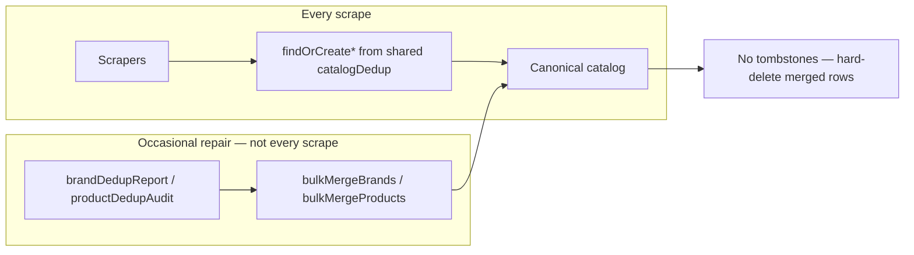
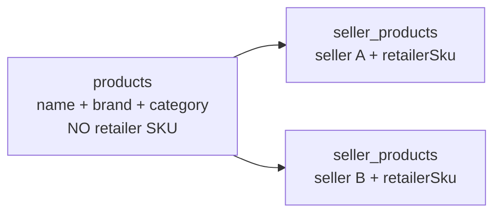
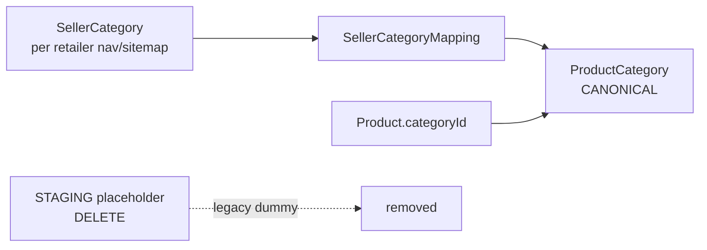
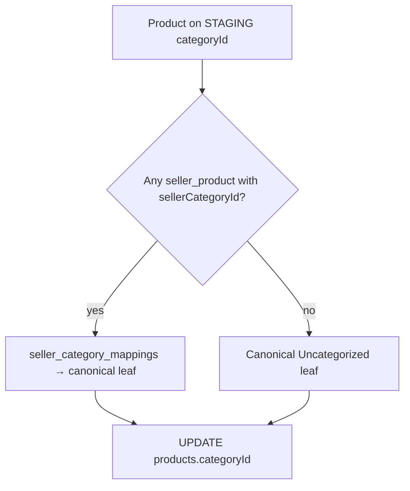

# ALE-78 Ingest-time catalog deduplication (scrape without duplicates)

## Context

**Linear:** [ALE-78](https://linear.app/dewly/issue/ALE-78/ingest-time-catalog-deduplication-scrape-without-duplicates)

**Follow-up to:** [ALE-77](./ALE-77-cross-retailer-product-deduplication-evaluation.md) — batch brand + product dedup shipped locally; scrapers still create one `products` row per retailer listing, then scripts merge clusters offline.

**Design constraints (from product review):**

- **Ingest:** scrapers call shared `findOrCreate*` only — no per-retailer dedup copy-paste.
- **Bulk repair:** keep audit/merge CLIs for occasional use when new duplication patterns appear (not after every scrape).
- **Tombstones:** remove `mergedIntoProductId` and all resolution code; bulk merge hard-deletes duplicate rows.
- **Library:** one `catalog-dedup` package — `core` + `ingest` + `bulk` — shared by scrapers and CLI scripts; **unit-tested only in the package** (≥90% `core/` + `ingest/` coverage).
- **Categories:** wire canonical taxonomy at ingest; **delete** all STAGING placeholder rows and `staging_bucket_v1` dummy mappings — products only reference real CANONICAL leaves.

- **Listing identity:** retailer external IDs live **only** on `seller_products.retailerSku` — not on `products.sku`. The canonical `products` row has no per-retailer SKU; drop `products.sku` after backfill (**architect approval**).

**Branch (when implementing):** `ALE-78-ingest-time-catalog-deduplication` in `commerce-platform-backend` and `commerce-platform-scrapers` (matching branches in both repos).

**Database changes:** Any new columns (e.g. `seller_products.retailerSku`, `seller_products.sellerCategoryId`, `brands.normalizedName`) or **drops** (e.g. `products.sku`, `products.mergedIntoProductId`) require **architect approval** before migration.

---

## Problem statement

Today's pipeline:


Target pipeline:



ALE-77 proved name-heuristic blocking works for cross-retailer matching, but dedup runs **after** ingest as batch scripts (`mergeDuplicateBrands.ts`, `mergeMatchedProducts.ts`). That creates tombstones, merge-chain repair work, and a runbook step after every scrape wave.

**Desired end state:**

1. **Ingest (default path):** Scrapers call shared **`findOrCreate*`** helpers only — no copied dedup logic per retailer.
2. **Bulk repair (occasional):** Keep CLI tools to audit and merge duplicates when we discover **new** duplication sources (e.g. additional brand or product identity rules we don't handle at ingest yet). Not required after every scrape wave.
3. **Tombstones out of scope:** Remove `products.mergedIntoProductId` and all tombstone resolution. Bulk merge **repoints FKs and deletes** duplicate rows (same as brand merge today).
4. **One shared library:** Ingest and bulk repair use the **same** `catalogDedup` core — zero duplicated matching logic between scrapers and scripts.
5. **Canonical categories — no placeholder data:** `products.categoryId` → **CANONICAL** leaves only. **Delete** per-retailer STAGING buckets, `staging_bucket_v1` mappings, and scraper staging helpers.
6. **Seller-scoped listing IDs only:** `seller_products.retailerSku` is the sole home for retailer external IDs (handle, `productNo`, `prdtNo`, etc.). **`products.sku` is removed** — it was a design mistake (retailer id stored on the canonical product row).

> **Note on BullMQ:** There are no deduplication BullMQ workers today — dedup is CLI scripts only. Bulk scripts remain as **maintenance tools**, not part of the routine scrape path.

---

## Target API: `findOrCreate*` helpers

Each scraped entity gets one shared function that encodes its **identity rules** — lookup canonical row first, create only on miss:

| Helper | Identity key | Status |
|--------|--------------|--------|
| `findOrCreateBrand(name)` | v1 trim/case/whitespace, v2 aggressive alphanumeric | **Exists** as `resolveBrandByName` — rename + move to shared module |
| `findOrCreateProduct({ brandId, sellerId, name, retailerSku, categoryId })` | Cross-seller `isBlockedPair` in same brand; **no `products.sku`** | **Missing** — core work |
| `findOrCreateSellerProduct({ sellerId, productId, retailerSku })` | **`(sellerId, retailerSku)`** — retailer external listing id | **Incomplete** — today upserts on `(sellerId, productId)` only |
| `findOrCreateSellerCategory({ sellerId, externalId, name })` | `(sellerId, externalId)` | **Exists** — hierarchy jobs upsert `seller_categories` |
| `resolveCanonicalCategory({ sellerCategoryId })` | `seller_category_mappings` → `product_categories` where `categoryKind = CANONICAL` | **In scope** — see Phase 6 |
| Sellers / currency | Seeded reference data (`find*` from env) | **N/A** — not scraped entities |

Brands already follow find-or-create with dedup. **Products**, **seller-product re-ingest idempotency**, and **canonical category assignment** are the gaps. Listing IDs are **per-retailer**, not global — they belong on `seller_products`, not `products`.

---

## Product vs listing identity (why `products.sku` goes away)

Two different concepts were conflated on one table:

| Concept | Table | Identity | Example |
|---------|-------|----------|---------|
| **Canonical product** | `products` | Cross-retailer sellable (`brandId` + name heuristic) | "COSRX Advanced Snail 96 Mucin Power Essence" |
| **Retailer listing** | `seller_products` | Per-seller external id | Jolse `productNo`, Shopify `handle`, OY `prdtNo` |

**Today (wrong):** ingest does `findFirst({ sku: retailerSku })` on `products` and writes `products.sku = retailerSku` on create. That treats a **retailer-local** id as if it were a **global** product key. After cross-retailer merge, the “winning” product keeps the first retailer's id in `products.sku`; other retailers' ids only survive via tombstones — hence ~25k tombstone rows.

**Target (correct):**



- **`findOrCreateSellerProduct`** resolves by `(sellerId, retailerSku)` first — same listing always hits the same row.
- **`findOrCreateProduct`** resolves by seller-product lookup, then cross-seller name match — **never** by `products.sku`.
- **New `products` rows:** `name`, `brandId`, `categoryId` only — **do not set `products.sku`**.
- **Backfill:** copy legacy `products.sku` → `seller_products.retailerSku` where each product still has a single seller listing; then **drop `products.sku` column** and `@@index([sku])`.
- **API / URLs:** `buildSellerProductPageUrl(template, sku)` must use **`seller_products.retailerSku`** for the seller context being displayed, not `products.sku`.

### Re-ingest idempotency (why seller products need explicit work)

Today every upsert ends with:

```ts
sellerProduct.upsert({ where: { sellerId_productId: { sellerId, productId } }, ... })
```

That is idempotent **only if** `findOrCreateProduct` returns the same `productId` on every scrape of the same listing. It is **not** sufficient on its own:

| Failure mode | What happens on 2nd scrape |
|--------------|----------------------------|
| Product lookup misses (no `retailerSku` on `seller_products`) | Creates a **new** `products` row → new `seller_product` → **duplicate listing** for same retailer |
| Cross-seller match resolves differently | Same retailer SKU attached to a different `productId` → second `seller_product` row |
| Tombstone / merge drift | SKU hit resolves to wrong canonical → duplicate or orphaned listing |

**Requirement:** Repeated ingest of the same retailer listing must produce **exactly one** `seller_products` row for that seller. The stable ingest key is **`(sellerId, retailerSku)`**, not `(sellerId, productId)`.

`findOrCreateSellerProduct` must:

1. **Find** existing row by `(sellerId, retailerSku)` when `seller_products.retailerSku` exists (preferred — architect approval)
2. If found → reuse that `seller_product` and its `productId` (update price/specs only)
3. If not found → call `findOrCreateProduct`, then **create** `seller_product` with `retailerSku` set
4. Upsert on `(sellerId, productId)` remains as a secondary guard, but must not be the **only** lookup path

**Migration-only fallback (delete after backfill):** `findFirst({ sku })` on `products` for same-seller re-scrape while `seller_products.retailerSku` is being backfilled. **Not part of target architecture** — see § Product vs listing identity.

## Current ingest behavior (as-built from ALE-77)

| Entity | Current pattern | Dedup at ingest? |
|--------|-----------------|------------------|
| **Brand** | `resolveBrandByName` (= `findOrCreateBrand`) — v1/v2 lookup, then `create` | **Yes** — all 20 upsert paths use it |
| **Product** | `findFirst({ sku: retailerSku })` on `products` + `create` with `sku` set | **No** — wrong layer; SKU is per-retailer, belongs on `seller_products` |
| **Seller product** | `sellerProduct.upsert` on `(sellerId, productId)` after product resolve | **Fragile** — re-scrape is idempotent only if `productId` is stable; no lookup by `(sellerId, retailerSku)` |
| **Category (product FK)** | `stagingCategoryId` from env seed — one STAGING bucket per retailer | **No** — must become CANONICAL via `resolveCanonicalCategory` + backfill remap |
| **Tombstone resolve** | `resolveCanonicalProductRow` when batch merge left `mergedIntoProductId` | **Legacy only** — remove after backfill + schema drop |

**Gap:** Product cross-retailer matching (`isBlockedPair`) lives only in backend batch scripts. Scrapers never call it at ingest.

**Code duplication today** (consolidate into shared `catalogDedup` / `findOrCreate*` module):

| Logic | Backend scripts | Scrapers |
|-------|-----------------|----------|
| Brand v1/v2 normalize | `scripts/lib/brandDedup/normalizeBrandName.ts` | Inline in `resolveBrandByName.ts` |
| Product name blocking | `scripts/lib/productDedupBlocking.ts` | Not used |
| Product listing id | `findFirst({ sku })` on `products` in every upsert | **Wrong layer** — move to `seller_products.retailerSku` |
| Tombstone chain walk | `productDedupLogic.resolveActiveProductId` | `resolveCanonicalProductRow.ts` — delete with tombstones |

---

## Categories — current state vs ideal

### Data model (already supports canonical taxonomy)

Three-layer design in `product_categories` / `seller_categories` / `seller_category_mappings`:



| Table | Role |
|-------|------|
| `product_categories` (`categoryKind`) | **CANONICAL** — platform-wide K-Beauty tree (+ one **Uncategorized** canonical leaf). **`STAGING` rows are legacy placeholder junk** — zero rows at ship |
| `seller_categories` | Retailer's own taxonomy (`sellerId` + `externalId`, hierarchical) — **real data, keep** |
| `seller_category_mappings` | Maps `seller_category` → **CANONICAL** `product_category`. Rows with `source: staging_bucket_v1` are **dummy mappings — delete** |
| `products.categoryId` | FK to **CANONICAL** `product_categories` only |

Canonical taxonomy is defined in `commerce-platform-backend/scripts/lib/unifiedProductTaxonomyData.ts` (~50 leaf nodes under "K-Beauty": Sheet masks, Cleansers, Sunscreen, etc.) with `upsertCanonicalTaxonomy()`. Olive Young seller-category → canonical mappings exist in `SELLER_MAPPINGS` (hand-curated by seller category id).

### What actually happens at ingest today

1. **Hierarchy job** — scrapes retailer nav/sitemap → `findOrCreateSellerCategory` via upsert on `(sellerId, externalId)`.
2. **Mapping job** — today maps **every** seller category to a **dummy** STAGING bucket (`source: "staging_bucket_v1"`). ALE-78 **stops creating** these and **deletes** existing ones after real canonical mappings exist.
3. **Product ingest** — today sets `products.categoryId` from `findStagingProductCategoryFor*` (placeholder). ALE-78 removes those helpers; ingest uses `resolveCanonicalCategory` only.

**Critical gap:** Category-scrape jobs know which `sellerCategory` they are iterating (e.g. Jolse `scrapeCategoryProducts` has `row.id`) but **do not pass it** to the product ingest job — only `stagingCategoryId` is enqueued. Retailer category context is thrown away before upsert.

So unlike brands (canonical at ingest) or products (goal of ALE-78), categories today use **intentional placeholder data** — one fake bucket per retailer. That entire pattern is **removed**, not evolved.

### Ideal: canonical categories like brands and products

Same `findOrCreate*` pattern, three entities:

| Helper | Behavior |
|--------|----------|
| `findOrCreateSellerCategory(sellerId, externalId, name, …)` | Already done in hierarchy jobs |
| `resolveCanonicalCategory(sellerCategoryId)` | Lookup `seller_category_mappings` for CANONICAL `productCategoryId`; fallback rules TBD (e.g. parent category, "Uncategorized" leaf) |
| `findOrCreateCanonicalCategory(name, parentId?)` | For seeding / admin — upsert into CANONICAL tree by stable id or normalized path (like `upsertCanonicalTaxonomy`) |

**Product ingest change:**

```ts
// Pass sellerCategoryId from category-scrape jobs into product ingest
const canonicalCategory = await resolveCanonicalCategory(prisma, sellerCategoryId);
const product = await findOrCreateProduct(prisma, {
  ...,
  categoryId: canonicalCategory.id,  // not stagingCategoryId
});
```

**Cross-retailer:** Two retailers' "Sheet Masks" seller categories map to the same canonical leaf (id `101`) → products in that category are browseable/filterable consistently platform-wide.

### Mapping strategy (not yet built for most retailers)

| Retailer | Mapping today | Target |
|----------|---------------|--------|
| Olive Young | `SELLER_MAPPINGS` in `unifiedProductTaxonomyData.ts` (OY-specific, keyed by seller category **row id**) | Generalize to `(sellerId, externalId)` → canonical id; run at mapping job or ingest |
| All other retailers | Dummy STAGING bucket only | Real seller → canonical mappings (curated or heuristic); **no STAGING rows** |

### Eliminate STAGING placeholder data (hard requirement)

ALE-78 is not complete until **all dummy category artifacts are gone** from DB and code. Remap products first, then delete placeholders.

| Artifact | Why it exists today | ALE-78 action |
|----------|---------------------|---------------|
| `product_categories` where `categoryKind = STAGING` and `name LIKE 'Staging taxonomy / %'` | Per-retailer ingest placeholder (~20 rows) | **DELETE** after zero products reference them |
| `seller_category_mappings` where `source = 'staging_bucket_v1'` | Fake “mapped to staging” for every seller category | **DELETE**; replace with canonical mappings before or during same migration window |
| `findStagingProductCategoryFor*` in scrapers | Resolves placeholder category id per retailer | **DELETE** from codebase |
| `stagingCategoryId` in job payloads | Passes placeholder id into ingest | **DELETE**; use `sellerCategoryId` only |
| Retailer seed migrations that `INSERT` STAGING categories | Historical onboarding pattern | **No new STAGING seeds**; optional cleanup migration `DELETE FROM product_categories WHERE categoryKind = 'STAGING'` |
| `taxonomy:unificationPhase2` placeholder job | Acknowledged staging-bucket tech debt | **DELETE** or replace with real mapping job |

**Uncategorized is not a placeholder:** one **CANONICAL** leaf (`categoryKind = CANONICAL`, e.g. `"Uncategorized"`) shared platform-wide for listings without a resolved seller category. It is real taxonomy data, not `"Staging taxonomy / {retailer}"`.

**Verification queries (must all be zero at ship):**

```sql
-- No products on dummy buckets
SELECT COUNT(*) FROM products p
JOIN product_categories c ON p."categoryId" = c.id
WHERE c."categoryKind" = 'STAGING';

-- No STAGING category rows left
SELECT COUNT(*) FROM product_categories WHERE "categoryKind" = 'STAGING';

-- No dummy mappings left
SELECT COUNT(*) FROM seller_category_mappings WHERE source = 'staging_bucket_v1';
```

**Code grep (must be zero):** `stagingCategoryId`, `findStagingProductCategory`, `staging_bucket_v1`, `Staging taxonomy /`

### Scope — canonical categories (in ALE-78)

Canonical categories are **in scope** for this ticket, not deferred to a follow-up. Work splits into **forward ingest** (new scrapes get canonical `categoryId`) and **backfill remap** (existing products leave STAGING buckets).

| Workstream | Deliverable |
|------------|-------------|
| **Taxonomy seed** | Ensure CANONICAL tree exists (`upsertCanonicalTaxonomy` / migration seed) — ~50 K-Beauty leaves |
| **Seller → canonical mappings** | Replace `staging_bucket_v1` rows in `seller_category_mappings` with real `(sellerCategoryId → canonical productCategoryId)` per retailer (phased: retailers with curated mappings first; others name/heuristic or manual table until curated) |
| **Pipeline** | Category-scrape + sitemap enqueue jobs pass `sellerCategoryId` (nullable for sitemap-only) instead of `stagingCategoryId` |
| **Ingest** | `resolveCanonicalCategory(sellerCategoryId)` in `catalog-dedup/ingest`; `findOrCreateProduct` sets `categoryId` to canonical leaf; fallback canonical **"Uncategorized"** when `sellerCategoryId` null or unmapped |
| **Provenance (optional)** | `seller_products.sellerCategoryId` nullable — set when listing scraped from a category context; powers backfill for rows already in DB (**architect approval**) |
| **Backfill remap** | `scripts/catalog-dedup/remap-products-to-canonical-categories.ts` — `UPDATE products SET categoryId = …` for all rows still on STAGING |
| **Cleanup** | **Delete** all STAGING `product_categories`, all `staging_bucket_v1` mappings, all `findStagingProductCategoryFor*` — see § Eliminate STAGING placeholder data |

**Backfill remap logic** (deterministic, idempotent):



For **cross-seller merged products** with conflicting categories from different listings: use `pickCanonicalCategory` tie-breaker (e.g. prefer category from seller_product with `sellerCategoryId`, then deepest leaf, then listing count) — mirror `pickCanonicalProduct` pattern in `catalog-dedup/core`.

**Sitemap-only listings** (no `sellerCategoryId` at ingest): assign **Uncategorized** until a category-scrape or PDP breadcrumb pass provides `sellerCategoryId` on re-ingest (then `findOrCreateProduct` can update `categoryId` if product not yet manually curated).

**Per-retailer mapping effort** remains uneven — ALE-78 does not require perfect mappings for all 20 retailers on day one, but **does** require: (1) canonical tree seeded, (2) ingest path wired with **no STAGING code path**, (3) backfill + **delete** all placeholder rows, (4) at least one retailer with real mappings end-to-end as reference implementation.

**Former ALE-79 scope** (LLM proposals, `taxonomy:unificationPhase2` automation, full manual curation for every retailer) can stay as polish follow-up if not all retailers have curated maps by ship.

---

## Strategy (explore → decide → implement)

### Phase 0 — Spike: listing identity + tombstones (decision gate)

Before building ingest-time product matching, lock the **listing identity model**: retailer external ids on `seller_products.retailerSku` only; canonical `products` row has no SKU.

**Why tombstones existed:** `products.sku` stored the **first retailer's** listing id as if it were global. After batch merge, duplicate product rows became tombstones (`mergedIntoProductId`) so `findFirst({ sku: retailerSku })` could still resolve the same retailer's re-scrape. That entire workaround goes away once listing ids live on `seller_products`.

| Option | Pros | Cons |
|--------|------|------|
| **A. Keep tombstones** | No schema change | Dead rows; wrong identity model persists |
| **B. Hard-delete merged products** | Cleaner `products` | Still broken if lookup uses `products.sku` |
| **C. `seller_products.retailerSku` + drop `products.sku`** (**recommended**) | Correct model; re-ingest idempotency; no tombstones for new data | Schema migration + backfill + API URL fix |
| **D. Hybrid** | Tombstones for legacy backfill only; new ingest uses C | Two paths during migration only |

**Recommendation (aligns with product review):**

1. **Option C** — `@@unique([sellerId, retailerSku])` on `seller_products`; **stop writing `products.sku`** on create; **drop `products.sku`** after backfill.
2. Measure tombstones created only because `products.sku` was retailer-scoped (expected: essentially all).
3. Tombstones are legacy-only — new ingest never creates duplicate product rows or uses `products.sku`.

**Exit criteria:** Written decision in § Tombstone decision + § Listing identity decision before Phase 2 implementation.

#### Phase 0 spike results (2026-06-13)

**Branches:** `ALE-78-ingest-time-catalog-deduplication` in `commerce-platform-backend` and `commerce-platform-scrapers` (off latest `main`).

**B vs C — decision: Option C (not B alone).**

Option B (hard-delete merged `products` rows, no `mergedIntoProductId`) solves table hygiene but **does not** fix re-ingest if lookup still uses `products.sku`:

| Scenario | Option B only (`products.sku` lookup) | Option C (`seller_products.retailerSku`) |
|----------|----------------------------------------|------------------------------------------|
| Retailer A scraped first; product created with `products.sku = A's id` | Works | Works — `(sellerA, retailerSku)` row created |
| Batch merge dedupes A + B onto canonical; secondary **hard-deleted** | Retailer B re-scrape: `findFirst({ sku: B's id })` → **miss** → **new duplicate product** | `seller_products` for B repointed to canonical; `(sellerB, B's id)` lookup → **hit** |
| Why tombstones exist today | Tombstone keeps B's row so `findFirst({ sku: B's id })` still finds a row → `resolveCanonicalProductRow` | Not needed — listing id never lived on deleted `products` row |

**Conclusion:** Tombstones are a workaround for storing **per-retailer** listing ids on **`products.sku`**. Option C moves ids to `seller_products.retailerSku` and **includes** B's hard-delete (no tombstones). Choosing B without C leaves re-ingest broken after merge.

**Local DB measurements** (commerce-platform-backend `.env`):

| Metric | Count |
|--------|------:|
| Total `products` | 50,287 |
| Tombstones (`mergedIntoProductId` set) | 32,994 (65.6%) |
| Tombstones with `sku` set | 32,994 (100% of tombstones) |
| Active products with `sku` | 17,293 |
| `seller_products` rows | 22,499 |
| Products with listings from **>1 seller** | 1,094 |
| Duplicate `sku` among active products | 0 |

Tombstones are almost entirely legacy merge fallout from the wrong identity model — not a separate concern from `products.sku`.

**Upsert path inventory (19 files + YesStyle = 20 retailers):**

All paths use `product.findFirst({ where: { sku: <retailerExternalId> } })` on create/update, then `sellerProduct.upsert` on `(sellerId, productId)`. **18/20** call `resolveCanonicalProductRow` after SKU hit; **YesStyle** and **Tester Korea** omit it (gap — fix in Phase 3).

| Retailer upsert | Retailer external id field | `retailerSku` source |
|-----------------|----------------------------|----------------------|
| Beauty of Joseon US | `handle` | `s.handle` |
| BeautyNet Korea | `productNo` | `s.productNo` |
| COSRX US | `handle` | `s.handle` |
| Innisfree US | `handle` | `s.handle` |
| Jolse | `productNo` | `s.productNo` |
| Laneige US | `handle` | `s.handle` |
| Medicube US | `handle` | `s.handle` |
| Moida | `handle` | `s.handle` |
| Oh Lolly | `handle` | `s.handle` |
| Olive Young | `prdtNo` | `s.prdtNo` |
| Olive Young US | `productId` | `s.productId` |
| Peach & Lily | `handle` | `s.handle` |
| RoseRoseShop | `handle` | `s.handle` |
| Skinglow Haven | `productId` | `s.productId` |
| Soko Glam | `handle` | `s.handle` |
| Style Korean | `itId` | `s.itId` |
| Tester Korea | `pid` | `s.pid` |
| Wishtrend | `handle` | `s.handle` |
| YesStyle | `productId` | `summary.productId` |
| (Shopify cluster) | `handle` | shared pattern |

**Ingest-time candidate query cost (estimate):**

Post-ALE-77 local catalog, `pairwise-cost-estimate.json` shows **7** remaining cross-seller edges across **603** brand buckets — bulk dedup already absorbed most duplicates. For **new** ingest:

1. **O(1)** — `sellerProduct.findUnique({ sellerId, retailerSku })` (indexed unique after migration).
2. **On miss** — `product.findMany({ brandId, mergedIntoProductId: null })` capped by `MAX_COUNTERPARTS` (default 25), filter with `isBlockedPair` in memory — same cost model as batch blocking, per listing not per catalog scan.

Largest brand buckets (Jolse ~1.7k listings) bound worst-case to 25 comparisons per ingest, not full bucket scan. Acceptable for scrape workers; index `(brandId)` + optional `(brandId, mergedIntoProductId)` already exist.

**`executeProductMerge` today:** sets `mergedIntoProductId` specifically so scrapers' `findFirst({ sku })` keeps working (`scripts/lib/executeProductMerge.ts` comment). Phase 5 changes this to `repointProductForeignKeys` + `product.delete` — only safe after Option C ingest + `retailerSku` backfill.

---

### Phase 1 — Shared `catalogDedup` library (single source of truth)

**Goal:** One well-structured package used by **scrapers (ingest)** and **backend (bulk repair)**. Scrapers never copy matching logic verbatim — they only call `findOrCreate*`.

**Proposed layout** (pick one package location in spike):

| Approach | Tradeoff |
|----------|----------|
| `packages/catalog-dedup/` in workspace | **Recommended** — clean dependency from backend + scrapers |
| `commerce-platform-backend/src/catalogDedup/` + scrapers import | Awkward cross-repo import |

**Module structure:**

```
catalogDedup/
  core/
    brandNormalize.ts         # normalizeBrandName, normalizeBrandNameAggressive, isUnknownBrandName
    productNameBlocking.ts    # significantTokens, isBlockedPair
    config.ts                 # MIN_TOKEN_OVERLAP, MAX_COUNTERPARTS (env-backed)
    pickCanonical.ts          # pickCanonicalBrand, pickCanonicalProduct (tie-breakers)
    groupDuplicates.ts        # groupDuplicateBrands, buildProductClusters (union-find)
  ingest/
    findOrCreateBrand.ts
    findOrCreateProduct.ts
    findOrCreateSellerProduct.ts
    resolveCanonicalCategory.ts   # seller_category_mappings → CANONICAL leaf + fallbacks
  bulk/
    auditBrandDuplicates.ts   # replaces brandDedupReport logic
    auditProductDuplicates.ts # replaces pairwise cost estimate / cluster preview
    mergeBrandCluster.ts      # repoint FKs + hard-delete duplicate brands
    mergeProductCluster.ts    # repoint FKs + hard-delete duplicate products (NO tombstone)
    remapProductsToCanonicalCategories.ts  # STAGING → CANONICAL backfill
  index.ts                    # public exports — scrapers import ingest/* only
```

**Dependency rules (enforce in code review):**

| Consumer | May import |
|----------|------------|
| `commerce-platform-scrapers` upsert paths | `catalogDedup/ingest` only |
| `commerce-platform-scrapers` jobs | `catalogDedup/ingest` only |
| Backend CLI (`scripts/catalog-dedup/*.ts`) | `catalogDedup/ingest` + `catalogDedup/bulk` |
| Both | `catalogDedup/core` via ingest/bulk — not duplicated inline |

**Scraper upsert shape after Phase 3** — each `upsertProductFrom*Hit.ts` is thin glue:

```ts
import { findOrCreateBrand, findOrCreateProduct, findOrCreateSellerProduct } from "catalog-dedup/ingest";

// ~10 lines: summarize fields → findOrCreate* → upsert price/specs
```

No per-retailer `findFirst({ sku })`, normalize helpers, or blocking logic.

**Refactor ALE-77 scripts → thin CLI wrappers:**

| Legacy script | Becomes |
|---------------|---------|
| `brandDedupReport.ts` | `scripts/catalog-dedup/audit-brands.ts` → calls `bulk/auditBrandDuplicates` |
| `mergeDuplicateBrands.ts` | `scripts/catalog-dedup/merge-brands.ts` → calls `bulk/mergeBrandCluster` |
| `mergeMatchedProducts.ts` | `scripts/catalog-dedup/merge-products.ts` → calls `bulk/mergeProductCluster` |
| `productDedupPairwiseCostEstimate.ts` | `scripts/catalog-dedup/audit-products.ts` |
| `scripts/lib/brandDedup/`, `productDedup/`, `productDedupBlocking.ts` | **Deleted** — logic lives in `catalogDedup/core` |

**Bulk merge without tombstones** (`mergeProductCluster`):

1. `repointProductForeignKeys(duplicateId → survivorId)` — includes `seller_products`, specs, cart, etc.
2. Ensure `seller_products.retailerSku` populated on all repointed listings
3. **Hard-delete** duplicate `products` row (same pattern as `executeBrandMerge` deleting duplicate brands)
4. No `mergedIntoProductId` write

**Delete (tombstone-era only):**

- `repairProductMergeChains.ts`, `flattenProductMergeChains.ts`
- `buildProductMatchCandidates.ts` + `product_match_candidates` table (audit replaced by `auditProductDuplicates`)
- Scraper `resolveCanonicalProductRow` / `resolveCanonicalProductId`

**Exit criteria:** Zero duplicated normalize/blocking/merge implementations; scrapers import only `catalogDedup/ingest`; bulk CLIs import `catalogDedup/bulk`; **`packages/catalog-dedup` has full unit coverage (see § Unit testing)**; `npm test` green in package + both consuming repos.

#### Phase 1 — Unit testing (`catalog-dedup` is the only test home)

Because ingest and bulk share one `core/`, **all matching logic is unit-tested in the package** — not re-tested in backend scripts or scrapers. Consumer repos run integration tests only for DB/Prisma wiring.

**Principles:**

| Rule | Rationale |
|------|-----------|
| **One suite** | `packages/catalog-dedup/**/*.test.ts` — delete duplicate tests in backend `scripts/lib/*Dedup*/__tests__` and scrapers `resolveBrandByName.test.ts` after migration |
| **Pure `core/` first** | No Prisma/DB in unit tests; `ingest/` and `bulk/` use injected `PrismaClient` mocks or test doubles |
| **Golden fixtures** | Port ALE-77 JSON fixtures; snapshot or assert exact cluster/audit output so refactors cannot silently change merge behavior |
| **Ingest ≡ bulk on `core/`** | Same inputs → `isBlockedPair` / `groupDuplicate*` / `pickCanonical*` must agree whether ingest `findOrCreateProduct` and bulk `auditProductDuplicates` would match |

**Migrate existing tests** (move, don't rewrite blindly):

| Current location | New location |
|------------------|--------------|
| `scripts/lib/brandDedup/__tests__/normalizeBrandName.test.ts` | `core/__tests__/brandNormalize.test.ts` |
| `scripts/lib/brandDedup/__tests__/brandDedupLogic.test.ts` | `core/__tests__/groupDuplicateBrands.test.ts` + `pickCanonical.test.ts` |
| `scripts/lib/productDedup/__tests__/productDedupClusters.test.ts` | `core/__tests__/groupDuplicates.test.ts` + `pickCanonical.test.ts` |
| `commerce-platform-scrapers/src/db/resolveBrandByName.test.ts` | **Delete** — covered by package `core/` + thin `ingest/findOrCreateBrand.test.ts` |

**Add tests that do not exist today** (gaps in ALE-77):

| Module | Cases |
|--------|-------|
| `productNameBlocking.ts` | `significantTokens` stop words; Hangul tokens; `tokenOverlapCount`; `isBlockedPair` true/false pairs (shade variants must **not** match; known ALE-77 true positives **must** match); 12-char prefix branch |
| `groupDuplicates.ts` | Transitive clusters (A↔B, B↔C → one component); same-seller edge exclusion if applicable |
| `pickCanonical.ts` | Survivor tie-breakers (listing count, createdAt, id) — parity with current `pickCanonicalBrand` / `pickCanonicalProduct` |
| `bulk/auditBrandDuplicates` | Output matches `scripts/fixtures/brand-dedup/report-v2.json` on frozen input slice |
| `bulk/auditProductDuplicates` | Edge count / cluster count stable vs `scripts/fixtures/product-dedup/pairwise-cost-estimate.json` methodology |
| `bulk/mergeProductCluster` | Mock Prisma: repoint + **delete** (never sets `mergedIntoProductId`) |
| `ingest/findOrCreateProduct` | Mock Prisma: same-seller SKU hit; cross-seller `isBlockedPair` attach; create on miss; unknown brand skip |
| `ingest/resolveCanonicalCategory` | Mapped seller category, unmapped, null → Uncategorized, conflicting mappings |
| `bulk/remapProductsToCanonicalCategories` | STAGING → canonical; dry-run; idempotent |

**Package layout:**

```
packages/catalog-dedup/
  package.json          # "test": "node --import tsx --test '**/*.test.ts'"
  vitest.config.ts      # or node:test — match workspace convention
  src/core/...
  src/ingest/...
  src/bulk/...
  src/**/__tests__/
  fixtures/             # moved from scripts/fixtures/{brand,product}-dedup/
```

**CI / pre-push:**

- `packages/catalog-dedup`: `npm test` on every change to the package
- `commerce-platform-backend` + `commerce-platform-scrapers`: `npm test` includes package tests via workspace script or explicit `npm test -w catalog-dedup` so a scraper-only PR cannot skip dedup tests
- **Coverage gate (package only):** `core/` and `ingest/` ≥ **90%** line coverage; `bulk/` ≥ **80%** (merge paths need Prisma mocks — don't skip)

**Phase 1 testing exit criteria:**

- [x] All migrated ALE-77 unit tests pass in package
- [x] New `isBlockedPair` test file with ≥10 explicit true/false cases
- [x] Golden fixture test for brand audit v2
- [x] Zero `normalizeBrandName` / `isBlockedPair` / `groupDuplicate` tests remain outside the package
- [x] Backend + scrapers `npm test` invoke package suite

---

### Phase 2 — `findOrCreateBrand` (harden existing)

`resolveBrandByName` already implements find-or-create with dedup. This phase renames, shares, and hardens it:

1. **Rename/move** to `findOrCreateBrand` in shared catalog module (keep `resolveBrandByName` as thin alias if needed during migration).
2. **Verify** all 20 `upsertProductFrom*Hit.ts` paths use it.
3. **Optional DB enforcement** (architect approval): `brands.normalizedName` TEXT + unique index; populate on create/update.

**Exit criteria:** New brand strings from any retailer resolve to existing row when v1/v2 keys match; zero new duplicate brand groups after scrape-only ingest test.

---

### Phase 3 — `findOrCreateProduct` + `findOrCreateSellerProduct` (core work)

**Goal:** Ingest never creates duplicate `products` rows (cross-retailer) or duplicate `seller_products` rows (re-scrape same listing).

#### 3.1 `findOrCreateProduct`

Location: shared catalog module, called from scrapers upsert paths.

```ts
// Pseudocode — actual signature TBD in Phase 0 spike
async function findOrCreateProduct(prisma, {
  sellerId,
  brandId,
  listingName,
  retailerSku,
  categoryId,
}): Promise<Product>
```

**Resolution order:**

1. **Same-seller re-ingest (highest priority):** Find existing `seller_product` by `(sellerId, retailerSku)` → return its `product`.
2. **Migration-only fallback** (remove after backfill): `findFirst({ sku: retailerSku })` on `products` — **deprecated**, same-seller only.
3. **Cross-seller name match** (ALE-77 rules):
   - Load candidate products: same `brandId`, active, with **at least one** `seller_product` where `sellerId ≠ currentSeller`
   - For each candidate (with cap `MAX_COUNTERPARTS_PER_PRODUCT`), run `isBlockedPair(listingName, candidate.name)`
   - On first match: return canonical candidate (do **not** create a new row)
4. **Create** new `products` row if no match — `name`, `brandId`, `categoryId` only; **never set `sku`**

**Eligibility rules** (same as batch dedup):

| Rule | Rationale |
|------|-----------|
| Exclude `Unknown brand` | No cross-retailer matching |
| Cross-seller only | Same-seller shade variants must not collapse |
| Active products only | Never match against tombstones as canonical target |
| Cap counterparts | Bound query cost per ingest |

#### 3.2 Performance / indexing spike

Batch dedup compares all pairs in a brand bucket (~285k edges pre-merge). Per-listing ingest cannot scan entire brand.

**Explore:**

| Technique | Notes |
|-----------|-------|
| Narrow candidate set | Only products with `seller_products` from **other** sellers in same brand; index `products(brandId, mergedIntoProductId)` exists |
| Token index (future) | Materialize `significantTokens` to junction table — only if brand buckets are too large |
| `pg_trgm` on `products.name` | GIN index for prefix/token prefilter — architect approval for migration |
| Early exit | Stop at first `isBlockedPair` match (ingest does not need full union-find) |

**Spike deliverable:** P95 latency estimate for `findOrCreateProduct` on top 10 brands by product count; accept or add index.

#### 3.3 `findOrCreateSellerProduct`

```ts
async function findOrCreateSellerProduct(prisma, {
  sellerId,
  productId,      // from findOrCreateProduct
  retailerSku,
}): Promise<SellerProduct>
```

**Behavior:**

1. `findFirst` where `sellerId` + `retailerSku` match → return existing row (update path)
2. Else `upsert` on `(sellerId, productId)` with `retailerSku` set on create
3. On P2002 / unique violation on `(sellerId, retailerSku)` → retry find by retailer SKU
4. Caller updates `seller_product_prices` and `product_seller_specs` on the returned row only

**Schema (architect approval):**

```prisma
model SellerProduct {
  // ...
  retailerSku String? @map("retailerSku")  // required for new rows after migration
  @@unique([sellerId, retailerSku])
  @@unique([sellerId, productId])          // existing
}
```

`retailerSku` nullable during backfill; NOT NULL for new inserts once migration complete.

#### 3.4 Integrate into upsert paths

Replace per-retailer product + seller-product blocks with:

```ts
const brand = await findOrCreateBrand(prisma, brandName);
const categoryId = await resolveCanonicalCategory(prisma, { sellerCategoryId }); // null → Uncategorized
const product = await findOrCreateProduct(prisma, { sellerId, brandId: brand.id, listingName, retailerSku, categoryId });
const sellerProduct = await findOrCreateSellerProduct(prisma, { sellerId, productId: product.id, retailerSku, sellerCategoryId });
// then upsert price + specs on sellerProduct.id
```

Roll out to all `upsertProductFrom*Hit.ts` files.

#### 3.5 Transitive matching

Batch dedup uses union-find because A↔B and B↔C implies A↔C. At ingest:

- Matching against **canonical active products only** is sufficient if batch backfill already collapsed clusters
- For **greenfield** ingest (post-backfill): first listing creates product; second retailer matches directly to first — no transitive issue
- Edge case: simultaneous scrapes creating two rows — mitigate with unique constraint + retry or advisory lock per `(brandId, normalizedNameKey)` (spike)

#### 3.6 Drop `products.sku` (architect approval)

Retailer external ids belong on `seller_products.retailerSku` only — see § Product vs listing identity.

1. **Phase 3 rollout:** ingest stops writing `products.sku`; all listing lookup via `(sellerId, retailerSku)`.
2. **Phase 4 backfill:** copy legacy `products.sku` → `seller_products.retailerSku` where missing (including repointed rows after merge).
3. **API fix:** `getShoppingProductCardsBatch` and any URL builders use `sellerProduct.retailerSku`, not `product.sku`.
4. **Migration:** `ALTER TABLE products DROP COLUMN sku`; drop index on `sku`; scrapers `db:pull`.

**Exit criteria:** No `products.sku` in schema; grep clean for `product.sku` / `products.sku` in app code (migrations excluded).

**Phase 3 exit criteria:**

- Integration test: ingest same logical SKU from two sellers → one `products` row, two `seller_products`
- Integration test: **ingest same listing twice** (same seller + retailerSku) → one `products` row, one `seller_product`, updated price/specs
- Integration test: same-seller shade variants → **two** product rows (no false merge)
- No new duplicates in `audit-products` after full scrape of test sellers

---

### Phase 4 — One-time legacy backfill

Run **once** on production (and any envs with pre-ALE-78 data) using **tombstone-era** bulk scripts before Phase 5 schema drop:

1. `merge-brands` (v1 + v2) — collapse existing duplicate brand rows
2. `repairProductMergeChains` — **last run** while tombstone column still exists; flatten broken chains
3. `merge-products --mode=clusters` — collapse duplicate product clusters (may still create tombstones in this pass)
4. Re-run until dry-run shows zero remaining merges
5. Backfill `seller_products.retailerSku` from legacy `products.sku` (per-seller listing id — the data's **correct** home)
6. Final pass with **new** `mergeProductCluster` (hard-delete, no tombstones) or manual delete of all `mergedIntoProductId` rows after FK repoint
7. Verify zero tombstones; drop `products.sku` column (§ 3.6)

**After this phase:** legacy duplicates cleaned; ongoing ingest uses `findOrCreate*`; future duplicates handled by occasional bulk repair (not every scrape).

**Exit criteria:** `audit-brands` clean; `audit-products` shows zero new merge candidates; `COUNT(mergedIntoProductId) = 0`.

---

### Phase 5 — Remove tombstone schema + tombstone-era code

Once Phase 3 ingest dedup is live **and** Phase 4 backfill is complete. **Keep bulk audit/merge CLIs** (refactored in Phase 1). **Remove tombstone machinery only.**

#### 5.1 Database — drop tombstone artifacts (architect approval)

| Artifact | Action |
|----------|--------|
| `product_match_candidates` table + `ProductMatchStatus` enum | Drop — replaced by `audit-products` CLI output / fixtures |
| `products.mergedIntoProductId` + self-relation + indexes | Drop — bulk merge hard-deletes duplicates going forward |
| `products.sku` + `@@index([sku])` | Drop — retailer ids live on `seller_products.retailerSku` only |

**Not dropped:** `products`, `brands`, `seller_products` (with `retailerSku`) — normal catalog tables.

**Migration steps:**

1. Verify `COUNT(*) FROM products WHERE "mergedIntoProductId" IS NOT NULL` = 0
2. Archive optional JSON snapshot of `product_match_candidates` if non-empty
3. `DROP TABLE product_match_candidates`; `DROP TYPE "ProductMatchStatus"`
4. `ALTER TABLE products DROP COLUMN "mergedIntoProductId"`
5. `ALTER TABLE products DROP COLUMN sku` (after `seller_products.retailerSku` backfill complete)
6. Scrapers: `npm run db:pull` + `db:generate`

#### 5.2 Backend — delete tombstone-only code; keep bulk CLIs

| Action | Paths |
|--------|-------|
| **Keep (refactored)** | `scripts/catalog-dedup/audit-brands.ts`, `merge-brands.ts`, `audit-products.ts`, `merge-products.ts`, `remap-products-to-canonical-categories.ts` |
| **Delete** | `repairProductMergeChains.ts`, `flattenProductMergeChains.ts`, `buildProductMatchCandidates.ts`, legacy `scripts/lib/brandDedup/`, `scripts/lib/productDedup/`, `executeProductMerge.ts` (tombstone version), `scripts/lib/productDedupBlocking.ts` (moved to package) |
| **Package** | `packages/catalog-dedup/` is the only home for matching/merge logic |

#### 5.3 Scrapers — delete tombstone resolution

| Path | Action |
|------|--------|
| `src/db/resolveCanonicalProductRow.ts` | Delete |
| `src/db/resolveCanonicalProductId.ts` | Delete |
| All `enrichProductPdp.ts` jobs | Remove tombstone resolve calls |
| `src/db/resolveBrandByName.ts` | Replace with re-export of `findOrCreateBrand` from package |

#### 5.4 Backend runtime — simplify reads

| Path | Action |
|------|--------|
| `getShoppingProductCardsBatch.ts` | Remove `mergedIntoProductId` fallback |

#### 5.5 Docs + runbook

- **Routine scrape path:** ingest only — no bulk merge step
- **Occasional maintenance:** document when to run `audit-brands` / `audit-products` and `merge-*` (e.g. after discovering a new duplication source, before adding a new ingest rule)
- Update ALE-77 plan: tombstones removed; bulk tools preserved under `scripts/catalog-dedup/`

**Exit criteria:** No `mergedIntoProductId` in schema or code; bulk CLIs work via shared package; scrapers contain no dedup logic beyond `findOrCreate*` imports; lint/build/test pass.

---

### Phase 6 — Canonical categories (ingest + backfill remap)

**Goal:** Every `products.categoryId` references a **CANONICAL** leaf. STAGING buckets are empty and deletable.

#### 6.1 Seed canonical taxonomy

- Run / migrate `upsertCanonicalTaxonomy()` so `product_categories` contains the platform K-Beauty tree (`categoryKind = CANONICAL`).
- Add canonical **"Uncategorized"** leaf if not present — default for unmapped / sitemap-only ingest.

#### 6.2 Replace `staging_bucket_v1` mappings

- Rewrite per-retailer `sellerCategoryMapping` jobs: upsert `seller_category_mappings` to **canonical** `productCategoryId`, not STAGING bucket.
- Port / generalize any hand-curated mappings (e.g. Olive Young seller category → canonical leaf).
- Retailers without curated maps: interim name-match to canonical leaf names, or map all to Uncategorized until curated (**document per retailer in spike**).

#### 6.3 Scrape pipeline — pass `sellerCategoryId`

- Category-scrape jobs (`scrapeCategoryProducts`): enqueue `sellerCategoryId: row.id` on product ingest jobs (remove `stagingCategoryId`).
- Sitemap / PDP-only jobs: enqueue `sellerCategoryId: null`.
- Update job types, workers, and all retailer copies (playbook pattern).

#### 6.4 `resolveCanonicalCategory` (shared package)

```ts
async function resolveCanonicalCategory(prisma, {
  sellerCategoryId,
}): Promise<bigint> // canonical productCategoryId
```

- Lookup `seller_category_mappings` where `productCategory.categoryKind = CANONICAL`.
- If multiple mappings → prefer highest confidence / non-staging `source`.
- If none → return Uncategorized canonical id.
- Unit tests: mapped seller category, unmapped, null input, conflicting mappings.

#### 6.5 Optional schema — listing category provenance

```prisma
model SellerProduct {
  sellerCategoryId BigInt? @map("sellerCategoryId")  // set when scraped from category context
  sellerCategory   SellerCategory? @relation(...)
}
```

Enables backfill for products already in DB without re-scraping category waves (**architect approval**).

#### 6.6 Backfill — remap existing products

CLI: `scripts/catalog-dedup/remap-products-to-canonical-categories.ts` → `bulk/remapProductsToCanonicalCategories`.

1. `SELECT` products where `category.categoryKind = STAGING`.
2. For each product, resolve target canonical id:
   - Prefer `seller_products.sellerCategoryId` → `resolveCanonicalCategory`
   - Else Uncategorized
   - Cross-listing conflicts → `pickCanonicalCategory`
3. `UPDATE products SET categoryId = :canonicalId` (batch/chunked).
4. Dry-run mode + counts report (products remapped, still Uncategorized, by retailer).

Run after Phase 6.2 mappings exist; safe to re-run (idempotent).

#### 6.7 Delete all STAGING placeholder data

After Phase 6.6 remap (zero products on STAGING):

1. `DELETE FROM seller_category_mappings WHERE source = 'staging_bucket_v1'`
2. `DELETE FROM product_categories WHERE "categoryKind" = 'STAGING'` (all `Staging taxonomy / *` rows)
3. Remove `findStagingProductCategoryFor*` and every `stagingCategoryId` reference from scrapers
4. Grep both repos — no `staging_bucket_v1`, `findStagingProductCategory`, `Staging taxonomy`
5. Stop seeding STAGING categories in new retailer onboarding migrations (document in scraper playbook)
6. Delete `taxonomy:unificationPhase2` placeholder job

**Optional (architect approval):** if `categoryKind = STAGING` has no remaining rows and no intended future use, consider enum/docs cleanup in a follow-up migration — not required for ALE-78 ship if row count is zero.

**Exit criteria:**

- All three verification queries in § Eliminate STAGING placeholder data return **0**
- New ingest never writes STAGING `categoryId` and never touches STAGING helpers
- Integration test: category-scrape ingest → product on expected canonical leaf
- Integration test: sitemap ingest → Uncategorized (until remapped on later category scrape)
- `remap-products-to-canonical-categories --dry-run` clean on production after run

---

## Name heuristic duplication — clarification

Two related but **distinct** name-matching layers exist:

| Layer | Key function | Purpose |
|-------|--------------|---------|
| **Brand** | `normalizeBrandName` / `normalizeBrandNameAggressive` | Exact-key grouping (case, punctuation) |
| **Product** | `isBlockedPair` | Fuzzy token overlap + 12-char prefix within same brand |

They share tokenization **ideas** (lowercase, alphanumeric/Hangul, stop words) but **not** the same functions. Phase 1 should extract both into `catalogDedup` without falsely merging brand normalize into product blocking.

**Possible shared primitive:** `tokenizeName(name) → Set<string>` used by `significantTokens` and optionally brand aggressive key — explore in Phase 1 spike only if it reduces duplication without coupling brand exact-match to product fuzzy-match.

---

## Risks

| Risk | Mitigation |
|------|------------|
| Ingest latency on large brands | Candidate cap + index spike (Phase 3.2) |
| False merge (shade/size) | Same `isBlockedPair` as ALE-77; same-seller exclusion; monitor false positives |
| Race: two scrapers create duplicate products | P2002 retry + second-pass name match; optional lock |
| Re-scrape creates duplicate seller_product | `findOrCreateSellerProduct` keyed on `(sellerId, retailerSku)` before product create |
| Retailer SKU lookup breaks after cross-seller attach | Listing id on `seller_products.retailerSku` only — never `products.sku` |
| `products.sku` used for PDP URLs after column drop | Fix API to use `sellerProduct.retailerSku` in seller context before migration |
| Drift between batch and ingest logic | Shared `catalogDedup` package; **one unit test suite in package**; golden fixtures; ingest ≡ bulk contract tests on `core/` |
| New duplication sources discovered post-ship | Run `audit-*` then `merge-*` CLIs; optionally extend `findOrCreate*` rules in same package |
| Production still has tombstones from ALE-77 batch | Phase 4 backfill must complete before Phase 5 schema drop |
| Dropping schema before backfill complete | Gate Phase 5 on `COUNT(mergedIntoProductId) = 0` + ingest dedup live |
| Incomplete seller→canonical maps | Backfill assigns Uncategorized; per-retailer mapping can improve incrementally |
| Sitemap products lack category context | Uncategorized until category re-scrape sets `sellerCategoryId` on re-ingest |
| Cross-seller products disagree on category | `pickCanonicalCategory` tie-breaker; document rule in package tests |

---

## Test plan

### `packages/catalog-dedup` — unit (primary; runs on every package change)

| Area | Tests |
|------|-------|
| `core/brandNormalize` | v1/v2 keys, unknown brand, aggressive edge cases (from migrated `normalizeBrandName.test.ts`) |
| `core/productNameBlocking` | tokens, overlap, `isBlockedPair` true/false matrix (**new**) |
| `core/groupDuplicates` | brand groups v1/v2, product union-find, `sellerPairKey` (from migrated cluster tests) |
| `core/pickCanonical` | brand + product survivor selection |
| `bulk/audit*` | golden fixture parity with ALE-77 reports |
| `bulk/merge*` | mock Prisma: repoint, hard-delete, no tombstone field |
| `ingest/findOrCreate*` | mock Prisma: lookup order, attach vs create, idempotency |

### Consumer repos — integration only

| Test | Repo |
|------|------|
| `findOrCreateProduct` — cross-seller match | scrapers |
| `findOrCreateProduct` — same-seller no match | scrapers |
| `findOrCreateProduct` — unknown brand skipped | scrapers |
| `findOrCreateSellerProduct` — same listing twice | scrapers |
| `findOrCreateSellerProduct` — cross-seller attach + re-scrape | scrapers |
| Upsert path end-to-end (2 retailers, 1 product) | scrapers |
| Retailer SKU re-scrape idempotency | scrapers |
| New product create — `products.sku` is null / column absent | scrapers |
| `getShoppingProductCardsBatch` URL uses `sellerProduct.retailerSku` | backend |
| Scraper upserts import only `catalog-dedup/ingest` | grep / lint |
| `ingest/resolveCanonicalCategory` | mapped, unmapped, null, conflicts |
| `bulk/remapProductsToCanonicalCategories` | STAGING → canonical; dry-run counts; idempotent re-run |
| Category-scrape ingest → canonical leaf | Integration | scrapers |
| Sitemap ingest → Uncategorized | Integration | scrapers |
| Post Phase 6: zero STAGING rows, mappings, and code references | SQL + grep | both repos |

**Not duplicated in scrapers/backend:** brand normalize, `isBlockedPair`, clustering, pick-canonical — package owns those tests exclusively.

---

## Open questions (resolve in Phase 0 spike)

1. ~~**Tombstone vs `seller_products.retailerSku`**~~ — **Resolved: Option C** (see § Tombstone decision + Phase 0 spike results)
2. **Shared package location** — workspace package vs backend `src/` export? **Spike lean:** `packages/catalog-dedup/` (clean cross-repo import; confirm in Phase 1)
3. ~~**Canonical `products.sku`**~~ — **resolved:** drop column; SKUs are seller-scoped only
4. **Do we need union-find at ingest** for any scenario, or is pairwise match-to-canonical sufficient?
5. **Production rollout** — ingest-time dedup on new scrapes only, or re-ingest all retailers after backfill?
6. **New duplication rules** — when we find another brand/product dup source (outside current heuristics), do we fix ingest first, bulk-merge first, or both in one PR?
7. **Per-retailer category maps** — which retailers ship with curated mappings in ALE-78 vs Uncategorized until later curation?
8. **`seller_products.sellerCategoryId`** — required for backfill without full re-scrape, or acceptable to re-run category waves?

**Out of scope for ALE-78 (document only):** Specific new brand/product duplication sources discovered recently — bulk repair path preserved for when we tackle them. LLM-assisted taxonomy proposals (`taxonomy:unificationPhase2`) remain optional polish.

---

## Tombstone decision

> **Status:** **COMPLETE** (Phase 0 spike, 2026-06-13). **Chosen: Option C** — not Option B alone.

| Decision | |
|----------|---|
| Chosen option | **C** — `seller_products.retailerSku` + hard-delete merged rows; drop `products.sku` |
| Rejected | **A** (keep tombstones), **B alone** (hard-delete without moving listing ids — breaks re-ingest), **D** (hybrid tombstones) |
| Rationale | Tombstones exist only because `products.sku` held retailer-local ids globally. 32,994/32,994 local tombstones still have `sku` set. Hard-delete (B) is **part of C** once lookup is `(sellerId, retailerSku)` on `seller_products` — `repointProductForeignKeys` already moves `seller_products` to canonical. |
| Schema changes | Add `seller_products.retailerSku` + `@@unique([sellerId, retailerSku])`; drop `mergedIntoProductId`, then `products.sku` |
| Tombstone cleanup timeline | Phase 4 backfill `retailerSku` from legacy `products.sku`, hard-delete tombstones; Phase 5 migrations |

## Listing identity decision

> **Status:** **Resolved** — retailer external ids on `seller_products.retailerSku` only.

| Decision | |
|----------|---|
| Canonical `products` row | `name`, `brandId`, `categoryId` — no retailer SKU |
| Listing external id | `seller_products.retailerSku` + `@@unique([sellerId, retailerSku])` |
| `products.sku` | Stop writing in Phase 3; backfill → drop in Phase 4/5 |
| Ingest lookup | `(sellerId, retailerSku)` on `seller_products`, then cross-seller name match — never `products.sku` |

---

## TODO

### Phase 0 — Spike
- [x] Document retailer SKU re-lookup flows for all 20 upsert paths
- [x] Compare tombstone vs `seller_products.retailerSku` — write decision in § Tombstone decision (**Option C**)
- [x] Estimate ingest-time candidate query cost on top brands (see Phase 0 spike results)

### Phase 1 — Shared library
- [x] Create `packages/catalog-dedup` with `core/`, `ingest/`, `bulk/` layout + `npm test` script
- [x] Extract ALE-77 logic into `core/` + `bulk/`; delete duplicated `scripts/lib/*Dedup*`
- [x] **Migrate** brand + product dedup unit tests into package; delete scraper `resolveBrandByName.test.ts`
- [x] **Add** `isBlockedPair` / `significantTokens` unit tests (gap today)
- [x] **Add** golden fixture tests (`brand-dedup/report-v2.json`, product audit methodology)
- [x] **Add** mock-Prisma tests for `ingest/findOrCreate*` and `bulk/merge*`
- [x] Wire package tests into backend + scrapers `npm test` / CI
- [x] Thin CLI wrappers under `scripts/catalog-dedup/`
- [x] Scrapers depend on package; `resolveBrandByName` → `findOrCreateBrand` re-export

### Phase 2 — `findOrCreateBrand`
- [x] Rename/move `resolveBrandByName` → `findOrCreateBrand` in shared module
- [x] Audit all upsert paths use it (19 upsert files + 3 enrich jobs; fixed Tester Korea + Style Korean enrich)
- [ ] (Optional) `brands.normalizedName` migration — architect approval

### Phase 3 — `findOrCreateProduct` + `findOrCreateSellerProduct`
- [ ] Migration: `seller_products.retailerSku` + `@@unique([sellerId, retailerSku])` — architect approval
- [ ] Implement `findOrCreateProduct` — **no `products.sku` on create**; lookup via `seller_products` first
- [ ] Implement `findOrCreateSellerProduct`
- [ ] Fix `getShoppingProductCardsBatch` (and similar) to use `sellerProduct.retailerSku` for URLs
- [ ] Performance spike + index decision
- [ ] Roll out to all `upsertProductFrom*Hit.ts` — remove `findFirst({ sku })` / `sku:` on product create
- [ ] Integration tests: cross-seller match, same-seller exclusion, **re-ingest idempotency**
- [ ] Migration: drop `products.sku` — architect approval (after backfill)

### Phase 4 — One-time legacy backfill
- [ ] Run brand + product bulk merges on production (last tombstone-era pass if needed)
- [ ] Backfill `seller_products.retailerSku` from legacy `products.sku`
- [ ] Hard-delete all tombstone product rows; verify zero `mergedIntoProductId`

### Phase 5 — Remove tombstones; keep bulk CLIs
- [ ] Migration: drop `product_match_candidates` + `ProductMatchStatus` — architect approval
- [ ] Migration: drop `products.mergedIntoProductId` + indexes — architect approval
- [ ] Migration: drop `products.sku` + index — architect approval (after retailerSku backfill)
- [ ] Delete tombstone-only scripts (`repairProductMergeChains`, legacy `executeProductMerge`, etc.)
- [ ] Keep `scripts/catalog-dedup/*` audit + merge CLIs on shared package
- [ ] Delete scraper tombstone resolvers + enrich job calls
- [ ] Remove `getShoppingProductCardsBatch` tombstone fallback
- [ ] Scrapers `db:pull` + `db:generate`; both repos lint/build/test pass
- [ ] Update runbook: routine = ingest only; occasional = `audit-*` / `merge-*`

### Phase 6 — Canonical categories + delete placeholders
- [ ] Seed CANONICAL taxonomy + Uncategorized leaf (backend migration/script)
- [ ] Spike: per-retailer mapping strategy (curated vs name-match vs Uncategorized)
- [ ] Rewrite `sellerCategoryMapping` jobs — canonical mappings only; **stop writing `staging_bucket_v1`**
- [ ] Pass `sellerCategoryId` through category-scrape → product ingest (all retailers)
- [ ] Implement `resolveCanonicalCategory` + `pickCanonicalCategory` in `catalog-dedup`
- [ ] (Optional) `seller_products.sellerCategoryId` migration — architect approval
- [ ] Update `findOrCreateProduct` / upsert paths — **no `stagingCategoryId` path**
- [ ] `remap-products-to-canonical-categories` CLI + unit tests
- [ ] Run backfill remap on production
- [ ] **DELETE** all `staging_bucket_v1` mappings + STAGING `product_categories` rows
- [ ] **DELETE** `findStagingProductCategoryFor*` + grep clean for placeholder strings
- [ ] Verify all three STAGING verification queries return 0
