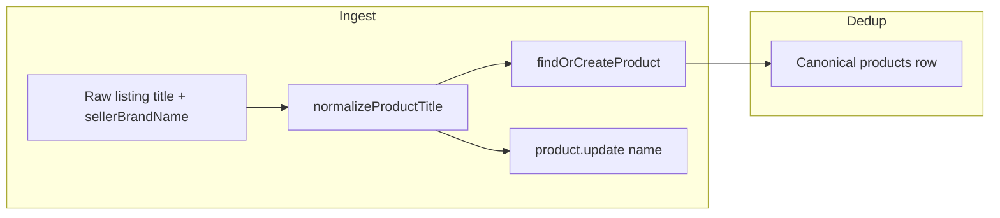

# ALE-79 Normalize product titles (promo prefixes + seller brand strip)

## Context

**Linear:** [ALE-79](https://linear.app/dewly/issue/ALE-79/strip-promotional-prefixes-from-product-names-for-deduplication)

**Follow-up to:** [ALE-78](./ALE-78-ingest-time-catalog-deduplication.md) (ingest-time `findOrCreateProduct`) and [ALE-77](./ALE-77-cross-retailer-product-deduplication-evaluation.md) (cross-retailer blocking heuristics).

After ALE-77/78, the catalog still has many “unique” `products` rows that differ only by **retailer merchandising noise** in the title — promo bracket tags, redundant brand prefixes — not by SKU, shade, or size.

Listing identity and re-scrape matching use **`seller_products.retailerSku`**, not `products.name`. We can clean canonical titles at ingest without breaking scrape idempotency.

**Branches (when implementing):** `ALE-79-strip-promotional-prefixes-from-product-names` in `commerce-platform-backend`, `commerce-platform-scrapers`, and `packages/catalog-dedup`.

**Database changes:** None required for v1 — rewrite `products.name` in place during ingest and bulk backfill. If we later add `products.normalizedName` + index, that requires **architect approval**.

---

## Problem statement

### 1. Promotional prefixes

Retailers embed promo / campaign labels directly in listing titles:

```
[BOGO] Mary&May Vegan Peptide Bakuchiol Sun Stick SPF50+ PA++++ 18g
[💗BOGO] ROUND LAB 1025 Dokdo Cleanser 150ml
[🌊TIME DEAL] SKIN1004 Madagascar Centella Ampoule 100ml
[OY Exclusive] Nexcare Blemish Clear Cover 78+22 Count
*NEW* Abib Quick Sun Stick Protection Bar 22g
```

`catalog-dedup` today compares **raw** names in `isBlockedPair` / `findOrCreateProduct`, so these listings create **new canonical product rows** instead of attaching to the base SKU.

BOGO promos on StyleKorean are often scraped with brand `💗BOGO` while the product name after the prefix is the real brand (`Mary&May`, `ROUND LAB`, …). Same-brand gating prevents any match until we strip the prefix (and ideally re-resolve brand — out of scope unless easy).

### 2. Redundant seller brand in title

On each retailer listing, the scraped **brand field** and **title** both carry the brand. Examples:

```
COSRX → "COSRX Pure Fit Cica Cream 50ml"
INNISFREE → "Innisfree Auto Eyebrow Pencil 0.3g"
```

~6,611 products have titles starting with the canonical brand name (excl. Unknown). The UI concatenates `brandName · name`, so shoppers see **COSRX · COSRX Pure Fit…**.

**Fix at the data layer**, not display-only formatting: strip the **seller-provided brand string** (`s.brandName` from each scrape) from the start of the listing title before persisting `products.name`.

Use the seller-local spelling (one form per listing), not cross-retailer canonical brand normalization — that is already handled by `resolveBrandByName` / `findOrCreateBrand`.

---

## Data audit (local Postgres, 2026-06-14)

Run: `commerce-platform-backend/scripts/analyzeProductNamePrefixes.ts`, `analyzeBrandInTitle.ts`

| Metric | Value |
|--------|------:|
| Total `products` | 16,790 |
| Names with **leading** `[tag]` | 5,545 (**33%**) |
| Names containing `[` anywhere | 5,716 |
| Names containing `BOGO` | 56 |
| Names containing `*` | 390 |
| Title starts with brand name (excl. Unknown) | ~6,611 |
| Trailing-only `[tag]` (shade/variant inline) | 49 |

### Top leading `[tag]` values

| Tag | Count | Strip in v1? |
|-----|------:|:-------------:|
| `[K-POP]` | 3,414 | **No** — channel/merch category, not promo on same SKU |
| `[DAISO]` | 580 | **No** — retailer sub-brand label |
| `[MD]` | 218 | **No** — merch category |
| `[💗BOGO]` / `[BOGO]` | 56 | **Yes** |
| `[🌊TIME DEAL]` | 42 | **Yes** |
| `[GIFT]` | 19 | **Yes** |
| `[NEW]` | 7 | **Yes** |
| `[OY Exclusive]` | 4 | **Yes** |
| `[1+1]` | 4 | **Yes** |
| `*...*` markers | 390 | **Yes** (promo allowlist) |
| `... Edition` / `... EDITION` collabs | ~40 | **No** in v1 — may be distinct SKU/artwork |

### Dedup opportunity (leading `[tag]` strip only, same `brandId`)

| Scope | Duplicate groups | Extra mergeable rows |
|-------|-----------------:|---------------------:|
| Prefixed rows only | 94 | 241 |
| Full catalog (all rows, strip leading tags before compare) | 200 | **492** |

Additional merge opportunity after brand-prefix strip — measure during bulk audit.

**Explicitly not stripped in this ticket:** quantity/size tokens (`500ml`, `10 pills`, `30g*5`, `SPF50+`, etc.) — separate follow-up ticket.

---

## Design

### Canonical `products.name` is cleaned at ingest

| Field | Purpose |
|-------|---------|
| **`products.name`** | Clean canonical title — promo prefixes and seller brand prefix removed. What users see (with brand shown separately). |
| **Raw listing title** (optional) | Store in seller product spec `Listing title` on first scrape if not already present — debugging / PDP parity only. |
| **Dedup comparison** | Same pipeline as storage: `normalizeProductNameForDedup(cleanName)` adds lowercase + collapse for matching. |

v1 does **not** add a `products.normalizedName` column unless profiling shows we need an index for candidate queries.

### `normalizeProductTitle(rawTitle, sellerBrandName): string`

New module: `packages/catalog-dedup/src/core/productNameNormalize.ts`

**Pipeline (order matters):**

1. **HTML entity cleanup** — `&amp;` → `&`, `&#39;` → `'`, numeric entities.
2. **Collapse whitespace** — trim, single spaces.
3. **Strip leading promo bracket segments** — repeat while name starts with `[tag]` and `tag` matches promo allowlist (case-insensitive, emoji-tolerant):
   - `BOGO`, `💗BOGO`, `NEW`, `SALE`, `GIFT`, `HOT`, `BEST`, `BUNDLE`, `LIMITED`
   - `TIME DEAL`, `🌊TIME DEAL`
   - `OY Exclusive`, `TK Only`, `STYLEKOREAN` (when used as promo header, not brand)
   - `1+1`, `2+1`, `1+1 SET`, bundle-ratio patterns
   - Regex shape: `^(\s*\[[^\]]+\]\s*)+` gated by allowlist on captured tag text
4. **Strip leading/trailing asterisk promo markers** — `*NEW*`, `*HOT*`, `*SALE*` (allowlist on inner text).
5. **Strip leading bare promo words** (no brackets) — `BOGO `, `NEW ` at start only when followed by a brand-like token (conservative).
6. **Strip seller brand prefix** — `stripSellerBrandPrefix(name, sellerBrandName)`:
   - Only when `sellerBrandName` is non-empty and not a known synthetic aisle brand (`💗BOGO`, `K-POP`, `Unknown`, etc. — small denylist).
   - Remove **one** leading occurrence of the seller's brand string (case-insensitive match at start; strip matched length from title).
   - Require word boundary after brand (space, `-`, `|`, `·`, or end) so `COS` does not strip from `COSRX …`.
   - Do not strip inline brand occurrences (not at position 0 after steps 3–5).
7. **Final whitespace trim** — collapse repeated spaces.
8. **Do not strip** inline `[...]` segments (not at position 0).
9. **Do not strip** quantity/size patterns (see guard tests below).

Export helpers:

```ts
export function stripPromotionalPrefixes(name: string): string;
export function stripSellerBrandPrefix(name: string, sellerBrandName: string): string;
export function normalizeProductTitle(name: string, sellerBrandName: string): string;
export function normalizeProductNameForDedup(name: string, sellerBrandName?: string): string; // normalizeProductTitle + lowercase
export function isPromoBracketTag(tag: string): boolean;
```

### Wire into ingest (scrapers)

Single choke point: `commerce-platform-scrapers/src/db/upserts/upsertCatalogListing.ts`



| Step | Change |
|------|--------|
| `upsertCatalogListing` | `cleanName = normalizeProductTitle(listingName, brandName)`; pass `cleanName` to `findOrCreateProduct` and `product.update({ name: cleanName })` |
| First-time listing | Optionally upsert seller spec `Listing title` = raw `listingName` |
| All `upsertProductFrom*Hit` | No per-scraper changes if normalization lives in `upsertCatalogListing` |

**Important:** `upsertCatalogListing` currently overwrites `products.name` with raw `listingName` on every re-scrape — normalization must run **before** that write or the next scrape undoes cleanup.

### Wire into matching

| Consumer | Change |
|----------|--------|
| `productNameBlocking.ts` | Compare normalized names inside `isBlockedPair` / `significantTokens`. When comparing two products, use each row's `brands.name` as `sellerBrandName` proxy for bulk dedup; at ingest, caller passes seller brand string. |
| `findOrCreateProduct.ts` | Normalize incoming name with `brandName` before candidate loop; exact normalized-name equality shortcut before token overlap |
| `estimatePairwiseEdges.ts` | Uses `isBlockedPair` — gets fix for free |

For **bulk dedup** on existing rows without seller context per product: use canonical `brands.name` as the brand string to strip (best-effort backfill alignment with what ingest will do going forward).

### Bulk repair

**Audit:** `commerce-platform-backend/scripts/catalog-dedup/audit-product-title-clusters.ts`

1. For each product, load `brand.name`, compute `normalizeProductNameForDedup(product.name, brand.name)`.
2. Group by `(brandId, normalizedName)` where group size > 1.
3. Emit JSON report: cluster id, member product ids, raw names, cleaned names, sellers, suggested canonical root.

**Title backfill:** `cleanup-product-titles.ts`

1. For each product with a known brand, compute `cleanName = normalizeProductTitle(product.name, brand.name)`.
2. Dry-run default; `--apply` updates `products.name` where `cleanName !== product.name`.
3. Optionally set seller spec `Listing title` from pre-cleanup name when missing.

**Merge:** `merge-product-title-clusters.ts` (or flag on existing `merge-products.ts`) — dry-run default, merge via `bulkMergeProducts` / FK repoint + hard-delete.

**BOGO / `💗BOGO` brand bucket:** audit flags clusters where members span `💗BOGO` and a real brand with identical normalized name — manual or scripted brand fix before merge.

---

## Implementation phases

### Phase 1 — Core normalizer + tests

- [x] Add `productNameNormalize.ts` + `productNameNormalize.test.ts` in `packages/catalog-dedup`
- [x] Fixtures: BOGO, TIME DEAL, OY Exclusive, `&amp;`, inline `[Charcoal]`, K-POP left intact, COSRX/Innisfree brand strip
- [x] Guard tests: `500ml`, `10 pills`, `30g*5`, `SPF50+ PA++++` remain; `COS` must not strip from `COSRX`
- [x] Export from `packages/catalog-dedup/src/core/index.ts`

### Phase 2 — Ingest (scrapers) + matching

- [x] `normalizeProductTitle` in `upsertCatalogListing` before `findOrCreateProduct` and `product.update`
- [x] Update `isBlockedPair` to normalize before token overlap + prefix branch
- [x] Add exact normalized-name equality shortcut in `findOrCreateProduct` candidate loop (via `isBlockedPair`)
- [x] Extend `productNameBlocking.test.ts` with prefixed ↔ base and brand-redundant pairs
- [x] `npm test` in `packages/catalog-dedup`; scrapers build

### Phase 3 — Bulk title cleanup + dedup merge

- [x] `cleanup-product-titles.ts` with dry-run / `--apply`
- [ ] `audit-product-title-clusters.ts` + fixtures under `fixtures/product-title-dedup/`
- [ ] Wire merge through existing `bulkMergeProducts`
- [ ] Phase 3: dry-run on local DB; record before/after product counts and title-change counts in plan TODO
  - Dry-run `cleanup-product-titles.ts` (2026-06-14): **16,790** scanned, **7,082** would change

### Phase 4 — Documentation

- [ ] Keep `analyzeProductNamePrefixes.ts` and `analyzeBrandInTitle.ts` as repeatable audit tools
- [ ] Note follow-up ticket for **quantity/size normalization**

---

## Risks and mitigations

| Risk | Mitigation |
|------|------------|
| Over-merge collab editions (`[MOOMIN EDITION]`) | Promo allowlist only; edition/collab tags excluded unless explicitly added |
| Stripping `[K-POP]` merch conflates distinct SKUs | Never allowlist K-POP/DAISO/MD; those rows stay separate |
| BOGO under wrong `brandId` | Audit flags cross-brand normalized matches; fix brand or merge manually |
| Brand strip too aggressive (`COS` from `COSRX`) | Word-boundary check after matched brand prefix |
| Synthetic aisle brand stripped from title | Denylist `💗BOGO`, `K-POP` for `stripSellerBrandPrefix` |
| Re-scrape overwrites cleaned name | Normalize in `upsertCatalogListing` on every upsert |
| Bulk backfill uses canonical brand not seller spelling | Acceptable for repair; ingest uses seller string going forward |
| Quantity stripped accidentally | Explicit negative tests; no size regex in this module |

---

## Follow-up (out of scope — separate Linear ticket)

**ALE-?? Normalize product quantity/size tokens for deduplication**

- Strip or canonicalize `500ml`, `50ml`, `10 pills`, `30g*5`, `x 30 sticks` for **matching only**
- Handle equivalent unit forms (`ml` vs `mL`, `pcs` vs `ea`)
- Must run **after** promo + brand normalization

---

## TODO

- [x] Phase 1: `productNameNormalize.ts` + unit tests (promo + brand strip)
- [x] Phase 2: wire into `upsertCatalogListing` + `isBlockedPair` + `findOrCreateProduct`
- [ ] Phase 3: bulk title backfill (`cleanup-product-titles.ts`) + audit + dry-run merge on local DB
- [ ] Phase 3: measure merge count and title rewrite count
- [ ] Phase 4: document runbook for BOGO brand-bucket edge cases
- [ ] Create follow-up Linear ticket for quantity/size normalization
