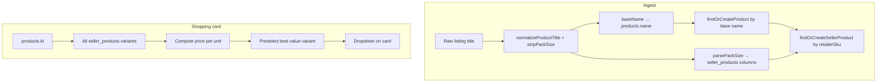

# ALE-80 Normalize pack size variants for product deduplication and shopping cards

## Context

**Linear:** [ALE-80](https://linear.app/dewly/issue/ALE-80/normalize-pack-size-variants-for-product-deduplication-and-shopping)

**Follow-up to:**

- [ALE-77](./ALE-77-cross-retailer-product-deduplication-evaluation.md) — cross-retailer name-heuristic dedup; one `products` row per physical SKU (size was still in the name).
- [ALE-78](./ALE-78-ingest-time-catalog-deduplication.md) — ingest-time `findOrCreate*`; `seller_products.retailerSku` as listing identity.
- [ALE-79](./ALE-79-strip-promotional-prefixes-from-product-names.md) — promo + seller-brand title cleanup; **explicitly deferred** quantity/size tokens to this ticket.

After ALE-77–79, duplicate clusters are mostly gone for promo/brand noise, but many **quantity-only** duplicates remain:

```
Vitamin C Serum 500mg
Vitamin C Serum 1000mg

Probiotic 10 Capsules
Probiotic 20 Capsules

COSRX Snail Essence 50ml
COSRX Snail Essence 100ml
```

Today each size is a separate `products` row because pack size is part of `products.name` and `isBlockedPair` treats them as distinct (or partially overlapping) identities.

**Branch (when implementing):** `ALE-80-normalize-pack-size-variants-for-deduplication` in `commerce-platform-backend`, `commerce-platform-scrapers`, `commerce-platform-frontend`, and `packages/catalog-dedup`.

**Database changes:** New columns on `seller_products`, enum for pack units, replace unique `(sellerId, productId)` with `(sellerId, productId, packAmount, packUnit, packCount)` — **architect approval required** before migration.

---

## Problem statement

### Identity model mismatch

| Layer | Today | Target |
|-------|-------|--------|
| `products` | One row per size-specific listing title | One row per **product line** (base name, no pack size) |
| `seller_products` | One row per `(sellerId, productId)` max | One row per **retailer listing** (SKU); many per seller per product |
| Pack size | Embedded in `products.name` | Structured on `seller_products` |
| Price comparison | Lowest absolute price across offers | Lowest **price per base unit** within variant picker |
| Shopping cards | Single price + URL | Dropdown of variants; preselect best value |

### Why ALE-79 did not solve this

ALE-79 intentionally **did not** strip `500ml`, `10 capsules`, etc. — those tokens are product identity for the old model and stripping them without a structured home would cause over-merge (e.g. 50ml vs 500ml) or lose shopper context.

### Constraint blocker

`seller_products` has `@@unique([sellerId, productId])`, which prevents one seller from listing both 500mg and 1000mg SKUs on the same canonical product. Listing identity for re-scrape is `(sellerId, retailerSku)` (ALE-78). Replace the product-level unique with a **variant-level** composite that includes pack size so we allow multiple sizes per seller per product but still block duplicate rows for the same variant.

---

## Strategy decision (locked for v1)

| Decision | Rationale |
|----------|-----------|
| **Product line = canonical `products` row** | Shoppers think "this serum" then pick size; agent recommendations should target the line, not a single pack |
| **Pack size lives on `seller_products`** | Size is listing-specific; same seller often has different SKUs per size |
| **Parse + strip pack size from titles at ingest** | Extend `normalizeProductTitle` pipeline after promo/brand steps |
| **Dedup compares base names only** | `findOrCreateProduct` / `isBlockedPair` use name with pack tokens removed |
| **Do not collapse shade/color in v1** | `#21 Rose` vs `#22 Nude` stay separate canonical products — different sellable identity |
| **Price per unit computed at read time** | `price / normalizedPackAmount` in base unit; no stored column unless profiling says otherwise |
| **Card default = best price per unit** | Better consumer signal than lowest sticker price for different pack sizes |
| **Variant unique = seller + product + pack** | Replace `(sellerId, productId)` with `(sellerId, productId, packAmount, packUnit, packCount)` — not packAmount alone (500mg ≠ 500ml) |



---

## Data model (architect approval required)

### New enum: `PackUnit`

Normalized unit for pack size and price-per-unit comparison. Start with units seen in catalog audit:

| `PackUnit` | Examples in titles |
|------------|-------------------|
| `MG` | 500mg, 1000 mg |
| `G` | 50g, 1.7oz → convert where needed |
| `ML` | 50ml, 100 mL |
| `FL_OZ` | 1.7 fl oz |
| `OZ` | 1 oz (weight) |
| `CAPSULE` | 10 capsules, 60 caps |
| `TABLET` | 30 tablets |
| `COUNT` | 78+22 count, 100 sheets |
| `PIECE` | 30 pcs, 5 ea |
| `STICK` | 1 stick |
| `PAIR` | 2 pairs |

Add `UNKNOWN` for unparseable listings (card shows absolute price only; excluded from cross-variant PPU ranking).

### `seller_products` new columns

| Column | Type | Notes |
|--------|------|-------|
| `packAmount` | `Float` | Numeric amount in `packUnit` (e.g. 500, 10, 50). Use `0` when unparseable (with `packUnit = UNKNOWN`). |
| `packUnit` | `PackUnit` | Enum; default `UNKNOWN` when title parse fails |
| `packCount` | `Int` | Multiplier for compound patterns (`30g x 5` → amount 30, unit G, count 5). Default `1`. |
| `listingTitle` | `String?` | Optional raw/scraped title for PDP parity (if not already on spec) |

Pack columns are **NOT NULL** (with defaults) so the composite unique index behaves predictably — PostgreSQL treats `NULL` as distinct in unique constraints, which would allow duplicate variant rows.

**Replace:** `@@unique([sellerId, productId])` → `@@unique([sellerId, productId, packAmount, packUnit, packCount])`.

One seller can list 500mg and 1000mg on the same canonical product (different `packAmount`), but cannot insert two rows for the same `(seller, product, 500, MG, 1)`.

**Keep:** `@@unique([sellerId, retailerSku])` — primary listing identity for scrape re-ingest.

**Index:** `(productId, packUnit, packAmount)` for variant queries on cards.

### `products.name`

Store **base name** only (pack size stripped). Display on cards without redundant size in title; size shown via variant label.

---

## Pack size parsing (`packages/catalog-dedup`)

New module: `packages/catalog-dedup/src/core/productPackSize.ts`

### `parsePackSizeFromTitle(title: string): PackSizeParseResult`

Returns `{ baseName, packAmount, packUnit, packCount?, matchedSuffix }`.

**Patterns (v1, trailing suffix preferred):**

- `\d+(\.\d+)?\s*(mg|g|ml|mL|oz|fl\.?\s*oz)\b`
- `\d+\s*(capsules?|caps?|tablets?|pills?|pcs|ea|count|sheets?|sticks?|pairs?)\b`
- Compound: `\d+g\s*[*x×]\s*\d+` → amount + unit + packCount
- Trailing ` - 50ml`, ` (10 Capsules)`

**Guards — do not strip:**

- SPF values (`SPF50+`, `PA++++`) — not pack size
- Shade codes (`#21`, `No. 5`, `Rose Beige`) — shade identity
- Model numbers that look numeric but aren't size (`1025 Dokdo`, `96 Mucin`)
- Leading size when it's the product name (`5% Niacinamide`) — only strip **trailing** pack suffix in v1

### `stripPackSizeForDedup(title: string): string`

Calls `parsePackSizeFromTitle`, returns `baseName` trimmed. Used by:

- `normalizeProductNameForDedup` (blocking)
- `findOrCreateProduct` (persist `products.name`)
- Bulk merge audit

### Unit normalization for PPU

`normalizeToBaseUnit(amount, unit): { amount: number, baseUnit: PackUnit } | null`

- Weight: mg ↔ g (1000mg = 1g)
- Volume: ml ↔ fl_oz (1 fl_oz ≈ 29.5735 ml)
- Count types: compare within same `PackUnit` only (capsules vs capsules)

Cross-unit PPU (mg vs capsules) — **not comparable**; show variants grouped by unit family in dropdown or separate sections if needed.

---

## Ingest changes

### `normalizeProductTitle` pipeline (extend ALE-79 order)

1. HTML entities → whitespace → promo brackets → seller brand strip (**existing**)
2. **`stripPackSizeForDedup`** → `baseName` for `products.name`
3. **`parsePackSizeFromTitle`** on original cleaned title → pack columns for `seller_products`

### `findOrCreateProduct`

- Match candidates using **base name** (post pack strip), same `brandId`, cross-seller gate unchanged
- Create with `name: baseName` only
- **Never** merge two listings that share base name but differ in `retailerSku` into one `seller_product` — only share `productId`

### `findOrCreateSellerProduct`

1. **Primary lookup:** `(sellerId, retailerSku)` — same listing always hits the same row on re-scrape.
2. **Secondary lookup (optional):** `(sellerId, productId, packAmount, packUnit, packCount)` when `retailerSku` changes but pack identity is stable (retailer URL/handle migration).
3. **Create** with pack columns populated before insert; on unique violation, re-fetch by whichever key collided.
4. **Remove** upsert on `sellerId_productId` alone — that key no longer exists.

On create/update: set `packAmount`, `packUnit`, `packCount` (default `1` / `UNKNOWN` + `0`), optional `listingTitle`.

### Scrapers

No per-retailer logic — all via `upsertCatalogListing`. Optionally populate pack from PDP specs when title parse fails (Phase 2).

---

## Bulk repair

Scripts under `commerce-platform-backend/scripts/catalog-dedup/` (or extend existing):

| Script | Purpose |
|--------|---------|
| `audit-pack-size-clusters.ts` | Group products where `stripPackSizeForDedup(name)` + `brandId` match; count mergeable rows |
| `backfill-seller-product-pack-size.ts` | Parse from current `products.name`; write `seller_products` columns |
| `cleanup-product-base-names.ts` | Rewrite `products.name` to base name |
| `merge-pack-size-clusters.ts` | Union-find clusters differing only by pack suffix; repoint `seller_products` to canonical `productId`; hard-delete duplicate products (ALE-78 style) |

**Merge rules:**

- Same `brandId` + same `baseName` after strip → one canonical `products` row
- Pick canonical root: most `seller_products`, then most specs, then lowest `id` (same as ALE-77)
- **Never** merge if parsed pack is identical and retailer SKUs differ only by shade token in base name — manual review queue

Run audit on local DB before apply; record counts in this plan's TODO.

**Operational runbook (staging/prod, new retailers):** [`commerce-platform-backend/scripts/catalog-dedup/README.md`](../commerce-platform-backend/scripts/catalog-dedup/README.md) § Pack-size audit runbook.

---

## API + shopping cards

### GraphQL (`ShoppingProductCard`)

Extend type:

```graphql
type ShoppingProductVariant {
  sellerProductId: EncodedID!
  quantityLabel: String!       # "500 mg", "10 capsules"
  priceLabel: String!
  pricePerUnitLabel: String    # "$0.12 / mg" — null when not comparable
  productUrl: String!
  retailerName: String!
  isBestValue: Boolean!
}

type ShoppingProductCard {
  # existing fields...
  variants: [ShoppingProductVariant!]!
  selectedSellerProductId: EncodedID!
}
```

### `getShoppingProductCardsBatch`

For each `productId`:

1. Load all linkable `seller_products` with prices + pack columns
2. Build variant list with `quantityLabel` from structured pack
3. Compute PPU within comparable unit family
4. Set `selectedSellerProductId` = variant with lowest PPU (tie-break: lowest absolute price)
5. Top-level `priceLabel`, `productUrl`, `retailerName` mirror **selected** variant (backward compatible)

### Frontend (`shoppingProductCard.tsx`)

- When `variants.length > 1`, render `<select>` (or design-system combobox) on card
- On change: update displayed price, URL, retailer; stop navigation until click (select change does not follow link)
- Show `pricePerUnitLabel` in option text when available: `500 mg · $24.99 · $0.05/mg`
- Single variant: no dropdown (current UX)

### Agent / structured output

Shopping agent still emits `productId` (canonical line). Server resolves default variant for card hydration. Future: agent could request specific pack size via tool arg.

---

## Cart and orders (v1 boundary)

`cart_products` and `order_products` still reference `productId` + `quantity` (cart line qty). **Not** switching to `sellerProductId` in v1 — card link uses selected variant URL only.

**Follow-up ticket if needed:** cart lines should pin `sellerProductId` so re-scrape does not change which SKU the user added.

---

## Test plan

### `packages/catalog-dedup`

- `productPackSize.test.ts` — parse/strip for mg, ml, g, capsules, compound `30g*5`, SPF/shade guards
- `findOrCreateProduct.test.ts` — 500mg + 1000mg listings → same `productId`, two `seller_products`
- `productNameBlocking.test.ts` — `isBlockedPair("Foo 500mg", "Foo 1000mg")` → true (same line)

### Backend

- `getShoppingProductCardsBatch` — multi-variant product returns sorted variants + correct `isBestValue`
- Interaction test: ingest two sizes, one product row

### Frontend

- Card renders dropdown when `variants.length > 1`
- Selection updates price and href
- Best value preselected

---

## Risks and mitigations

| Risk | Mitigation |
|------|------------|
| Over-merge different formulas with similar names | Require exact base name match after strip; shade tokens block strip |
| Strip `96` from "Snail 96 Mucin" | Allowlist product-line numbers; only strip known unit suffixes |
| 50ml vs 0.5oz rounding in PPU | Use normalized base unit floats; display 2 decimal places |
| Same seller, two sizes → unique violation | Replace `(sellerId, productId)` with composite including `packAmount` + `packUnit` + `packCount` |
| Unparseable pack → duplicate variant rows | NOT NULL defaults (`UNKNOWN`, `0`, `1`); unparseable listings still dedupe via `(sellerId, retailerSku)` |
| Bulk merge breaks agent product IDs | Merge script repoints FKs; chat history cards re-resolve by `productId` |
| K-beauty minis vs full size | Different pack amounts → separate variants on same product (correct) |

---

## Phases

### Phase 0 — Audit (read-only)

- [x] Script: `scripts/catalog-dedup/audit-pack-size-clusters.ts` + `packages/catalog-dedup/src/core/productPackSize.ts`
- [x] Sample false positives (shade, SPF, kit sets) in fixture `scripts/fixtures/pack-size-dedup/pack-size-clusters.json`
- [x] Record baseline on local DB (2026-06-15)

**Local audit results (post ALE-79 merges, 15,979 active products):**

| Metric | Value |
|--------|------:|
| Products with parseable trailing pack suffix | 5,709 (35.7%) |
| Multi-size clusters (same brand + base name, ≥2 distinct pack sizes) | 165 |
| Mergeable product rows (cluster members − 1) | 179 |
| Junk clusters (title is *only* pack size, empty base name) | 1 (14 rows — YesStyle) |
| False-positive samples flagged | 40 |

**Interpretation:** ~179 rows could fold into 165 canonical product lines today with trailing-suffix parsing only. Many kit/set titles (`80ml Set (+Refill 80ml)`, `1+1 Special Set`) are flagged as `unparsed_suffix` — v1 parser intentionally handles trailing suffix only; bundle patterns are a Phase 1+ parser extension.

**Example real cluster:** `Dear, Klairs Freshly Juiced Vitamin E Mask` — 15g vs 90g.

### Phase 1 — `catalog-dedup` parsing + tests

- [x] `productPackSize.ts` + unit tests (Phase 0 prototype; wire into ingest next)
- [x] Wire `stripPackSizeForDedup` into `normalizeProductNameForDedup` / `findOrCreateProduct`
- [x] `canonicalProductBaseName` for `products.name` + `upsertCatalogListing` ingest path
- [x] `findOrCreateSellerProduct` accepts parsed pack fields (persist after Phase 2); guard against overwriting a different `retailerSku` on same `(sellerId, productId)` until variant unique lands

### Phase 2 — Database migration (architect approval)

- [x] Add `PackUnit` enum + `seller_products.packAmount`, `packUnit`, `packCount`, `listingTitle` (pack columns NOT NULL with defaults)
- [x] Replace `seller_products_sellerId_productId_key` with `seller_products_sellerId_productId_packAmount_packUnit_packCount_key`
- [x] Mirror migration in `commerce-platform-scrapers` schema introspection
- [x] Applied locally: `20260614180000_ale_80_seller_product_pack_size`

### Phase 3 — Ingest + bulk backfill

- [x] Deploy migration; run `backfill-seller-product-pack-size.ts` + `cleanup-product-base-names.ts`
- [x] Run `merge-pack-size-clusters.ts` on local DB (post-cleanup: 5 clusters, 9 products merged; pre-cleanup audit was 165/179)
- [x] Confirm re-scrape idempotency for multi-size same seller

### Phase 4 — API + frontend

- [x] GraphQL schema + `getShoppingProductCardsBatch` variants
- [x] `npm run codegen` in backend + frontend
- [x] Product card dropdown UX + tests

### Phase 5 — Documentation

- [x] Update ALE-77/78 docs cross-links
- [x] Runbook for pack-size audit after new retailers → [`commerce-platform-backend/scripts/catalog-dedup/README.md`](../commerce-platform-backend/scripts/catalog-dedup/README.md)

---

## TODO

- [x] Phase 0: run pack-size cluster audit on local DB; paste counts above
- [x] Phase 1 (partial): `productPackSize` module + unit tests
- [x] Phase 1: wire into ingest + blocking
- [x] Phase 2: migration written + applied locally (staging/prod pending architect approval)
- [x] Phase 3: bulk backfill + merge executed locally; catalog-dedup/scrapers/backend builds + 86 tests pass
- [x] Phase 4: shopping card variant dropdown shipped
- [x] Phase 5: docs/runbook updated
