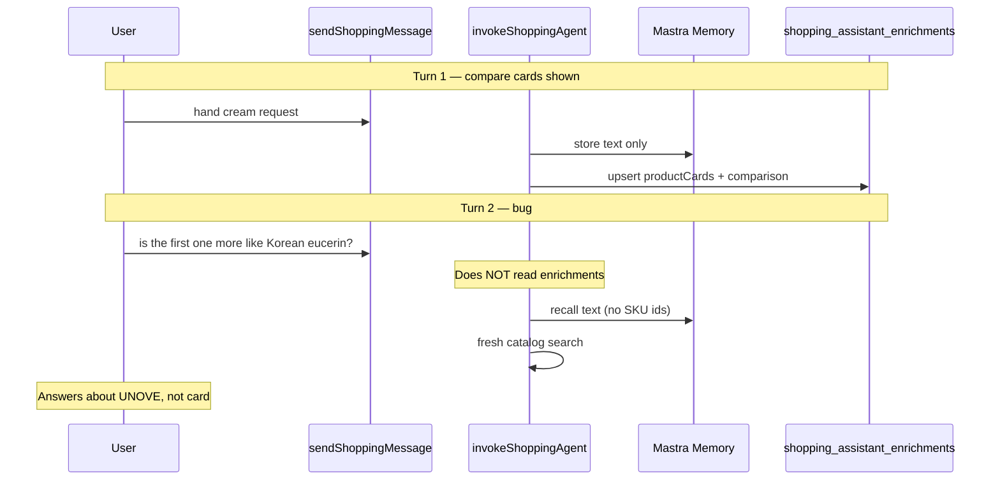

# ALE-97 — Resolve product card references on follow-up turns

## Context

[Linear ALE-97](https://linear.app/dewly/issue/ALE-97/agent-loses-product-card-context-on-follow-up-references-the-first-one)

**Bug (Jul 2026 screenshot):**

1. Assistant shows a **Quick compare** table with two hand creams (column 1 = Shea Butter Hand Cream / ROSEROSESHOP; column 2 = Dr.Jart+ Ceramidin / TESTER KOREA).
2. User: “is the first one more like Korean eucerin?”
3. Assistant answers about **Glow Hand Cream by UNOVE** — a product never shown — and later misattributes the Shea Butter cream to DONGGUBAT.

**Repo scope:** `commerce-platform-backend` (primary). Playwright E2E in `commerce-platform-frontend`.

**Database changes:** None.

**Related work:**

- [ALE-14](ALE-14-remove-redundant-info-from-the-agent-responses.md) — strips product names from assistant prose; Mastra memory no longer carries SKU identifiers on compare turns.
- [ALE-18](ALE-18-fix-recommendation-of-similar-products.md) — `comparison.items` ordering and finalist vs alternative partitioning.
- [ALE-41](ALE-41-comparison-returns-plain-text-instead-of-cards.md) — enrichment architecture (`shopping_assistant_enrichments`).
- `sendShoppingMessage.ts` — existing `wantsRepeatCards` path already loads latest enrichment for explicit “show cards again” requests.

---

## Root cause

| Layer | Location | Problem |
| ----- | -------- | ------- |
| Persistence | `shopping_assistant_enrichments` | `productCards` + `comparison` stored per assistant `mastraMessageId` |
| Read path | `getChatMessages.ts` | Enrichment joined for UI only |
| Write / agent path | `invokeShoppingAgent.ts` | Agent gets `userMessage` + Mastra text memory only — **no prior enrichment** |
| Agent instructions | `shoppingAgent.ts` L42 | “Only discuss specific products that appear in **this conversation turn's tool results**” |
| Text dedupe | `dedupeAssistantTextForStructuredEnrichment.ts` | Assistant memory says things like “compare them in the table below” with no product names |
| Ordinal refs | — | No resolver for “first one”, “second card”, “that one”, etc. |



---

## Expected behavior

- When the user references a previously shown product by **position** (first / 1st / second / third) or **deixis** (that one, this one, the one on the left), resolve to the correct `productId` from the most recent enrichment.
- **Comparison column order** is authoritative: `comparison.items[0]` = first column = “the first one”.
- Agent answers about the **resolved referent**; may search for comparison anchors (e.g. “Korean eucerin”) but must not substitute a random search hit for the referent.
- No new product cards on pure Q&A follow-ups unless the user explicitly asks for new options.

---

## Design decisions

### 1. Deterministic resolution + injected system context (locked)

Follow the pattern used for `wantsRepeatCards`, `isClearlyBeautyRelated` (ALE-85), and `adviceForOtherUser` (ALE-10): a pure helper detects reference intent; `invokeShoppingAgent` injects a system context block before `agent.generate`.

Avoid relying on the LLM alone to infer ordinals from stripped Mastra memory.

### 2. Source of truth for “which products were shown” (locked)

Load the **most recent** `shopping_assistant_enrichment` for the chat where `productCards.length > 0`.

When `comparison.items.length >= 1`, use `comparison.items` order for ordinals. When only single-card or discount cards exist (no comparison), fall back to `productCards` array order.

### 3. Relax agent grounding rule for follow-ups only (locked)

Add a per-turn system nudge when card references are resolved:

> Products currently shown to the user are authoritative. The user’s message refers to product #N. Use `get_product_detail` on that `productId` before answering. You may search for comparison targets mentioned by the user, but do not replace the referent with unrelated search results.

Update `shoppingAgent.ts` instructions to allow grounding in **injected shown-product context**, not only current-turn tool results, when that context is present.

### 4. Do not emit new cards on referent-only follow-ups (locked)

When the turn is purely about a shown product (compare / explain / “is X like Y?”), suppress new `productCards` extraction unless tools return genuinely new SKUs the user asked for. Reuse or omit cards rather than surfacing a random search result as a new card.

---

## Implementation steps

### 1. Add `getLatestShoppingEnrichmentForChat`

**File:** `commerce-platform-backend/src/interactions/chat/getLatestShoppingEnrichmentForChat.ts`

- Query `shoppingAssistantEnrichment.findFirst({ where: { chatId }, orderBy: { updatedAt: 'desc' } })`.
- Reuse `parseProductCardsJson` / `parseComparisonJson` from `listShoppingAssistantEnrichmentsForChat.ts` (extract shared parsers if needed).
- Return `{ productCards, comparison, mastraMessageId } | null`; null when no rows or empty cards.

**Tests:** `getLatestShoppingEnrichmentForChat.test.ts` — latest row wins; invalid JSON skipped; empty cards → null.

### 2. Add `resolveShoppingCardReferences`

**File:** `commerce-platform-backend/src/interactions/chat/resolveShoppingCardReferences.ts`

**Input:** `userMessage`, `{ productCards, comparison }`

**Output:**

```ts
type ResolvedCardReference = {
  kind: "ordinal" | "deictic" | "none";
  index?: number; // 1-based
  productId?: string;
  productName?: string;
  retailerName?: string;
  allShownProducts: Array<{ index: number; productId: string; name: string; retailerName?: string }>;
};
```

**Detection heuristics (v1):**

| Pattern | Maps to |
| ------- | ------- |
| `\b(first\|1st)\b` + optional `\b(one\|card\|option\|pick\|product)\b` | index 1 |
| `\b(second\|2nd)\b` + optional deictic noun | index 2 |
| `\b(third\|3rd)\b` + optional deictic noun | index 3 |
| `\b(that one\|this one\|the one)\b` | index 1 when only one comparison item; else ambiguous → prefer most recently discussed single finalist if exactly one comparison exists |

Resolve `productId` via `comparison.items[n-1].productId`, hydrate name/retailer from `productCards` map.

**Tests:** `resolveShoppingCardReferences.test.ts` — cover screenshot phrase, “second one”, no match → `kind: "none"`, comparison vs card-only fallback.

### 3. Add `buildShownProductsContextSystemBlock`

**File:** `commerce-platform-backend/src/interactions/chat/buildShownProductsContextSystemBlock.ts`

Format injected context, e.g.:

```
Products currently shown to the user (authoritative — do not substitute other SKUs):
1. [productId=123] Shea Butter Hand Cream — ROSEROSESHOP ($11.14)
2. [productId=456] Dr.Jart+ Ceramidin Moisturizing Hand Cream — TESTER KOREA ($1.00)

The user's message refers to #1. Answer about THAT product. Call get_product_detail(123) first. You may search for "Korean eucerin" as a comparison reference only.
```

When `kind === "none"` but enrichment exists and message mentions “them”, “these”, “the options”, include the list without a single referent.

### 4. Wire into `invokeShoppingAgent`

**File:** `invokeShoppingAgent.ts`

Before `trackedAgentGenerate`:

1. `const latest = await getLatestShoppingEnrichmentForChat(chatId)`
2. `const ref = resolveShoppingCardReferences(userMessage, latest)`
3. If `latest` and (`ref.kind !== "none"` or collective reference detected), append `buildShownProductsContextSystemBlock(ref, latest)` to `context` array (alongside `systemWithTurn` and `knownProfileSystem`).

Log structured debug: `{ chatId, refKind, resolvedProductId, shownCount }`.

### 5. Update agent instructions

**File:** `shoppingAgent.ts`

Add under **Storefront product cards**:

- When system context lists **Products currently shown to the user**, treat those `productId`s as valid grounding for follow-up questions even if they are not in this turn’s search results.
- Never answer about a different SKU when the user clearly refers to a shown card.

### 6. Optional: suppress misleading new cards on referent follow-ups

**File:** `invokeShoppingAgent.ts` (structured enrichment path)

If `ref.kind !== "none"` and the user did not ask for new alternatives, skip emitting new `productCards` / `comparison` for the turn (text-only answer). Mirror logic in `shouldSuppressProductCardsForAssistantText` or add `shouldSuppressProductCardsForCardReferenceFollowUp`.

### 7. E2E regression (TDD)

**Flow:** `e2eTestFlows/flows/card-reference-follow-up.md`

**Spec:** `commerce-platform-frontend/playwright/tests/chat/card-reference-follow-up.spec.ts`

1. Signed-in user gets a compare turn with ≥2 visible product cards (hand cream or similar).
2. Capture first card product name from DOM (stable `data-testid` on comparison column if missing — add `data-testid="comparison-product-{n}"` to `shoppingProductComparison.tsx`).
3. User sends: “is the first one more like Korean eucerin?”
4. `captureAgentResponseReview` with heuristics:
   - `mentionsProductName`: first card name substring present
   - `mentionsUnrelatedProduct`: false (no UNOVE or other catalog drift — use forbidden-name list from visible cards only)
   - `expectNoProductCards` or `productCardCount` unchanged
5. Cross-link in `e2eTestFlows/index.md`.

---

## Files to touch

| File | Change |
| ---- | ------ |
| `getLatestShoppingEnrichmentForChat.ts` | **new** |
| `resolveShoppingCardReferences.ts` | **new** |
| `buildShownProductsContextSystemBlock.ts` | **new** |
| `invokeShoppingAgent.ts` | load enrichment, inject context |
| `shoppingAgent.ts` | follow-up grounding instruction |
| `shoppingProductComparison.tsx` | optional `data-testid` for E2E |
| `playwright/tests/chat/card-reference-follow-up.spec.ts` | **new** E2E |
| `e2eTestFlows/flows/card-reference-follow-up.md` | **new** flow doc |

---

## Test plan

- [ ] Unit: `resolveShoppingCardReferences` — ordinals, deictics, no-match, comparison vs card-only
- [ ] Unit: `getLatestShoppingEnrichmentForChat` — ordering, parse failures
- [ ] Unit: `buildShownProductsContextSystemBlock` — snapshot of injected text
- [ ] Integration: `invokeShoppingAgent` mock — assert system context includes resolved `productId` when user says “first one”
- [ ] E2E: compare turn → “is the first one…” → response mentions first card name, not random SKU
- [ ] `npm run lint` + `npm run build` + `npm test` in backend
- [ ] `npm run build` + affected Playwright spec in frontend

---

## Out of scope (v1)

- Full anaphora resolution (“the cheaper one”, “the one with ceramides”) — may add in v2 using comparison attributes.
- Client-side passing of card context in `sendShoppingMessage` mutation (server-side enrichment is sufficient and tamper-resistant).
- Increasing Mastra `lastMessages` beyond 6 (enrichment injection is more reliable than longer text memory).

---

## TODO

- [x] Create branch `ALE-97-resolve-card-references-in-follow-ups` in backend (+ frontend for E2E)
- [x] Implement `getLatestShoppingEnrichmentForChat`
- [x] Implement `resolveShoppingCardReferences` + tests
- [x] Implement `buildShownProductsContextSystemBlock`
- [x] Wire into `invokeShoppingAgent` + update `shoppingAgent.ts` instructions
- [x] Add E2E flow + Playwright spec (red → green)
- [x] Suppress new cards on referent-only follow-ups
- [x] Pre-push: lint, build, unit tests, E2E spec
