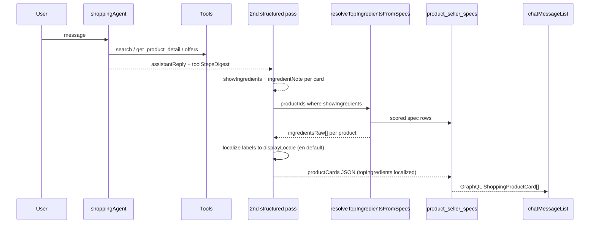

# ALE-15 Ingredients display in product cards

## Context

**Linear:** [ALE-15](https://linear.app/alexandinseongprojects/issue/ALE-15/ingredients-display-in-the-product-cards)

**Ticket summary:**
- When the shopping agent is reasoning about **ingredients** (user asked to compare actives, or the reply makes an ingredient-led point), product cards should show **up to 3 key ingredients** plus a short **“why it’s good for you”** line.
- Ingredients should **not** appear on every card by default — only when the agent decides the turn is ingredient-relevant (flag on the card).
- Reference mockup in the ticket (ingredient callout on cards in a compare/discount row).

**Branch:** `ALE-15-ingredients-display-in-product-cards` (frontend + backend)

**Repos:**

| Repo | Scope |
|------|--------|
| `commerce-platform-backend` | Deterministic ingredient resolution from `product_seller_specs` (same pattern as thumbnails), chat enrichment, GraphQL |
| `commerce-platform-frontend` | Card UI, GraphQL fragments, tests |

---

## Product goals

1. User asks “compare niacinamide serums” → cards show **3 hero ingredients** + one-line benefit tied to their concern.
2. User gets a normal price/routine recommendation → cards stay **unchanged** (no ingredient clutter).
3. Ingredient **names** on cards are **deterministically derived from scraped `product_seller_specs`**, same trust model as thumbnail URLs — not LLM training knowledge.
4. Card ingredient labels are shown in **English by default**; if scraped tokens are Korean (common on Olive Young featured-ingredient copy), **translate to English** before display. Only show Korean (or another language) when the user is clearly conversing in that language or asks for it.
5. Comparison table can keep using `heroActives`; cards get a **lighter, scannable** ingredient strip aligned with the mockup.

---

## Reference implementation: product thumbnails

We already solve cross-seller PDP metadata with a **deterministic spec resolver** — no ML, no guessing from product titles.

| Piece | Thumbnail pattern (today) | Ingredient pattern (this ticket) |
|-------|---------------------------|----------------------------------|
| Data | `product_seller_specs.stringValue` + `seller_specs.name` | Same tables |
| Query | OR on image-like values + known spec names; tags `FACET` \| `PAGE` \| `COMMERCE` | OR on ingredient-like values + known spec names; same tags |
| Pick spec | **Score `seller_specs.name`** (e.g. `Thumbnail path` +1000, `thumbnailList[0].imagePath` +900) | **Score spec names** (`SK ingredients` +1000, mapped INCI +950, `ftrdIngrdText` +800, …) |
| Parse value | `extractCandidateImageRefs` → resolve URL per seller | `parseInciTokens` / `pickTopIngredients` → `ingredientsRaw` → `localizeIngredientLabels` (EN default) |
| Single product | `getProductThumbnailUrl.ts` | `getProductTopIngredients.ts` |
| Batch | `getShoppingProductCardsBatch.ts` → `resolveThumbnailFromSpecs` | `getProductTopIngredientsBatch.ts` → `resolveTopIngredientsFromSpecs` |
| Value-shape audit | Extension / path heuristics in query | Reuse signals from `enrichSpecsByValuesOnly.ts` (comma-dense + cosmetic vocabulary) |

**Files to mirror:**

- `commerce-platform-backend/src/interactions/catalog/getProductThumbnailUrl.ts`
- `commerce-platform-backend/src/interactions/catalog/getShoppingProductCardsBatch.ts` (`resolveThumbnailFromSpecs`)

**Principle:** Ingredient display is **catalog infrastructure**, not an agent hallucination layer. The LLM decides **whether** to show the block (`showIngredients`), **display language**, and writes the **note**; **which** actives appear come from the resolver (scraped tokens); **localized label text** is a constrained translation step when scraped text is not already in the target language.

---

## Current state

### Chat product cards pipeline



- **`invokeShoppingAgent`** structured pass fills `productCards` + optional `comparison`.
- **`getProductDetail`** truncates `stringValue` to **150 chars** — unsuitable for INCI. Ingredient resolver reads **full** `stringValue` from DB (like thumbnails bypassing agent truncation).

### Scraped ingredient specs (known sellers)

Curated in `tagSpecs.ts`, `sellerSpecMappingBatchData.ts`, `manualSpecCurationBatch*.ts`, and value analysis in `enrichSpecsByValuesOnly.ts`:

| Priority | `seller_specs.name` (examples) | Canonical mapping | Value shape |
|----------|-------------------------------|-------------------|-------------|
| 1 | `SK ingredients` | `Ingredients (INCI list)` | Comma-separated INCI |
| 2 | Seller specs mapped to **`Ingredients (INCI list)`** | (via `seller_spec_mappings`) | Comma-separated INCI |
| 3 | `OY PDP.detailsInfo.details.ftrdIngrdText` | `Featured ingredients (narrative)` | Marketing actives / bullets |
| 4 | `OY PDP.detailsInfo.notice.notiCont` + `OY description.*` | Often `Product notice / disclosure` | May include INCI paragraph (code-specific) |
| 5 | Name matches `/ingredient\|inci\|composition/i` + value passes **ingredient-like** test | — | Fallback discovery |

---

## Deterministic resolver design

### New module: `ingredientSpecResolution.ts`

**Path:** `commerce-platform-backend/src/interactions/catalog/ingredientSpecResolution.ts`

Pure functions (unit-tested with fixture strings — no DB):

```ts
export type IngredientSpecRow = {
  stringValue: string;
  sellerSpecName: string;
  canonicalName?: string | null; // product_specs.name when mapped
  updatedAt?: Date;
};

export type ResolvedTopIngredients = {
  source: "inci" | "featured" | "notice" | "none";
  sellerSpecName: string | null; // winning row, for debug
  /** Scraped tokens after parse/pick — may be Korean or Latin INCI */
  ingredientsRaw: string[];
};

export function scoreIngredientSpecName(name: string, canonicalName?: string | null): number;
export function isIngredientLikeValue(value: string): boolean;
export function stripIngredientHtml(value: string): string;
export function parseInciTokens(value: string): string[];
export function parseFeaturedIngredientPhrases(value: string): string[];
export function pickTopIngredients(tokens: string[], limit: number): string[];
export function resolveTopIngredientsFromSpecs(
  rows: IngredientSpecRow[],
  limit?: number,
): ResolvedTopIngredients;
```

### Spec name scoring (mirror thumbnail weights)

```ts
// Illustrative — tune with fixtures from real SK/OY rows
function scoreIngredientSpecName(name: string, canonical?: string | null): number {
  let score = 0;
  if (canonical === "Ingredients (INCI list)") score += 950;
  if (name === "SK ingredients") score += 1000;
  if (name === "OY PDP.detailsInfo.details.ftrdIngrdText") score += 800;
  if (/ftrdIngrd/i.test(name)) score += 750;
  if (/^OY description\./i.test(name)) score += 400; // notice lines; verify code → INCI in audit
  if (/notice\.notiCont/i.test(name)) score += 350;
  if (/ingredient|inci|composition/i.test(name)) score += 300;
  if (name.startsWith("OY ")) score += 100;
  return score;
}
```

Sort rows by `score` desc, then `updatedAt` desc. Walk in order; first row that yields ≥1 display ingredient wins.

### Value-shape detection (from prior spec analysis)

Reuse logic aligned with `enrichSpecsByValuesOnly.ts`:

- **INCI-like:** contains `,` and matches `/(extract|acid|water|glycerin|niacinamide|hyaluronic|fragrance|parfum|oil|peptide|vitamin)/i`
- **Featured-like:** shorter text, bullets `·` / `•`, or line breaks; may not be full INCI
- Reject: mostly URLs, JSON debug blobs, boolean/numeric-only, instruction-only (`apply`, `rinse`, …)

### Parse + pick top 3 (fully deterministic)

**INCI path** (`parseInciTokens`):

1. `stripIngredientHtml` (tags, entities, collapse whitespace).
2. Split on `,` / `;` (K-beauty standard).
3. Trim; drop empty; cap token length (e.g. 48 chars).

**`pickTopIngredients`** (no LLM):

1. Walk tokens in INCI order (concentration proxy).
2. Skip solvent/carrier list: `Water`, `Aqua`, `Eau`, `Butylene Glycol`, `Propanediol`, `Glycerin`, `Glycerol`, …
3. Prefer tokens matching **ACTIVE_LEXICON** (fixed set: `niacinamide`, `retinol`, `ascorbic`, `centella`, `ceramide`, `hyaluronic`, `panthenol`, `adenosine`, `peptide`, `salicylic`, `glycolic`, …) — first 3 matches in list order.
4. If &lt; 3 actives, fill with next non-solvent tokens after solvent block.
5. Normalize tokens only (trim parentheticals, collapse whitespace) — **do not translate here**; output `ingredientsRaw`.

**Featured path** (`parseFeaturedIngredientPhrases`): split on `·`, `•`, newlines, `,`; take first 3 non-empty phrases (min length 2). Often Korean marketing copy on OY.

### Display localization (English default)

**New:** `localizeIngredientLabels.ts`

```ts
export type DisplayLocale = "en" | "ko"; // extend later if needed

export function detectHangul(text: string): boolean;
export function needsLocalization(raw: string[], target: DisplayLocale): boolean;

/** One-to-one: output[i] is the display form of raw[i]; never add/remove slots */
export async function localizeIngredientLabels(
  raw: string[],
  target: DisplayLocale,
): Promise<string[]>;
```

**Rules:**

| `displayLocale` | Behavior |
|-----------------|----------|
| `en` (default) | If any `ingredientsRaw` token contains Hangul → **translate each token to English** (cosmetic-ingredient terminology, not free paraphrase). Latin INCI tokens: Title Case, keep INCI names (e.g. `Niacinamide`). |
| `ko` | If user writes in Korean / asks for Korean: show **scraped text as-is** when already Korean; translate Latin-only tokens to Korean if needed. |
| Other | Out of v1 unless product adds locale prefs — treat as `en`. |

**How we pick `displayLocale`:**

1. Default **`en`** for all shoppers (matches English-first app copy and shopping agent tone).
2. Structured extraction pass sets optional `displayLocale` on the turn when the **user’s latest message** is clearly Korean (Hangul-heavy) or they explicitly request Korean ingredient labels.
3. Do **not** infer locale from scraped PDP language — only from **user language**.

**Translation implementation (v1):**

- **Constrained LLM call** (single batch per chat turn): input JSON array of unique raw labels across cards (≤9 strings); output same-length array of English cosmetic names. Instructions: translate faithfully, do not invent actives, preserve proper nouns/INCI where standard, one output string per input.
- Track via `trackedAgentGenerate` with a small model; cache by `hash(raw + locale)` in memory or skip cache for v1.
- **Fallback:** if translation fails, show raw token (better than empty) and log — or omit that chip.

**Trust boundary:** Translation may change **surface form** only. The resolver still decides **which** scraped tokens are shown; translation cannot swap in actives that were not in `ingredientsRaw`.

**Tests:**

- Fixture: `["나이아신아마이드", "판테놀"]` + `en` → `["Niacinamide", "Panthenol"]` (mock LLM or stub)
- Fixture: Latin INCI + `en` → Title Case, no LLM call
- `needsLocalization` false when target `ko` and tokens are Hangul

### Single + batch loaders

**`getProductTopIngredients.ts`** (mirror `getProductThumbnailUrl.ts`):

```ts
const getProductTopIngredients = async (productId: number, limit = 3) => {
  const rows = await prisma.productSellerSpec.findMany({
    where: {
      productId: BigInt(productId),
      stringValue: { not: null },
      OR: [
        { sellerSpec: { name: { in: KNOWN_INGREDIENT_SPEC_NAMES } } },
        { sellerSpec: { sellerSpecMapping: { productSpec: { name: "Ingredients (INCI list)" } } } },
        { sellerSpec: { sellerSpecMapping: { productSpec: { name: "Featured ingredients (narrative)" } } } },
        // Value-shape prefilter (like image extension OR):
        {
          AND: [
            { stringValue: { contains: "," } },
            { stringValue: { contains: "glycerin", mode: "insensitive" } }, // representative; expand in OR group
          ],
        },
      ],
      sellerSpec: { tag: { in: ["FACET", "PAGE", "COMMERCE"] } },
    },
    select: {
      stringValue: true,
      updatedAt: true,
      sellerSpec: {
        select: {
          name: true,
          sellerSpecMapping: { select: { productSpec: { select: { name: true } } } },
        },
      },
    },
    orderBy: { updatedAt: "desc" },
    take: 40,
  });
  return resolveTopIngredientsFromSpecs(mapRows(rows), limit);
};
```

**`getProductTopIngredientsBatch.ts`** (mirror batch thumbnail query in `getShoppingProductCardsBatch`):

- One `productSellerSpec.findMany` for all `productIds` in the chat turn (max 3 cards).
- Group by `productId`; call `resolveTopIngredientsFromSpecs` per group → `ingredientsRaw`.
- Caller runs `localizeIngredientLabels` once per turn (dedupe labels across cards) → `topIngredients` for persistence.
- Signature: `getProductTopIngredientsBatch(productIds, { limit?, displayLocale?: "en" | "ko" })`.
- Used from `invokeShoppingAgent` after structured extraction (one DB round-trip + one optional translation call).

Optional later: call batch resolver from `getShoppingProductCardsBatch` when building routine/chat cards that need ingredients — same function, same scores.

---

## LLM responsibilities (narrow)

| Field | Who sets it |
|-------|-------------|
| Which actives (scraped) | **`resolveTopIngredientsFromSpecs` only** → `ingredientsRaw` |
| `topIngredients[]` (display) | **`localizeIngredientLabels`** from `ingredientsRaw` + `displayLocale` (default `en`) |
| `displayLocale` | Structured extraction pass (default `en`; `ko` when user message is Korean or user asks) |
| `showIngredients` | Structured extraction pass (intent: user asked about actives / reply is ingredient-led) |
| `ingredientNote` | Structured extraction pass — same language as user turn; must only mention actives in localized `topIngredients` |

**Explicit rules:**

- Do not use model training knowledge to **pick** actives — only scraped tokens.
- Translation LLM is allowed only for **label localization** (Korean → English), with **1:1** input/output strings tied to resolver output.
- If scraped data has no ingredient row, **hide** the ingredient block (`showIngredients` forced false).

**Optional:** `comparison.items[].heroActives` filled from the same localized `topIngredients` per `productId` so compare table and cards match.

---

## Chat enrichment flow

Extend **`shoppingProductCardExtractionSchema`**:

```ts
showIngredients: z.boolean().optional(),
displayLocale: z.enum(["en", "ko"]).optional(), // default en when omitted
ingredientNote: z.string().min(1).max(200).optional(),
// topIngredients: server-only, not in extraction schema
```

**`invokeShoppingAgent` after `resolveShoppingProductCardPdpUrls`:**

1. `displayLocale = extraction.displayLocale ?? "en"`.
2. Collect `productId`s where extraction set `showIngredients: true`.
3. `getProductTopIngredientsBatch(ids, { displayLocale })` → raw per product.
4. Dedupe all `ingredientsRaw` labels → `normalizeIngredientLabels` (deterministic + LLM for marketing phrases) → `localizeIngredientLabels(unique, displayLocale)` → map back per card → `topIngredients`.
5. If every card ends with empty `topIngredients`, set `showIngredients: false`.
6. Validate `ingredientNote` mentions only localized `topIngredients` (same language as note).

**`STRUCTURED_OUTPUT_INSTRUCTIONS`:** model sets flag, `displayLocale`, and note only; never outputs `topIngredients`. Default ingredient chips to English unless the user is writing in Korean or requests Korean labels.

---

## Preflight: spec audit script (mirror thumbnail discovery)

**New script:** `commerce-platform-backend/scripts/auditIngredientSpecCandidates.ts`

Similar spirit to `auditFacetCandidates.ts` / `enrichSpecsByValuesOnly.ts`:

1. Sample `product_seller_specs` grouped by `seller_specs.name`.
2. Flag names where `isIngredientLikeValue` hit rate &gt; threshold.
3. Report coverage: % products with resolved `source: "inci"` vs `featured` vs `none`.
4. Output suggested additions to `KNOWN_INGREDIENT_SPEC_NAMES` / score table.

Run once before merge; attach summary to PR.

---

## GraphQL + frontend

**`ShoppingProductCard`:**

```graphql
showIngredients: Boolean
topIngredients: [String!]
ingredientNote: String
```

**`shoppingProductCard.tsx`:** ingredient chips + note when `showIngredients && topIngredients?.length`.

Codegen + fragment updates in `shopOperations.graphql`.

---

## UX (unchanged intent)

When `showIngredients: true` on vertical cards: up to 3 chips + one-line “why good for you” below price/rating. Hide when flag false or resolver returned empty.

---

## Database changes

**None for v1.** Persisted on existing `shopping_assistant_enrichments.productCards` JSON.

---

## Implementation phases

### Phase 1 — Deterministic resolver (core)

- [x] `ingredientSpecResolution.ts` + fixture unit tests (SK INCI sample, OY featured, HTML INCI, empty)
- [x] `getProductTopIngredients.ts` + interaction test with factories
- [x] `getProductTopIngredientsBatch.ts`
- [x] `localizeIngredientLabels.ts` + tests (Hangul detection, en/ko paths, 1:1 stub)
- [ ] `scripts/auditIngredientSpecCandidates.ts` + run coverage report

### Phase 2 — Chat wiring

- [x] Extend Zod / enrichment JSON / GraphQL fields
- [x] `invokeShoppingAgent` batch merge + localization + note validation
- [x] Update `STRUCTURED_OUTPUT_INSTRUCTIONS` (flag, `displayLocale`, note only)
- [x] Optional: fill `comparison.heroActives` from localized labels

### Phase 3 — Frontend

- [x] Card UI + tests per mockup

---

## Test plan

**Unit (fixtures):**

- [ ] `SK ingredients` comma list → 3 actives, skips water/glycerin first
- [ ] `ftrdIngrdText` → featured phrases, `source: "featured"`
- [ ] Scored row order: `SK ingredients` beats generic `OY description.*`
- [ ] HTML INCI → stripped tokens match raw list
- [ ] No qualifying rows → `{ source: "none", ingredientsRaw: [] }`
- [ ] Korean featured phrases + `displayLocale: "en"` → English chip labels (1:1 with raw)
- [ ] Latin INCI + `displayLocale: "en"` → no translation call; Title Case only

**Integration:**

- [ ] Factory product with `product_seller_specs` → `getProductTopIngredients` returns expected `ingredientsRaw`
- [ ] End-to-end: raw Korean → persisted card `topIngredients` in English

**Manual chat:**

- [ ] Ingredient compare (English user) → chips in **English** even when OY PDP copy is Korean
- [ ] User writes in Korean → chips may stay Korean (or mixed per localization rules)
- [ ] Price-only shop → no ingredient block
- [ ] Product without spec → block hidden

---

## Open questions

1. **Compare + cards:** Hide card ingredient strip when `comparison` is shown, or show both — check Linear mockup.
2. **OY notice codes:** Which `OY description.*` / `notiCont` codes hold full INCI — document in audit script output before boosting scores.
3. **Translation cache:** Whether to persist `hash(raw, locale) → localized` for repeat products across chats (v1: optional in-memory only).

---

## TODO

- [x] `ingredientSpecResolution.ts` + fixture tests
- [x] `getProductTopIngredients` + `getProductTopIngredientsBatch`
- [x] `localizeIngredientLabels.ts` (English default, Korean → EN translation)
- [ ] `auditIngredientSpecCandidates.ts` + coverage report
- [x] Chat schema + `invokeShoppingAgent` merge + `displayLocale`
- [x] GraphQL + frontend card UI + tests
- [ ] Manual test plan (English default + Korean user path)
