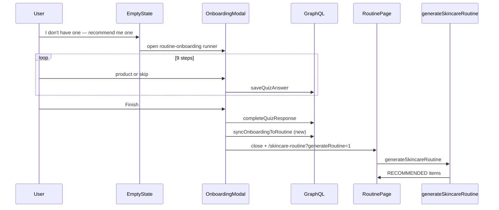

# ALE-34 Routine Onboarding Quiz — Chat Capture + Agent Recommendations

## Context

Change of plan after discarding the **skin-quiz-in-modal** routing work. The secondary empty-state CTA **“I don't have one — recommend me one”** must **not** open the existing **skin quiz** (`/quizzes/skin-quiz`, `url: "skin-quiz"`).

Instead it opens a **separate quiz** stored in the same Prisma quiz tables, with a **chat-style onboarding UI** modeled on the kbeauty prototype:

- Source mock: `commercePlatformMocks/kbeauty skin care (1)/routine-onboarding.jsx` (`OnboardingSheet`)
- Visual reference: screenshot + `Your Skincare Routine.html` (`.sheet-head`, `.chat`, `.bubble`, `.avatar-bot`, popular-pick chips)

**Linear:** [ALE-34](https://linear.app/alexandinseongprojects/issue/ALE-34/your-skin-routine-new-user)

**Branch:** `ALE-34-routine-onboarding-quiz` (frontend + backend; matching branch names in both repos if backend changes land separately)

**Repos:**

| Repo | Scope |
|------|--------|
| `commerce-platform-frontend` | Chat onboarding modal/runner, empty-state wiring, post-quiz redirect + auto-generate UX |
| `commerce-platform-backend` | Seed new quiz, sync answers → MANUAL routine items, relax/adapt `generateSkincareRoutine` quiz source |

**Prototype vs product wiring (important):**

In `routine-app.jsx`, the mock attaches **OnboardingSheet** to the **primary** CTA (“Set up my routine”) and **QuizSheet** (skin profile) to **“I don't have one”**. Product direction inverts that for production:

| CTA | Mock | Target (this plan) |
|-----|------|---------------------|
| **Set up my routine** | Chat onboarding (9 product steps) | Keep **existing** `RoutineSetupModal` — AM/PM **step grid** (`ROUTINE_STEPS` from skin-quiz config) |
| **I don't have one — recommend me one** | Skin profile quiz (`QuizSheet`) | **New** chat onboarding quiz (`routine-onboarding`) → MANUAL items → agent recommendations |

---

## User goals

1. User with no routine clicks **I don't have one — recommend me one** → sees **Soone chat onboarding** (not skin quiz).
2. User answers **9 predefined product questions** (one slot at a time), with brand + product name, popular picks, or **I don't use one** (skip).
3. On **Finish**, quiz answers are persisted and **synced to `user_routine_items` as `MANUAL`** (their “current” routine).
4. User lands on `/skincare-routine` and **`generateSkincareRoutine` runs automatically** (or with one clear CTA if auto-run is deferred).
5. Agent returns **RECOMMENDED** items (keep / swap / new) using onboarding quiz profile + MANUAL items.

**Skin quiz** remains available on `/quizzes/skin-quiz` and hero **Take skin quiz** — out of scope for this modal path.

---

## Prototype UX spec (looks)

Reference: `routine-onboarding.jsx` + attached screenshot.

### Modal shell

| Element | Spec |
|---------|------|
| Max width | ~640px (`sheet` in mock) |
| Header | Row: orange **Soone** avatar (`s`), title **Set up your routine**, subtitle **Takes about 2 minutes** |
| Progress | Thin horizontal bar between title block and step counter |
| Step counter | `1 / 9` monospace (`Geist Mono` in mock → `theme` mono or small caps) |
| Close | Circular × top-right |
| Body | Scrollable chat column + input block below current question |
| Footer | **Back** (ghost, disabled on step 1) · **I don't use one** (ghost) · **Continue →** / **Finish** (primary dark) |

### Chat transcript (not a live LLM chat)

Predetermined copy; append on each step transition:

1. **Opening bot bubble** (serif, larger): “Hi — I'm Soone. Let's get your current routine in one place.”
2. For each step, show prior Q/A pairs as history:
   - Bot bubble: step prompt (plain sans)
   - User bubble (right-aligned, dark): answer label e.g. `COSRX · Low pH Good Morning Gel` or `Skip for now`
3. **Current** bot bubble repeats the active question at the bottom of the transcript (mock behavior).

### Per-step input block (below chat)

| Element | Spec |
|---------|------|
| Category pill | Icon + label + **Morning** / **Evening** (from step metadata) |
| Fields | **Brand** placeholder `Brand (e.g. COSRX)` · **Product name** |
| Popular picks | Eyebrow `POPULAR PICKS · TAP TO USE` · chips `Brand · Product` (fill both fields on tap) |
| Continue enabled | When brand **or** product name non-empty (mock allows either) |
| Skip | **I don't use one** → stores null answer, still advances |

### Loading / completion (optional polish)

Mock `QuizSheet` shows **Building your routine…** after last question. Recommend same interstitial inside modal or on routine page (already partially exists on empty state).

### Tokens

Reuse commerce frontend theme: `theme.colors.accent` avatar, `theme.colors.surfaceSubtle` / cream bot bubbles, `theme.font.display` for serif opener, existing `Button` variants.

---

## Question list (from prototype)

All steps from `ONB_STEPS` in `routine-onboarding.jsx`. Suggested DB `key` / `rank` / GraphQL question order:

| # | Key | Time | Category | Prompt (bot message) |
|---|-----|------|----------|----------------------|
| 1 | `morning_cleanser` | AM | Cleanser | First up — what do you wash your face with in the morning? |
| 2 | `morning_toner` | AM | Toner | Any toner or essence after that? |
| 3 | `morning_serum` | AM | Serum | How about a serum or treatment? |
| 4 | `morning_moisturizer` | AM | Moisturizer | And a moisturizer to seal everything in? |
| 5 | `morning_spf` | AM | Sunscreen | Sunscreen is the whole point of a morning routine. What are you using? |
| 6 | `evening_cleanser` | PM | Cleanser | Switching to evenings — how do you cleanse at night? |
| 7 | `evening_essence` | PM | Essence | Any essence or hydrating layer? |
| 8 | `evening_serum` | PM | Serum | Any actives at night — retinol, AHA, vitamin C? |
| 9 | `evening_moisturizer` | PM | Moisturizer | And a night cream or moisturizer? |

### Popular picks per step (seed in `configJson`)

Copy from `popular` map in `routine-onboarding.jsx` (3 chips per category where defined; essence/serum may have 2).

### Routine `stepKey` mapping (for `addRoutineItem`)

Align with existing skin-quiz `ROUTINE_STEPS` keys where possible:

| Question key | `RoutineTimeOfDay` | `stepKey` |
|--------------|-------------------|-----------|
| `morning_cleanser` | AM | `cleanser_am` |
| `morning_toner` | AM | `toner_am` |
| `morning_serum` | AM | `serum_am` |
| `morning_moisturizer` | AM | `moist_am` |
| `morning_spf` | AM | `spf_am` |
| `evening_cleanser` | PM | `cleanser_pm` |
| `evening_essence` | PM | `serum_pm` *(or add `essence_pm` if product uses distinct step — confirm with existing step keys)* |
| `evening_serum` | PM | `treat_pm` *(actives / treatment slot)* |
| `evening_moisturizer` | PM | `moist_pm` |

**Action during implementation:** verify keys against `commerce-platform-backend/prisma/seed.ts` `ROUTINE_STEPS` config and `generateSkincareRoutine` agent expectations; add `essence_pm` only if architect approves a new step key.

---

## Quiz data model (same schema, new quiz row)

### New quiz record

| Field | Value |
|-------|--------|
| `url` | `routine-onboarding` |
| `title` | Set up your routine |
| `introTitle` | *(unused in chat UI — optional)* |
| `introSubtitle` | Takes about 2 minutes |
| `isActive` | true |

### Question type strategy

User noted product-selection question types already exist. Today’s enum (`QuizQuestionType`):

- `SINGLE_CHOICE`, `MULTIPLE_CHOICE`, `BUDGET_RANGE`, `ROUTINE_STEPS`, `TAG_LIST`, `AVOID_LIST`

**Recommended v1 (no enum migration):** one question per step, type **`TAG_LIST`** with tight config:

```json
{
  "maxSelections": 1,
  "captureMode": "brand_and_product",
  "timeOfDay": "AM",
  "stepKey": "cleanser_am",
  "categoryLabel": "Cleanser",
  "categoryIcon": "cleanser",
  "popularPicks": [
    { "brand": "COSRX", "name": "Low pH Good Morning Gel" }
  ],
  "allowSkip": true
}
```

**Answer shape in `quiz_answers.value_json`:**

```json
null
```

or

```json
{
  "brand": "COSRX",
  "name": "Low pH Good Morning Gel",
  "productId": "encoded-id-or-null"
}
```

`TAG_LIST` today stores `string[]` for “loved” — onboarding runner will use structured JSON instead (same column; backend already accepts arbitrary JSON).

**Alternative (needs architect approval):** add `PRODUCT_ENTRY` to `QuizQuestionType` enum + migration for clearer semantics and validation.

### Database changes

| Change | Approval |
|--------|----------|
| New rows in `quizzes`, `quiz_questions`, `quiz_answer_options` | **Seed only** — no Prisma schema migration |
| Refactor `prisma/seed.ts` to idempotent upserts | No migration — run `npm run db:seed` per environment |
| New enum value `PRODUCT_ENTRY` | **Architect approval** if chosen |

**No SQL data migration.** Quiz tables already exist (`20260509192500_add_quizzes`). Deploy pipelines that only run `prisma migrate deploy` do **not** apply seed data — run `npm run db:seed` (or add it to CI) after deploy, same as today for `skin-quiz`.

---

## Quiz seeding (idempotent upsert)

Replace the current **destructive** pattern in `prisma/seed.ts`:

```typescript
await tx.quiz.deleteMany({ where: { url: "skin-quiz" } });
await tx.quiz.create({ ... });
```

`deleteMany` on a quiz cascades away **all** `quiz_responses` / `quiz_answers` for that quiz in that database. Re-running seed in staging or prod would wipe user quiz history. This refactor fixes that for **both** quizzes.

### Natural keys (already in schema)

| Model | Upsert `where` |
|-------|----------------|
| `Quiz` | `{ url }` — `quizzes.url` is `@unique` |
| `QuizQuestion` | `{ quizId_key: { quizId, key } }` — `@@unique([quizId, key])` |
| `QuizAnswerOption` | `{ questionId_key: { questionId, key } }` — `@@unique([questionId, key])` |

Also respect `@@unique([quizId, rank])` / `@@unique([questionId, rank])` — seed definitions must keep **stable `key` and `rank`** per question/option.

### Layout

| File | Role |
|------|------|
| `prisma/seed.ts` | Thin `main()`: transaction, call seed helpers, log summary |
| `prisma/seed/quizDefinitions.ts` | **New** — declarative quiz payloads (`skin-quiz`, `routine-onboarding`) |
| `prisma/seed/upsertQuiz.ts` | **New** — shared `upsertQuizFromDefinition(tx, definition)` |

### `upsertQuizFromDefinition` behavior

For each quiz definition (identified by `url`):

1. **`quiz.upsert`** on `url` — `create` + `update` title, intro fields, `isActive`.
2. **For each question** in definition (stable `key`, `rank`):
   - **`quizQuestion.upsert`** on `quizId_key` — update `prompt`, `helperText`, `questionType`, `isRequired`, `configJson`.
   - **For each answer option** (when present):
     - **`quizAnswerOption.upsert`** on `questionId_key` — update `label`, `rank`, `helperText`, `metadataJson`.
   - **Prune options** removed from definition: `deleteMany` on `quiz_answer_options` where `questionId` = this question and `key` not in seed option keys (safe — does not delete user responses; options are only referenced if selected).
3. **Prune questions** removed from definition: `deleteMany` on `quiz_questions` where `quizId` = this quiz and `key` not in seed question keys (cascades options; **does not** delete `quiz_responses` — responses stay tied to quiz id).

Do **not** delete the quiz row on re-seed.

### Quizzes in seed (after refactor)

| `url` | Action |
|-------|--------|
| `skin-quiz` | Migrate existing 6 questions + options into `quizDefinitions.ts`; upsert via helper (parity with today’s content) |
| `routine-onboarding` | **Add** 9 `TAG_LIST` questions per [Question list](#question-list-from-prototype); no `answerOptions` rows (product capture is free-form + `popularPicks` in `configJson`) |

### Running seed

```bash
cd commerce-platform-backend
npm run db:seed
```

Safe to run repeatedly in local, staging, and prod when refreshing copy or adding questions — idempotent upserts, no duplicate quizzes/questions/options.

### Seed idempotency tests (required)

**Gate:** These tests run in **`npm test`** (jest-prisma DB) on every PR. Implementation is not done until they pass. Refactoring seed without updating tests is not allowed.

**File:** `commerce-platform-backend/src/__tests__/prisma/seedQuizzes.test.ts`

Use `jestPrisma.client` (same pattern as other interaction tests in `src/__tests__/setup.ts`). Call the exported seed entrypoint — e.g. `seedQuizzes(tx)` from `prisma/seed.ts` or `upsertAllQuizDefinitions(tx)` — **not** shelling out to `npm run db:seed`.

#### Helper assertions (reuse in tests)

```typescript
async function assertNoDuplicateQuizQuestions(quizId: bigint) {
  const rows = await prisma.$queryRaw<{ key: string; cnt: bigint }[]>`
    SELECT key, COUNT(*)::bigint AS cnt
    FROM quiz_questions
    WHERE "quizId" = ${quizId}
    GROUP BY key
    HAVING COUNT(*) > 1`;
  expect(rows).toEqual([]);
}

async function assertNoDuplicateAnswerOptions(questionId: bigint) {
  // same pattern on quiz_answer_options for questionId + key
}
```

#### Test cases

| # | Test name | What it proves |
|---|-----------|----------------|
| 1 | `seedQuizzes is idempotent for skin-quiz` | Run `seedQuizzes` **twice** → exactly **1** row in `quizzes` with `url = 'skin-quiz'`; question count equals definition length (6); `assertNoDuplicateQuizQuestions`; option counts per question unchanged on second run |
| 2 | `seedQuizzes is idempotent for routine-onboarding` | Run **twice** → 1 quiz row for `routine-onboarding`; exactly **9** questions; no duplicate `(quizId, key)`; no duplicate `(quizId, rank)` |
| 3 | `second seed run updates in place` | After first seed, change a known `prompt` in `quizDefinitions` (test-only fixture or mutate definition in test), run seed again → still 1 question row for that `key`, `prompt` matches new copy, count unchanged |
| 4 | `seed does not delete existing quiz responses` | Create `QuizResponse` + `QuizAnswer` for `skin-quiz` via factory; run `seedQuizzes` twice; response row still exists (guards against `deleteMany` on quiz) |
| 5 | `full seed entrypoint is idempotent` | Run exported `main` seed function twice in one test → combined counts for both URLs stable; total `quizzes` rows with url in `['skin-quiz','routine-onboarding']` is **2** |
| 6 | `prune removes orphaned question keys` | Upsert quiz with questions A+B; upsert again with only A in definition → question B gone, A remains; still one quiz row (optional but documents prune behavior) |

#### CI / local

```bash
cd commerce-platform-backend
npm test -- --testPathPattern=seedQuizzes
```

Also listed under backend **§4 Tests** and pre-push checklist: `npm run lint && npm run build && npm test`.

#### Definition of done (seed)

- [ ] `src/__tests__/prisma/seedQuizzes.test.ts` exists with cases **1–5** at minimum (case 6 if prune is implemented)
- [ ] Fails if `seed.ts` reintroduces `deleteMany` on quiz url before upsert
- [ ] Fails if a second `seedQuizzes` call doubles question or option rows

---

## End-to-end flow



---

## Backend implementation

### 1. Idempotent quiz seed + `routine-onboarding` content

See [Quiz seeding (idempotent upsert)](#quiz-seeding-idempotent-upsert).

Implementation order:

1. Extract `upsertQuizFromDefinition` + move `skin-quiz` payload to `quizDefinitions.ts` (behavior parity).
2. Add `routine-onboarding` definition: 9 questions, `questionType: TAG_LIST`, `isRequired: false` (skip allowed), `configJson` with `popularPicks`, `timeOfDay`, `stepKey`, `categoryLabel`, etc.
3. Wire `main()` to upsert both quizzes in one transaction.
4. Add **`seedQuizzes.test.ts`** (cases 1–5); must pass under `npm test`. Manually run `npm run db:seed` twice locally as a smoke check.

### 2. Sync quiz answers → MANUAL routine items

**New interaction:** `syncRoutineOnboardingToManualItems(clerkUserId, quizResponseId)`

- Load completed response + answers for `routine-onboarding`
- For each answer with non-null `valueJson` product payload:
  - `addRoutineItem` / upsert: `source: MANUAL`, `timeOfDay`, `stepKey`, `productId` if resolved, else `customProductName: "${brand} · ${name}"`
- Skip null answers (no row for that slot)
- Idempotent: if user re-runs, replace or skip duplicates by `(timeOfDay, stepKey)` — match `persistRoutineSteps` dedupe behavior

**Expose via GraphQL** (pick one):

- **A)** Mutation `syncRoutineOnboardingAnswers` called by frontend after `completeQuizResponse`
- **B)** Side effect inside `completeQuizResponse` when `quiz.url === "routine-onboarding"` (simpler client, tighter coupling)

Recommendation: **B** for fewer round trips; document in plan for review.

### 3. Adapt `generateSkincareRoutine`

**File:** `commerce-platform-backend/src/interactions/routines/generateSkincareRoutine.ts`

Today: hard-requires latest **completed `skin-quiz`** response.

**Target:**

| Input | Source |
|-------|--------|
| `quizProfile` | Latest completed **`routine-onboarding`** if newer or only one completed; else **`skin-quiz`** (backward compatible) |
| `currentRoutineManualItems` | Existing MANUAL items (populated by sync) |
| Gate | Allow generate when **≥1 MANUAL item** OR completed onboarding quiz OR completed skin quiz |

Minimum for “I don't have one” path: user completes onboarding → sync creates MANUAL items → generate must **not** require skin-quiz.

Update error copy: “Complete routine setup or skin quiz before generating…”

**Prompt tweak:** When `manualItems.length > 0` and onboarding quiz present, note in `policy.notes` that recommendations should compare against captured current products step-by-step.

### 4. Tests

| Area | File | Notes |
|------|------|-------|
| **Seed idempotency (required)** | `src/__tests__/prisma/seedQuizzes.test.ts` | See [Seed idempotency tests](#seed-idempotency-tests-required); blocks regressions to `deleteMany` + duplicate rows |
| Quiz loaded by URL | `getQuizByUrl.test.ts` | `routine-onboarding` returns 9 questions after seed helper runs |
| Onboarding sync | `syncRoutineOnboardingToManualItems.test.ts` | **New** — answers → MANUAL items |
| `completeQuizResponse` hook | `completeQuizResponse.test.ts` | Onboarding quiz triggers sync; skin-quiz unchanged |
| Generate routine | `generateSkincareRoutine.test.ts` / `routineMutations.test.ts` | Onboarding + MANUAL without skin-quiz; skin-quiz-only regression |

---

## Frontend implementation

### 1. Replace `QuizModal` skin-quiz wiring

**Files:** `components/skincareRoutinePage.tsx`, remove/rename `components/quizModal.tsx`

| Before | After |
|--------|-------|
| `QuizModal` + `QuizRunner` `skin-quiz` | `RoutineOnboardingModal` + `RoutineOnboardingRunner` `routine-onboarding` |

Empty state `onNoRoutine` opens onboarding modal only.

### 2. New `RoutineOnboardingRunner` (chat UI)

**File:** `components/routineOnboardingRunner.tsx` (name flexible)

**Not** a variant of `QuizRunner` — different layout (chat transcript + dual text fields). Still uses:

- `useQuizByUrlQuery({ url: "routine-onboarding" })`
- `useStartQuizResponseMutation`, `useSaveQuizAnswerMutation`, `useCompleteQuizResponseMutation`
- `useQuizProductSuggestionsQuery` for autocomplete on brand/product fields (reuse catalog search like `TagListInput` / `ProductLookupInput`)

**State machine:**

- `stepIndex` 0..8 maps to question `rank`
- Local `history` for bubbles (mirror mock)
- `scratch: { brand, name }` per step
- On Continue: save answer JSON, push history, increment step
- On Finish (step 9): complete response → `onFinished`

**Components to extract/reuse:**

- `OnboardingChatBubble` (bot/me)
- `PopularPickChips` from configJson
- `CategoryPill` with step icon (reuse routine icon set from mock `routine-icons.jsx` or simple emoji/label)

### 3. `RoutineOnboardingModal`

Wraps runner in `OverlayModal` (same shell as current quiz modal: no title bar, `ariaLabel`, maxWidth 960).

**Header copy:** “Set up your routine” / “Takes about 2 minutes” — matches screenshot (not “Skin quiz”).

### 4. Post-completion routing

On `onFinished`:

1. Refetch `myRoutine` + latest quiz
2. Close modal
3. `router.push("/skincare-routine?generateRoutine=1")`

**`SkincareRoutinePage`:**

- `useEffect` on `generateRoutine=1`: call `generateSkincareRoutine` when allowed; `router.replace` to strip param
- Show **Building your routine…** on empty state while `generateLoading`
- Error banner + hero **Build my routine** retry (reuse pattern from discarded routing plan if not present)

**Gate for auto-generate:** completed `routine-onboarding` + synced MANUAL items (or rely on backend sync + refetch item count > 0).

### 5. Keep `RoutineSetupModal` unchanged

Primary CTA still opens step grid from skin-quiz `ROUTINE_STEPS` question config (`url: "skin-quiz"`, question `routine`).

### 6. Tests

| Test | Focus |
|------|--------|
| `routineOnboardingRunner.test.tsx` | step advance, skip, popular pick fills fields, history bubbles |
| `routineOnboardingModal.test.tsx` | navigates to `?generateRoutine=1` on finish |
| `skincareRoutinePage.test.tsx` | secondary CTA opens onboarding modal (not skin quiz); auto-generate mock |
| `persistOnboardingAnswers.test.ts` | maps valueJson → addRoutineItem inputs (if sync stays frontend) |

---

## Files to touch (summary)

### Backend

| File | Change |
|------|--------|
| `prisma/seed.ts` | Orchestrate idempotent upsert for all quizzes |
| `prisma/seed/quizDefinitions.ts` | **New** — `skin-quiz` + `routine-onboarding` definitions |
| `prisma/seed/upsertQuiz.ts` | **New** — shared upsert + prune helpers |
| `src/__tests__/prisma/seedQuizzes.test.ts` | **New** — idempotency + no-duplicate tests (required) |
| `src/interactions/quizzes/completeQuizResponse.ts` | Optional sync hook for onboarding quiz |
| `src/interactions/routines/syncRoutineOnboardingToManualItems.ts` | **New** |
| `src/interactions/routines/generateSkincareRoutine.ts` | Quiz source + gate |
| `src/__tests__/...` | Coverage per above |

### Frontend

| File | Change |
|------|--------|
| `components/routineOnboardingRunner.tsx` | **New** — chat UI |
| `components/routineOnboardingModal.tsx` | **New** — replaces skin-quiz modal |
| `components/skincareRoutinePage.tsx` | Wire CTA, auto-generate |
| `lib/onboardingQuiz.ts` | **New** — step config types, answer parsing, label formatting |
| `components/quizModal.tsx` | Remove or repurpose (no skin-quiz in modal) |
| `src/__tests__/...` | New/updated tests |

### Out of scope

- Redesigning full routine editor after recommendations — see [ale-34-routine-page-redesign.md](ale-34-routine-page-redesign.md)
- Changing skin-quiz content or full-page `/quizzes/skin-quiz` flow
- Chat CTA URL changes (unless product wants `?openOnboarding=1` deep link)
- New scraper/catalog work for popular picks (static seed chips v1)

---

## Verification (manual)

1. Empty routine → **I don't have one** opens **chat onboarding** (Soone intro, 9 steps), **not** skin quiz.
2. Step 1 matches screenshot: category pill, brand/name fields, popular picks, Back / I don't use one / Continue.
3. Skip and filled answers appear correctly in chat history.
4. After **Finish**, `/skincare-routine` loads; MANUAL column shows captured products; generation runs.
5. RECOMMENDED column populates with keep/swap/new style recommendations.
6. User who only uses **Set up my routine** (grid) is unchanged.
7. `npm test` includes `seedQuizzes.test.ts` — all idempotency cases green.
8. Optional smoke: `npm run db:seed` twice against same DB → still one `routine-onboarding` quiz, 9 questions.
9. `npm run build && npm test` in both repos touched.

---

## Decisions (locked for planning; confirm before build)

| Decision | Choice | Rationale |
|----------|--------|-----------|
| Quiz URL | `routine-onboarding` | Distinct from `skin-quiz`; same tables |
| UI implementation | Dedicated runner, not `QuizRunner` embedded | Chat UX is structurally different |
| Question type v1 | `TAG_LIST` + structured `valueJson` | Avoid enum migration |
| Sync timing | Server-side on `completeQuizResponse` | Atomic quiz complete + routine rows |
| Generate gate | MANUAL items from onboarding **or** skin-quiz profile | Supports new path without skin quiz |
| Primary CTA | Keep step-grid modal | User only changed secondary path |
| Quiz data deploy | **`npm run db:seed`** (idempotent upsert) | No data migration; not auto-run on `db:deploy` |
| Seed correctness | **`seedQuizzes.test.ts` in CI** | Automated guard against duplicates / destructive re-seed |

---

## TODO

- [x] Confirm `stepKey` mapping for evening essence/serum with team (essence → `serum_pm`, evening serum → `treat_pm`)
- [x] Architect: approve `TAG_LIST` + JSON vs new `PRODUCT_ENTRY` enum (shipped v1: `TAG_LIST` + structured `valueJson`)
- [x] Backend: refactor seed to idempotent upsert (`upsertQuiz.ts` + definitions under `src/seed/`)
- [x] Backend: migrate `skin-quiz` into definitions (no `deleteMany` on quiz)
- [x] Backend: add `routine-onboarding` with 9 questions + popular picks in `configJson`
- [x] Backend: **`src/__tests__/seed/seedQuizzes.test.ts`** — idempotent double-seed, no duplicate keys/ranks, update-in-place
- [ ] Backend: smoke-check `npm run db:seed` twice locally; run `db:seed` on staging/prod after deploy (document in PR)
- [x] Backend: `syncRoutineOnboardingToManualItems` + hook on complete
- [x] Backend: update `generateSkincareRoutine` quiz gate + profile source
- [x] Backend: interaction tests for sync
- [ ] Backend: interaction test for generate without skin-quiz (optional follow-up)
- [x] Frontend: `RoutineOnboardingRunner` chat UI per prototype
- [x] Frontend: `RoutineOnboardingModal`; wire empty-state secondary CTA
- [x] Frontend: post-quiz redirect + `generateRoutine=1` auto-generate on routine page
- [x] Frontend: unit tests; `npm run build && npm test`
- [ ] Manual QA per checklist above
