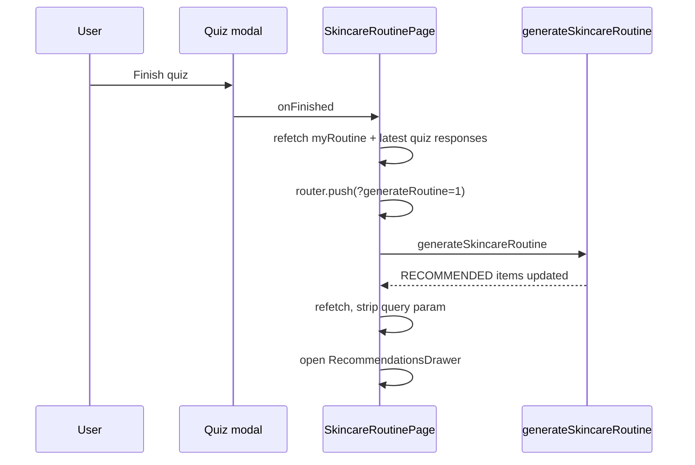

# ALE-34 Routine Page Redesign — Current Routine Primary + Recommendations Drawer

## Context

Follow-on to [ALE-34 new-user empty state](ALE-34-your-skin-routine-new-user.md) and [routine onboarding quiz](ale-34-routine-onboarding-quiz.md). Those shipped the empty state, `RoutineOnboardingModal`, and `?generateRoutine=1` auto-generate.

This plan covers the **signed-in routine page** when the user already has MANUAL items: move from a **two-column** editor (current vs recommended side-by-side) to the kbeauty prototype layout where **“what you use today” is the only main column**, and recommendations live in a **right-hand drawer**.

**Prototype source:** `commercePlatformMocks/kbeauty skin care (1)/`

| File | Role |
|------|------|
| `routine-app.jsx` | Page shell, hero CTAs, single-column list, banners, modal wiring |
| `routine-recommendations.jsx` | `RecommendationsDrawer` — diff rows, Buy / Dismiss / Buy bundle |
| `routine-onboarding.jsx` | `OnboardingSheet` — re-do routine chat quiz |
| `routine-quiz.jsx` | `QuizSheet` — skin profile quiz |

**Linear:** [ALE-34](https://linear.app/alexandinseongprojects/issue/ALE-34/your-skin-routine-new-user)

**Branch:** `ALE-34-routine-page-redesign` (frontend primary; backend only if apply/dismiss needs new APIs)

**Repos:** `commerce-platform-frontend` (required). `commerce-platform-backend` — no schema changes expected; reuse `generateSkincareRoutine`, `addRoutineItem`, `updateRoutineItem`, `removeRoutineItem`.

---

## Comparison: current (left) vs prototype (right)

| Area | Current (`skincareRoutinePage.tsx`) | Prototype (`routine-app.jsx`) | Target |
|------|-----------------------------------|-------------------------------|--------|
| **Hero headline** | “Hi {name} — here's the routine I built for you.” | “Hi {name} — *what you use, daily.*” (or “Your routine, *refined.*” after quiz) | Match prototype copy by state |
| **Hero primary action** | “Build custom skincare routine” (regenerates in place) | “Take the skin quiz” (opens `QuizSheet`) | Skin quiz modal; generation runs after finish |
| **Hero secondary action** | None | “Re-do my routine” (opens `OnboardingSheet`) | Routine onboarding modal (`routine-onboarding`) |
| **Main layout** | 2-column grid: MANUAL \| RECOMMENDED | Single column: numbered step cards only | Single column for MANUAL |
| **Recommended UX** | Always visible right column | Right **drawer** after quiz; optional banner when closed | Drawer; **plus** persistent open control (see below) |
| **Slot controls** | AM/PM pills above both columns | AM/PM in section head + drawer | Section head (prototype) |
| **Slot metadata** | “Changes this slot · N recommended” | Step count + optional slot total price | Step count + slot total when prices exist |
| **Add product** | `ProductLookupInput` card per column | “Add a step” row → opens onboarding | Inline add row at bottom of list (opens onboarding or compact add — match prototype) |
| **Product row** | Horizontal product card or plain card + Remove | Numbered step, category icon, brand·name, price, trash | New `RoutineStepCard` component |
| **After quiz** | No drawer; recs stay in column | Auto-open drawer; `view = 'recs'` | Auto-open drawer + `?generateRoutine=1` |
| **Access recs anytime** | Always (right column) | Hero “View recommendations” only when `view === 'recs'` | **Add** always-available control when user has ≥1 RECOMMENDED item (gap in prototype) |

### What we keep from current

- Empty state (`NewUserRoutineEmptyState`) — already aligned with mock `Empty`
- `RoutineSetupModal` for **Set up my routine** on empty state (step grid)
- `RoutineOnboardingModal` for **I don't have one** and for **Re-do my routine**
- `QuizModal` + `QuizRunner` `skin-quiz` (still in repo; wire back for hero CTA)
- `generateSkincareRoutine` + `?generateRoutine=1` after either quiz completes

### What we remove / replace

- Two-column `RoutineColumn` layout for the main page
- Hero trailing **Build custom skincare routine** as the primary affordance (move regen to drawer footer or a tertiary “Refresh recommendations” if needed)
- Inline RECOMMENDED column and its `ProductLookupInput`-less list

---

## Page states

Mirror mock `view` with product data:

| State | Condition | Hero | Main body | Drawer |
|-------|-----------|------|-----------|--------|
| **empty** | `routineItems.length === 0` | Hidden | `NewUserRoutineEmptyState` | Closed |
| **routine** | Has MANUAL items; no completed skin quiz **or** no RECOMMENDED rows yet | “what you use, daily” + Re-do + Take skin quiz | Single-column MANUAL list | Closed; optional quiz nudge banner |
| **recs** | Has RECOMMENDED items (typically after generation) | “Your routine, refined” + View recommendations | Same single-column MANUAL list | Open on first entry after quiz/generate; closable |

**Note:** `recs` can be derived: `recommendedItems.length > 0` (any slot), not a separate DB flag.

---

## Hero CTAs (signed-in, non-empty)

### Default (`routine` / no recs yet)

| Button | Variant | Action |
|--------|---------|--------|
| **Re-do my routine** | Ghost / outline + edit icon | `setOnboardingModalOpen(true)` → `RoutineOnboardingModal` |
| **Take the skin quiz** | Primary + wand icon | `setSkinQuizModalOpen(true)` → `QuizModal` (`skin-quiz`) |

Copy (from mock):

- Title: `Hi {displayName} — what you use, daily.` (italic on “what you use, daily.”)
- Subtitle: “Everything you're using right now, in one place. Take the skin quiz any time to see what I'd refine.”

### After recommendations exist (`recs`)

| Button | Action |
|--------|--------|
| **View recommendations** (primary, sparkles) | `setRecommendationsDrawerOpen(true)` |

- Title: `Your routine, refined.`
- Subtitle: “Based on your skin quiz, I've drafted some swaps and additions. Apply what feels right — your current routine stays the source of truth.”

Remove hero **Build custom skincare routine** from the main hero; regeneration is triggered automatically after quizzes (below). Optional: “Refresh recommendations” link in drawer header for manual re-run of `generateSkincareRoutine` (only if product wants parity with old button).

---

## Quiz completion → recalculate suggested routine

Both quiz paths must end with the same pipeline:



### Routine onboarding (`routine-onboarding`)

Already implemented:

- `RoutineOnboardingModal` `onFinished` → refetch → `?generateRoutine=1`

**Change:** After successful generate + refetch, set `recommendationsDrawerOpen = true` (do not rely on user to click hero).

### Skin quiz (`skin-quiz`)

Wire `QuizModal` on hero **Take the skin quiz**:

```typescript
onFinished={async () => {
  setSkinQuizModalOpen(false);
  await Promise.all([refetch(), refetchLatestSkinQuiz()]);
  router.push("/skincare-routine?generateRoutine=1&openRecs=1");
}}
```

**`SkincareRoutinePage`:** extend existing `generateRoutine` effect:

- When `openRecs=1` and generate completes (or recs already present), open drawer and `router.replace` without query params.

### Re-do my routine (onboarding again)

Same as first-time onboarding finish: sync MANUAL items (server on complete) → generate → open drawer.

---

## Main column: “What you use today”

Replace `RoutineColumn` MANUAL column with a **stacked step list** per mock `RoutineList` / `StepCard`.

### Section header

| Element | Spec |
|---------|------|
| Eyebrow | `WHAT YOU USE TODAY` |
| Title | `Morning routine` / `Evening routine` |
| Meta right | `{n} steps` · optional **Slot total** (sum `productCard.price` or parsed price labels) · AM/PM segmented control |

Reuse existing `slot` state (`RoutineTimeOfDay`).

### Step card (`RoutineStepCard`)

| Element | Behavior |
|---------|----------|
| Index | 1-based circle |
| Thumbnail | Product image from `productCard` or category placeholder (reuse `routineCategoryIcons` / stepKey) |
| Category | Uppercase label + small icon from `stepKey` |
| Name | `{brand} · {name}` |
| Price | From `productCard.priceLabel` when present |
| Actions | Trash → `removeRoutineItem` (MANUAL only) |
| Badges | Optional “Swapped” / “New” if we track recent applies (mock `recentChanges`) — v1 can skip |

### Add step

Bottom **Add a step** row (mock): opens `RoutineOnboardingModal` **or** inline `ProductLookupInput` — **decision:** v1 use `ProductLookupInput` in a compact row for faster adds; “Add a step” subtitle lists categories. Re-do still uses full onboarding modal.

### Remove from main column

- No RECOMMENDED rows in the list
- No second column

---

## Recommendations drawer

Port UX from `routine-recommendations.jsx` → `components/recommendationsDrawer.tsx`.

### Shell

| Element | Spec |
|---------|------|
| Scrim | Click closes |
| Panel | Fixed right, ~480–520px wide, full viewport height |
| Header | “Your custom routine” · subtitle “From your skin quiz · {n} suggested changes” (copy can mention onboarding if that was the profile source) |
| Slot toggle | AM/PM inside drawer (sync with page `slot` or local state — prefer **shared** `slot` with main list) |
| Body | Scrollable list of diff rows |
| Footer | Bundle summary + Buy bundle / Close (prices optional v1) |

### Diff row (per RECOMMENDED item with label SWAP / KEEP / NEW)

Map from existing `RoutineItem` fields:

| `recommendationLabel` | UI |
|-----------------------|-----|
| `KEEP` | Single product + reason; no actions |
| `SWAP` | Current (from `swapFromProductName` or matched MANUAL item) → arrow → recommended |
| `NEW` | Recommended only |

| Action | Implementation (v1) |
|--------|---------------------|
| **Buy** (mock) = apply to routine | For SWAP/NEW: `updateRoutineItem` / `addRoutineItem` on MANUAL with recommended `productId` or `customProductName`; remove superseded MANUAL row if swap; `removeRoutineItem` on applied RECOMMENDED row or leave for audit — **prefer:** copy to MANUAL, remove RECOMMENDED duplicate |
| **Dismiss** | `removeRoutineItem` on RECOMMENDED item |
| **Buy all** | Sequential apply for unapplied SWAP/NEW in slot |

**Architect check:** Confirm whether applying a swap should delete the old MANUAL item or update it in place (`updateRoutineItem` exists).

### Data source

No new query: filter `myRoutine.items` where `source === RECOMMENDED` and `timeOfDay === slot`, same as today.

---

## Persistent “View recommendations” control (prototype gap)

The prototype only surfaces recommendations via:

- Auto-open after quiz
- Hero button when `view === 'recs'`
- Banner when drawer closed and unapplied changes remain

**Product requirement (add):** User can open the drawer **at any time** once recommendations exist.

### Recommended placements (implement at least one primary + one secondary)

| Placement | When visible | Label |
|-----------|--------------|-------|
| **Section header** (right of AM/PM) | `recommendedItems.length > 0` (current slot or global) | Link/button: “View recommendations” with count badge `{unapplied} suggested` |
| **Hero** | `recs` state | Primary “View recommendations” (already in mock) |
| **Floating pill area** | Optional | Icon-only sparkles — only if header is crowded |

**Behavior:** `onClick` → `setRecommendationsDrawerOpen(true)` regardless of banner state.

**Empty recs:** Control hidden (not disabled).

---

## Banners (optional, from mock)

| Banner | When | CTA |
|--------|------|-----|
| **Recs banner** | Has unapplied SWAP/NEW and drawer closed | Re-take quiz · View recommendations |
| **Quiz nudge** | Has MANUAL, no skin quiz completed, no recs | Take the skin quiz |

Use mock styling: cream/paper background, icon left, short headline + body.

---

## Frontend files

| File | Change |
|------|--------|
| `components/skincareRoutinePage.tsx` | Hero states, single column, drawer state, quiz modals, banners, persistent recs CTA |
| `components/routineStepCard.tsx` | **New** — numbered step row |
| `components/recommendationsDrawer.tsx` | **New** — drawer + diff rows + apply/dismiss |
| `components/recommendationsDiffRow.tsx` | **New** (optional extract) |
| `lib/routineRecommendations.ts` | **New** — group recs by slot, unapplied count, apply helpers |
| `components/quizModal.tsx` | Re-wire from page (no change to component) |
| `components/routineColumn.tsx` | **Remove** or keep only if tests import — prefer delete after migration |

### GraphQL (frontend)

Reuse existing mutations; add client wrappers if needed:

- `useUpdateRoutineItemMutation` for apply-swap
- Existing `addRoutineItem`, `removeRoutineItem`, `generateSkincareRoutine`

Codegen if `updateRoutineItem` not yet in frontend hooks.

---

## Backend

**No Prisma migration** for this plan.

| Topic | Notes |
|-------|--------|
| `generateSkincareRoutine` | Already runs after onboarding; ensure skin-quiz-only path still passes gate |
| Apply semantics | Client-side composition of existing mutations unless we add `applyRoutineRecommendation` later |

---

## Tests

| Test | Focus |
|------|--------|
| `skincareRoutinePage.test.tsx` | Single column; hero CTAs open correct modals; drawer opens on `openRecs=1`; persistent CTA visible when recs exist |
| `recommendationsDrawer.test.tsx` | Diff rows by label; dismiss calls remove; apply calls add/update |
| `routineStepCard.test.tsx` | Renders index, category, remove |

---

## Verification (manual)

1. User with MANUAL routine sees **single column** only (no right “What I'd build” column).
2. **Re-do my routine** opens chat onboarding modal; on finish, routine regenerates and **drawer opens**.
3. **Take the skin quiz** opens skin quiz modal (not full-page); on finish, same generate + drawer behavior.
4. **View recommendations** in hero (when recs exist) opens drawer.
5. **View recommendations** in section header opens drawer even when hero is in “daily” copy mode (persistent access).
6. Applying a swap updates MANUAL list; dismissing removes RECOMMENDED row.
7. AM/PM toggle updates both list and drawer.
8. Empty state unchanged.
9. `npm run lint && npm run build && npm test` in frontend.

---

## Out of scope

- Navbar redesign (separate mock / ALE-31)
- Bundle checkout / real cart integration for “Buy bundle” (can stub or link to product URLs v1)
- Changing onboarding question content
- New scraper/catalog work

---

## TODO

- [x] Confirm apply-swap behavior with architect (`updateRoutineItem` vs delete+add) — v1: update manual in place, remove RECOMMENDED row
- [x] Add `useUpdateRoutineItemMutation` to frontend (`graphql/routineOperations.graphql` + codegen)
- [x] Implement `RoutineStepCard` + section header
- [x] Refactor `skincareRoutinePage` to single-column layout
- [x] Implement `RecommendationsDrawer` + apply/dismiss handlers
- [x] Wire `QuizModal` for **Take the skin quiz**; extend `generateRoutine` + `openRecs` flow
- [x] Wire **Re-do my routine** to `RoutineOnboardingModal` (already exists; verify on non-empty page)
- [x] Add **persistent View recommendations** control (section header + hero)
- [x] Optional: rec banner + quiz nudge banner
- [x] Unit tests + manual QA checklist
- [x] `npm run build && npm test` (repo-wide `npm run lint` has pre-existing failures unrelated to this change)
- [ ] Manual QA per checklist above
